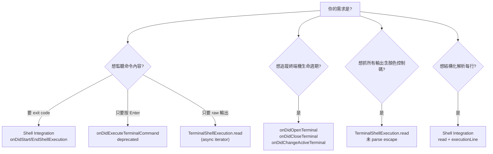

# Superset

VSCode 擴充功能 (extension):在主側欄 (Primary Side Bar) 新增「Terminals」面板,列出所有開啟中的終端機;當某個「非作用中」的終端機有新輸出時,在面板、終端機分頁名稱、狀態列三處高亮提示,聚焦後自動解除。

`superset` 把 VSCode 終端機事件彙整成可觀察的狀態,核心使用情境:背景的 Claude Code 終端機持續輸出時,使用者能在側欄一眼看到「哪個背景終端機有新動靜」。

> 程式碼實作以本文件的「VSCode 終端機事件總覽」表格為準;`src/extension.ts` 訂閱的每個 API 都應在此表中找到對應列。
> 設計決策、狀態機、資料流見 [`plans/2026-06-20-terminal-dashboard-panel.md`](plans/2026-06-20-terminal-dashboard-panel.md)。
>
> 註:本文件先前名為 `terminal-dashboard`;2026-06-20 重新命名為 `superset` 後,plan 檔名沿用日期前綴作為歷史 ID、內文已同步更新。

---

## 主要功能 (Features)

- 主側欄面板列出當前所有終端機,點擊任一列直接聚焦該終端機。
- 背景終端機 (例如跑 Claude Code 的那個) 有新輸出時,在三處同步高亮:
    - 面板該列換成加重圖示 + `● 新輸出` 描述。
    - 終端機分頁名稱前綴加 `● `。
    - 狀態列顯示 `N 個終端機有新輸出`。
- 重新聚焦該終端機時,所有高亮自動解除。
- 若使用者在高亮期間手動改了終端機名稱,清除時 Presenter 只剝 `● ` 前綴、不還原舊名,避免覆蓋使用者意圖。
- 命令 `Superset: Open TUI Terminal` 開啟 PTY-backed terminal,內部用 `node-pty` 100% 攔截 TUI app (`claude`、`vim`、`htop`) 的所有輸出。建議在跑 TUI app 前用此命令開新 terminal。

---

## 系統需求 (Requirements)

| 項目 | 版本 |
|---|---|
| VSCode | `^1.85.0` (需要 Shell Integration 穩定 API) |
| Node.js | 18+ (VSCode 內建 Electron 對應的 Node 版本) |
| npm | 隨 Node 一起裝 |

---

## 建置、開發與安裝 (Build, Develop, Install)

### 開發建置 (Development Build)

第一次或更新相依套件時:

```bash
npm install
```

型別檢查並把 `src/` 編譯到 `out/`:

```bash
npm run build
```

邊改邊編譯 (watch 模式):

```bash
npm run watch
```

執行單元測試 (Vitest,29 個 case):

```bash
npm test
```

### 在 VSCode 裡試跑 (Run in Extension Development Host)

最直覺的開發循環:

1. 用 VSCode 打開這個資料夾 (`superset/`)。
2. 按 `F5` (或選單 `Run` → `Start Debugging`)。
3. 會跳出一個新的「Extension Development Host」視窗;這個視窗已載入本擴充。
4. 在新視窗開幾個終端機 (例如 `Ctrl+`` 開一個、然後再開一個跑 `claude` 之類的長輸出命令)。
5. 切回主側欄,應能看到 `Terminals` 圖示;點開後列出所有終端機。
6. 切換終端機後,看背景那個的圖示與 tab 名稱是否帶 `● `,狀態列是否顯示計數。

### 打包成 `.vsix` (Package)

`vsce` (VSCode Extension Manager) 是 VSCode 官方打包工具。可以直接使用 `npx` 進行打包：

```bash
npx @vscode/vsce package
```

會在專案根目錄產出:

```
superset-0.0.1.vsix
```

> 預設 `.vscodeignore` 已排除 `src/`、`tsconfig.json`、`node_modules/`、`out/**/*.map`,所以 VSIX 只含 `out/` 編譯產物,大小約 幾 KB。
> 本擴充沒有 runtime dependencies (只有 `vscode` 注入的 API),所以不需要 esbuild bundling;`tsc` 直接編譯就夠。

### 安裝 (Install)

#### 方法 A: `.vsix` 安裝 (推薦)

打包出 `superset-0.0.1.vsix` 後,選一個方式:

- 命令列:
    ```bash
    code --install-extension superset-0.0.1.vsix
    ```
- VSCode UI:
    1. 打開 Extensions 面板 (`Ctrl+Shift+X` / `Cmd+Shift+X`)。
    2. 點右上角 `⋯` → `Install from VSIX...`。
    3. 選剛剛的 `.vsix` 檔。

重新啟動 VSCode 後即可生效。

> **TUI 偵測**:本擴充用 `node-pty` 自己握 PTY 來 100% 攔截 TUI app 的輸出。需要透過命令 `Superset: Open TUI Terminal` 開啟新的 terminal 才能使用此功能(命令面板搜尋 `Superset: Open`)。在裡面跑 `claude`、`vim` 等 TUI 都能正確觸發面板高亮。

#### 方法 B: 從原始碼 symlink (開發用)

```bash
# 把專案 link 到 VSCode 擴充資料夾
ln -s "$(pwd)" ~/.vscode/extensions/superset-0.0.1
```

> Windows 上對應的是 `%USERPROFILE%\.vscode\extensions\`。

之後改程式碼只要重新 `npm run build`,重啟 VSCode 就生效。

#### 方法 C: 直接用 Extension Development Host

照上面「在 VSCode 裡試跑」段落的 F5 流程即可,不需要打包。

### 卸載 (Uninstall)

```bash
code --uninstall-extension shuk.superset
```

或從 Extensions 面板找到 `Superset`,點 `Uninstall`。

---

## 專案目的 (Project Purpose)

`superset` 是一個 VSCode extension,把「使用者對終端機做了什麼」彙整成可觀察的狀態 (terminal 清單 + 各自高亮旗標),目標包括:

- 監聽終端機開關與切換
- 解析命令列內容 (`commandLine`)、工作目錄 (`cwd`)
- 偵測背景終端機的新輸出並在三處高亮
- 後續可延伸為 WebView 儀表板

---

## 架構 (Architecture)

四個獨立單元,以 `TerminalRegistry` 為唯一資料來源,其餘三者只讀它並訂閱其變更事件:

| 元件 | 職責 | 依賴 |
| --- | --- | --- |
| `TerminalRegistry` | 維護終端機清單與各自的 unseen 旗標;發出 `onDidChange` 事件 | 無 (純狀態) |
| `OutputWatcher` | 訂閱 `onDidStartTerminalShellExecution`;當該終端機非作用中 → 標記 unseen | Registry |
| `TerminalTreeProvider` | `vscode.TreeDataProvider` 實作;讀 Registry 渲染面板;點擊 → `superset.focus` 命令 | Registry |
| `HighlightPresenter` | 訂閱 Registry 變更;更新 tab 名稱前綴與狀態列文字 | Registry |

`vscode` API 集中在 `src/extension.ts` 組裝層;核心三元件接受注入依賴,在 Vitest 下無需 Extension Host 即可測試。`HighlightPresenter` 與 `OutputWatcher` 都從 `./treeSpec` import 純輔助函式,確保 import graph 不污染 `vscode`。

> 渲染細節 (面板圖示 / description / 命令 ID) 抽到 `src/treeSpec.ts` 的純函式 `buildTreeItemSpec`;`TerminalTreeProvider` class 本體 (vscode-bound) 不做單元測試。

---

## VSCode 終端機事件總覽 (Terminal Event Reference)

本擴充訂閱 / 使用的所有 VSCode 終端機 API。`src/extension.ts` 的任何事件訂閱都應對應本表中的某列。

| 事件 API | 層級 | 觸發時機 | 狀態 |
| --- | --- | --- | --- |
| `window.onDidOpenTerminal` | Window | 新終端機被建立 | 穩定 |
| `window.onDidCloseTerminal` | Window | 終端機被關閉 | 穩定 |
| `window.onDidChangeActiveTerminal` | Window | 作用中的終端機切換 | 穩定 |
| `window.onDidExecuteTerminal` | Window | 使用者在終端機內按 Enter 執行程式 | Deprecated |
| `window.onDidExecuteTerminalCommand` | Window | 同上,結構化命令物件 (`TerminalCommand`) | Deprecated (1.93+) |
| `window.onDidWriteTerminalData` | Window | 任何終端機寫入資料 | Deprecated |
| `Terminal.onDidWriteData` | 物件 | 該終端機寫入原始 bytes | 已移除 (本擴充走 Shell Integration,免依賴 proposed API) |
| `window.onDidStartTerminalShellExecution` | Shell | Shell 開始執行一個命令 | 穩定 (1.85+) |
| `window.onDidEndTerminalShellExecution` | Shell | Shell 命令執行結束 (含 exit code) | 穩定 (1.85+) |
| `TerminalShellExecution.read` | Shell | 命令執行期間的 stdout/stderr (async iterator) | 穩定 (1.85+) |
| `TerminalShellExecution.commandLine` | Shell | 該次執行的完整命令列 | 屬性 |
| `TerminalShellExecution.cwd` | Shell | 該次執行的工作目錄 (若可得) | 屬性 |
| `TerminalShellExecution.executionLine` | Shell | 該次執行落在終端機的哪一行 | 屬性 |
| `workbench.view.<viewContainerId>` | 視窗 | 聚焦側欄視圖容器 | 命令呼叫 |
| `vscode.window.createTreeView` | 視窗 | 建立 TreeView,綁定 TreeDataProvider | 穩定 |

> 版本基線:`engines.vscode` 設為 `^1.85.0`,Shell Integration 系列事件從這個版本才開始可用。低於 1.85 的 VSCode 收不到 shell execution 事件,該終端機只會被列出但不會高亮。
>
> `TerminalShellExecution` 在 `@types/vscode@1.85.0` 只暴露 `read()` (async iterable),沒有 `onData` / `onEnd`。本擴充在組裝層 (`extension.ts`) 用 `for await (const chunk of event.execution.read())` 逐 chunk 餵給 `OutputWatcher` 的 callback 契約。

---

## 依情境選擇事件 (Choosing the Right Event)



| 你的情境 | 推薦事件 | 備註 |
| --- | --- | --- |
| 偵測「使用者下了什麼命令」 | `onDidStartTerminalShellExecution` | 拿 `commandLine`,可同時拿 `cwd` |
| 偵測「命令是否成功 / 拿到 exit code」 | `onDidEndTerminalShellExecution` | payload 含 `exitCode` 與 `durationMs` |
| 偵測「命令輸出內容」 | `TerminalShellExecution.read` | 需自行 parse ANSI/CRLF |
| 需要去重與冷卻的場景 | Shell Integration 完整鏈 | start + read + end 三段式最清楚 |
| 只要追蹤「誰開了幾個分頁」 | `onDidOpenTerminal` / `onDidCloseTerminal` | 不需要 shell 整合 |
| 切換到某個 terminal 時做事 | `onDidChangeActiveTerminal` | 可拿到 `undefined` (全部關閉時) |

---

## Shell Integration 注意事項

- 預設支援:`bash`、`zsh`、`fish`、`pwsh` 內建 shell integration 腳本,VSCode 啟動時自動注入。
- 不支援:`cmd.exe` 預設不整合,Windows 上若需要請改用 PowerShell 或 WSL。
- 執行時序:`onDidStartTerminalShellExecution` 的 callback 內可以立刻對 `event.execution.read()` 開始迭代,不要等到外面才訂閱,否則可能漏事件。
- 無整合的終端機 (例如 `cmd.exe`) 收不到 `onDidStartTerminalShellExecution`,會被 `OutputWatcher` 跳過。終端機本身仍會出現在面板,只是不會高亮。

---

## 程式碼範例

最小可運行的監聽 (摘自 `src/extension.ts` 簡化版):

```typescript
import * as vscode from "vscode";

export function activate(context: vscode.ExtensionContext): void {
    context.subscriptions.push(
        vscode.window.onDidStartTerminalShellExecution((event) => {
            console.log("command:", event.execution.commandLine.value);
            console.log("cwd:", event.execution.cwd?.fsPath);

            // 1.85+ 的型別只有 read(),沒有 onData / onEnd。
            // 需要逐 chunk callback 時,用 for await 適配。
            void (async () => {
                for await (const chunk of event.execution.read()) {
                    console.log("chunk:", chunk.length, "bytes");
                }
                console.log("execution done");
            })();
        })
    );
}
```

完整組裝層見 `src/extension.ts` (約 140 行,把 `TerminalRegistry`、`OutputWatcher`、`TerminalTreeProvider`、`HighlightPresenter` 接到 `vscode` API)。

---

## 測試 (Testing)

```bash
npm test            # 單次跑全部 29 個 case
npm run test:watch  # watch 模式
```

測試覆蓋 `TerminalRegistry` 純狀態機 (10)、`OutputWatcher` shell execution 訂閱 (5)、`buildTreeItemSpec` 面板渲染 (5)、`HighlightPresenter` 前綴 + 狀態列 (8),加 1 個 smoke test。`TerminalTreeProvider` class 本體 (vscode-bound) 不做單元測試,渲染邏輯已抽到 `src/treeSpec.ts` 的純函式。

---

## 疑難排解 (Troubleshooting)

| 現象 | 可能原因 | 解法 |
| --- | --- | --- |
| 高亮完全沒反應 | 終端機沒裝 shell integration (例如 Windows 的 `cmd.exe`) | 改用 PowerShell、bash、zsh 或 fish (VSCode 預設內建整合腳本) |
| `tsc` 編譯後 runtime 找不到 `vscode` | `main` 欄位路徑不對 | 確認 `package.json` 的 `main` 指向 `./out/extension.js` (不是 `./out/src/...`) |
| `vsce package` 報 `Missing publisher` | `package.json` 缺 `publisher` | 已預設填 `shuk`,若有調整請同步 |
| F5 沒跳出新視窗 | VSCode 沒抓到 launch config | 按 `Ctrl+Shift+P` → `Debug: Start Debugging` 重新選一次 |
| `npm test` 找不到 `vscode` 模組 | TypeScript 編譯時把 `import * as vscode from "vscode"` 拉進測試 graph | 確認被測模組沒有直接 import `vscode`;若需要,拆出純邏輯到獨立檔案 (參考 `treeSpec.ts` / `treeProvider.ts` 的分工) |

---

## 相關連結 (Related)

- [VSCode Extension Manifest 官方文件](https://code.visualstudio.com/api/references/extension-manifest)
- [VSCode Shell Integration 官方文件](https://code.visualstudio.com/docs/terminal/shell-integration)
- 設計規格: [`plans/2026-06-20-terminal-dashboard-panel.md`](plans/2026-06-20-terminal-dashboard-panel.md)
- 實作計畫: [`plans/2026-06-20-terminal-dashboard-panel.md`](plans/2026-06-20-terminal-dashboard-panel.md)

---

## 授權 (License)

`Apache-2.0`,見 [`LICENSE`](LICENSE)。