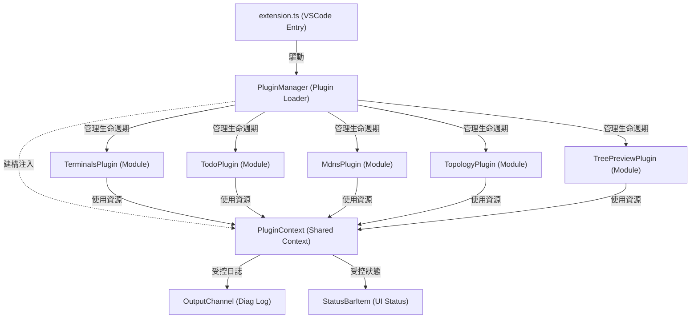

> **狀態 (Status):** ✅ 已實作完成 (Implemented) — 整合釋出於 `version 0.6.0`。
>
> **對應 commit:** [`6b76ca1`](https://github.com/BizShuk/superset/commit/6b76ca1bda56ea3fabe61c291116c4cee9671436) — `feat: implement plugin architecture with mDNS discovery, topology visualization, and todo preview features`
>
> **計劃建立 (Plan authored):** [`abc09c7`](https://github.com/BizShuk/superset/commit/abc09c7f162bae06a8be96c845ab26f4c0811fcf)
>
> **驗證 (Validation):** 39 個 test file / 358 個 test case 全綠 (`vitest run`);`tsc --noEmit` 編譯乾淨。

---

# 架構演進與優化計畫 — master (Architecture Evolution & Optimization Plan)

## 1. 現有架構診斷與技術債 (Architecture Diagnosis & Technical Debt)

本專案 `superset` 是一個整合式的 `VSCode` 擴充套件，提供終端機管理、`mDNS` 服務發現、網路拓撲掃描與 `README.todo` 待辦清單等功能。經過對整體程式碼庫 (Codebase) 的深度靜態分析，診斷出以下核心架構痛點與技術債 (Technical Debt)：

- `組合根高度耦合與缺乏容錯 (Coupled Composition Root & Lack of Fault Tolerance)`：
  - `src/extension.ts` 緊密導入並註冊了 `registerTerminals`、`registerMdns`、`registerTopology` 與 `registerTodo`。若單一功能模組在初始化時發生異常（例如 `mDNS` 埠口衝突或網路權限不足），將導致整個套件無法啟用 (Activation Failure)，使無關的功能模組也無法使用。
  - 快取重置機制 (`resetHandlers`) 以簡單的閉包陣列儲存，缺乏結構化的錯誤捕捉與狀態管理。

- `巨型元件與職責不清 (God Classes & Blurry Responsibilities)`：
  - `todo` 模組中的 `TodoStore` (661 行) 同時處理檔案讀寫、語法解析、狀態維護及行數拼接修改 (Line Splicing)；`todoTreeProvider` (521 行) 混雜了視覺呈現、優先級過濾與連結解析。
  - `mdns` 模組中的 `MdnsRegistry` (487 行) 同時負責網路封包接收、快取清理、多網卡去重與生命週期調度。
  - `terminals` 模組中的 `ptyTerminalHost` (215 行) 綁定了 `vscode.Pseudoterminal` 與底層 `node-pty` 行程的控制邏輯。

- `領域模型與 UI 展示依賴耦合 (Coupling of Domain Models and UI Presentations)`：
  - `topology` 模組的 `TopologyStore` 直接維護並回傳 `TopologyNode` 樹狀陣列。此結構為 `VSCode` `TreeItem` 量身定制，使該狀態資料無法被導出或在其他非 `TreeView` 場景（如 `SVG` 渲染面板）下重用。

## 2. 複雜度量測 (Complexity Metrics)

本量測數據基於專案原始碼的靜態掃描與 `Git` 變更歷史分析：

- `專案程式碼總量`：`5566` 行 `TypeScript` 程式碼。
- `檔案長度排行 (wc -l)`：
  1. `src/todo/todoStore.ts`：`661` 行 (主導整個 `todo` 模組)
  2. `src/todo/todoTreeProvider.ts`：`521` 行 (UI 渲染與過濾邏輯混雜)
  3. `src/mdns/mdnsRegistry.ts`：`487` 行 (去重、過期與網路協調混雜)
  4. `src/todo/index.ts`：`430` 行
  5. `src/terminals/index.ts`：`260` 行
- `改動熱點 (Changelog Hotspots)`：
  - `src/extension.ts` (16次變更)
  - `src/types.ts` (13次變更，已對齊拆分)
  - `src/todo/todoTreeProvider.ts` (5次變更)
  - `src/todo/todoStore.ts` (4次變更)
  - `src/mdns/mdnsRegistry.ts` (4次變更)

## 3. 架構簡化與解耦設計 (Simplification & Decoupling Design)

為了徹底解耦組合根並提供更安全的擴充套件治理，我們設計了統一的插件式模組載入架構。全模組將實現統一的 `ExtensionPlugin` 介面，並由 `PluginManager` 負責載入與生命週期治理。

### 系統元件依賴圖 (System Component Dependency Diagram)



## 4. 目錄與模組重整方案 (Reorganization Map)

本計畫將重整主目錄結構，劃分出明確的 `plugin/` 管理目錄，並將各子模組解耦為符合單一職責原則的結構：

```tree
src/
├── extension.ts          # 擴充套件物理入口 (VSCode Main Entry)
├── shared.ts             # 基礎共用定義 (Shared Core Types)
├── resetCaches.ts        # 緩存重置輔助 (Reset Utility)
├── plugin/               # 插件管理框架 (Plugin Manager Framework)
│   ├── index.ts          # 插件治理入口 (Plugin System Entry)
│   ├── manager.ts        # 插件生命週期管理器 (PluginManager)
│   ├── context.ts        # 插件受控上下文 (PluginContext)
│   └── types.ts          # 插件合約定義 (Plugin Contract Types)
├── terminals/            # 終端機模組 (Terminals Feature)
│   ├── plugin.ts         # 終端機插件實作 (Terminals Plugin Adapter)
│   ├── coordinator.ts    # 生命週期協調器 (TerminalLifecycleCoordinator)
│   ├── ptyProcessController.ts # 進程控制器 (PTY Process Controller)
│   └── ...               # 其他解耦組件 (Registry, Stores, UI Providers)
├── todo/                 # 待辦事項模組 (Todo Feature)
│   ├── plugin.ts         # 待辦插件實作 (Todo Plugin Adapter)
│   ├── parser.ts         # Markdown 語法解析器 (Markdown Parser)
│   ├── repository.ts     # 檔案持久化庫 (File Persistence Repository)
│   └── ...               # 其他解耦組件 (Store, Filters, UI Providers)
├── mdns/                 # mDNS 服務發現模組 (mDNS Feature)
│   ├── plugin.ts         # mDNS 插件實作 (mDNS Plugin Adapter)
│   ├── parser.ts         # DNS-SD 記錄解析器 (DNS Record Parser)
│   ├── store.ts          # 服務狀態與去重庫 (State Store & Dedup Index)
│   ├── expiration.ts     # 逾期清理器 (Expiration Sweeper)
│   └── ...               # 其他解耦組件 (Registry, UI Providers)
├── topology/             # 網路拓撲掃描模組 (Topology Feature)
│   ├── plugin.ts         # 拓撲插件實作 (Topology Plugin Adapter)
│   ├── transformer.ts    # 樹狀結構轉換器 (Topology Transformer)
│   └── ...               # 其他解耦組件 (Scanner, UI Providers)
└── treePreview/          # Markdown 預覽高亮模組 (Tree Preview Feature)
    └── plugin.ts         # 預覽插件實作 (Tree Preview Plugin Adapter)
```

## 5. 插件化與可擴充性機制 (Plugin & Extensibility Mechanism)

### 核心合約設計 (Core Contract Design)

我們在 `src/plugin/types.ts` 定義統一的插件上下文與合約，以收斂模組對外部環境的直接依賴：

```typescript
export interface PluginContext {
    readonly workspaceFolder: string;
    readonly extensionUri: vscode.Uri;
    readonly workspaceState: vscode.Memento;
    log(message: string): void;
    showStatus(text: string, tooltip?: string): void;
    registerDisposable(disposable: vscode.Disposable): void;
    registerResetHandler(handler: () => void | Promise<void>): void;
}

export interface ExtensionPlugin {
    readonly id: string;
    readonly name: string;
    activate(ctx: PluginContext): void | Promise<void>;
    deactivate?(): void | Promise<void>;
    contributeMarkdownIt?(md: any): any;
}
```

### 錯誤隔離與容錯加載 (Error Isolation & Fault-Tolerant Loading)

在 `PluginManager` 內部，每個插件的載入皆被包裝在獨立的 `try-catch` 區塊中：

```typescript
export class PluginManager {
    private activePlugins = new Map<string, ExtensionPlugin>();
    private contexts = new Map<string, PluginContext>();

    async activateAll(plugins: ExtensionPlugin[], baseCtx: vscode.ExtensionContext): Promise<void> {
        for (const plugin of plugins) {
            try {
                const pCtx = this.createContext(plugin.id, baseCtx);
                await plugin.activate(pCtx);
                this.activePlugins.set(plugin.id, plugin);
                this.contexts.set(plugin.id, pCtx);
            } catch (err) {
                // 錯誤邊界 (Error Boundary)：確保個別插件初始化失敗時，不影響其他子模組啟動
                this.logError(plugin.id, err);
            }
        }
    }
}
```

## 6. 漸進式重構路徑與驗證 (Refactoring Roadmap & Verification)

本重構計畫採「分段實作、持續回歸」策略，每階段重構完畢均須確保測試通過：

### 第一階段：插件底座與 `treePreview` 移轉 (基礎建設)
- `任務`：建立 `src/plugin/` 目錄並實作 `PluginContext` 與 `PluginManager`。移轉無狀態的 `treePreview` 作為第一個驗證插件。
- `驗證`：`npm run build` 通過且 Markdown 預覽樹高亮正常。

### 第二階段：`todo` 模組拆分與插件化 (巨型組件解耦)
- `任務`：依據 `plans/architecture-superset.md` 提取 `TodoParser`、`TodoRepository`、`TodoFilter`，建立 `src/todo/plugin.ts`。
- `驗證`：執行 `npm test`（`todo` 模組的 65 個測試皆綠燈）。

### 第三階段：`mdns` 模組拆分與插件化 (網路傳輸與狀態分離)
- `任務`：依據 `plans/architecture-mdns.md` 提取 `MdnsParser`、`MdnsStore` 與 `MdnsExpirationSweeper`，建立 `src/mdns/plugin.ts`。
- `驗證`：執行 `npm test`（`mdns` 相關測試通過，無狀態殘留）。

### 第四階段：`terminals` 模組拆分與插件化 (複雜狀態與進程解耦)
- `任務`：依據 `plans/architecture-terminals.md` 提取 `TerminalLifecycleCoordinator`、`PtyProcessController`、`GroupRepository`，建立 `src/terminals/plugin.ts`。
- `驗證`：執行 `npm test`（`terminals` 相關之 100+ 測試通過，包含 PTY 模擬測試）。

### 第五階段：`topology` 模組拆分與插件化 (轉換層抽取與命名對齊)
- `任務`：依據 `plans/architecture-topology.md` 提取 `TopologyTransformer` 並對齊命名風格。
- `驗證`：執行 `npm test`，確保本地 IP 衍生與拓撲組裝功能正常。

### 第六階段：最終整合與 `extension.ts` 清理 (組合根收斂)
- `任務`：移除 `extension.ts` 中對各功能子模組實作的直接依賴，改為透過 `PluginManager` 載入所有模組。
- `驗證`：執行全專案的 `266` 個測試案例皆綠燈，並在 VSCode 測試環境中進行冒煙測試。

## 7. 風險與回滾策略 (Risks & Rollback)

- `風險一：重寫 AST 造成 Markdown 原始排版損壞`：
  - `防範`：`TodoParser` 測試中應增加包含自訂代碼塊與複雜空行的 `README.todo` 範例，驗證寫回時非 Todo 項目內容 100% 保持一致。
- `風險二：檔案監聽 (File Watcher) 循環觸發狀態更新`：
  - `防範`：在 `TodoRepository` 寫入時暫時阻斷監聽事件，或在載入時比較內容雜湊值，無變更時不發送變更事件。
- `風險三：插件生命週期銷毀不全造成記憶體洩漏 (Memory Leak)`：
  - `防範`：`PluginContext` 接管所有 disposable 註冊，並在 `deactivate` 時由管理器強制執行 `dispose`，不依賴插件主動清理。
- `回滾機制`：
  - 每完成一個子階段的模組重構，即提交一次綠燈 Git commit。
  - 當遇到不可修復之編譯或執行錯誤，立即執行 `git reset --hard HEAD` 回滾至上一個穩定提交點。
