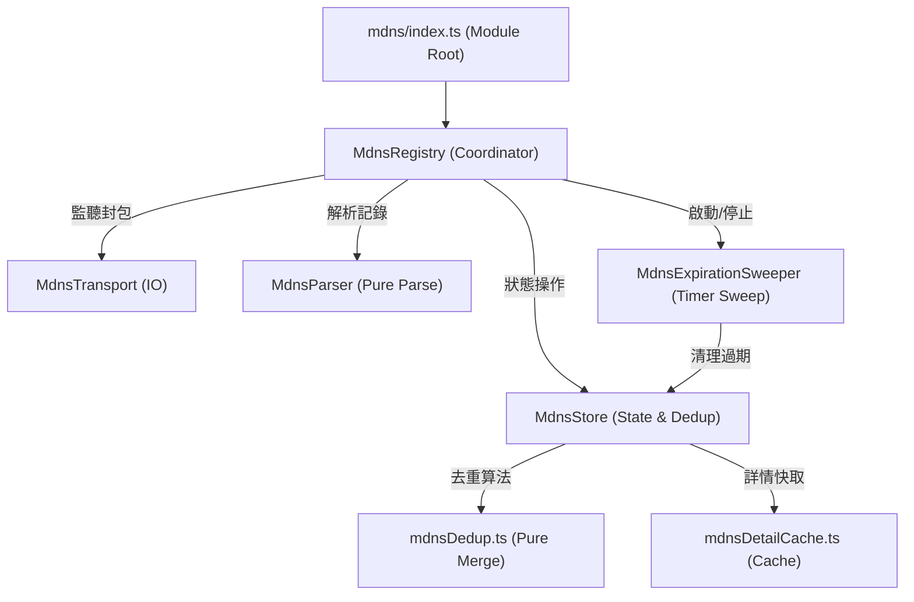

# 架構演進與優化計畫 — mdns (Architecture Evolution & Optimization Plan)

## 1. 現有架構診斷與技術債 (Architecture Diagnosis & Technical Debt)

本專案是一個 `VSCode` 擴充功能 (VSCode Extension)，其中 `mdns` 模組負責同網段下以 `DNS-SD/mDNS` 廣播的服務發現。經過對現有程式碼的分析，診斷出以下主要技術債 (Technical Debt)：

- `單一職責原則違背 (Single Responsibility Principle Violation)`：
  - `MdnsRegistry` ([mdnsRegistry.ts](file:///Users/shuk/projects/tmp/superset/src/mdns/mdnsRegistry.ts)) 同時承載了生命週期管理、觀察者訂閱管理、`DNS` 封包中各種記錄類型的解析與組裝、多筆記錄的防抖合併邏輯、基於網路端點的去重邏輯、以及定時的過期掃描清理。這使得整個類別承載了過多職責，違反了單一職責原則。
  - `MdnsTreeProvider` ([mdnsTreeProvider.ts](file:///Users/shuk/projects/tmp/superset/src/mdns/mdnsTreeProvider.ts)) 內部也包含了對服務分組與排序的業務邏輯，將其與 `VSCode` 的 `TreeItem` 視覺介面綁定，限制了邏輯的重用性。

- `緊密相依的防抖與狀態變更邏輯`：
  - `flushPending` 中同時包含了防抖計時器 `setTimeout`、去重新舊 Key 映射更新、別名合併以及 `DetailCache` 清理。這些邏輯盤根錯節，導致對去重邏輯進行單元測試時，必須模擬完整的封包接收流程，增加了測試的複雜度。

- `時間與計時器管理混雜`：
  - 服務的逾期清理 `expireStale` 和 `coalesceTimer` 直接在 `MdnsRegistry` 內部使用 `setInterval` 和 `setTimeout` 來驅動。這使得時間感知邏輯與資料狀態層混在一起，難以單獨對清理週期與邊界條件進行精確控制的單元測試。

## 2. 複雜度量測 (Complexity Metrics)

針對現有的 `mdns` 模組，以下為客觀的程式碼規模與訊號數據：

- `程式碼規模 (Lines of Code)`：
  - `src/mdns/mdnsRegistry.ts`：`488` 行。
  - `src/mdns/` 目錄總行數：約 `992` 行，`mdnsRegistry.ts` 佔了約 `50%`。
  - 核心功能在 `mdnsRegistry.ts` 內的行數分佈：
    - `封包解析與記錄類型處理` (L185-330)：`145` 行。
    - `防抖、合併與去重邏輯` (L333-428)：`96` 行。
    - `逾期服務清理掃描` (L458-481)：`24` 行。
    - `詳細資訊快取管理` (L430-449)：`20` 行。

- `改動熱點 (Changelog Hotspots)`：
  - 在之前的去重優化與過期機制調整中，`src/mdns/mdnsRegistry.ts` 被頻繁修改，顯示其狀態與邏輯過於集中，修改容易產生預期外的副作用。

## 3. 架構簡化與解耦設計 (Simplification & Decoupling Design)

為了解決 `mdns` 模組的技術債，我們設計了以下分層解耦方案，將複雜的單一類別拆解為高內聚、低耦合的元件：

- `MdnsParser (解析層)`：純函式類別，僅負責將 DNS-SD 記錄 (PTR, SRV, TXT, A, AAAA) 轉換為 `MutableService` 結構，或者就地更新 `MutableService` 的內容。此層級不儲存任何狀態，也不直接與網路傳輸層交互。
- `MdnsStore (狀態與去重層)`：管理記憶體中的 `MdnsService` 列表，維護 `byNetworkKey` 和 `canonKeyToNk` 等次索引，並呼叫 `mergeServices` 來封裝端點合併與去重邏輯。
- `MdnsExpirationSweeper (逾期清理層)`：專注於過期時間檢查，接受 `MdnsStore` 與 `ClockSource` 依賴，進行定時掃描並調用 `MdnsStore` 的刪除方法。
- `MdnsRegistry (協調層/組合根)`：負責連接 `MdnsTransport`、`MdnsStore`、`MdnsExpirationSweeper`，將 transport 收到的封包派發給防抖合併邏輯與 `MdnsParser`，最後寫入 `MdnsStore`，並向 VSCode 提供統一的 `onDidChange` 狀態變更事件。

以下為優化後的模組關聯圖 (Dependency Diagram)：



## 4. 目錄與模組重整方案 (Reorganization Map)

重整後的 `src/mdns/` 目錄樹將具備更單一的職責劃分：

```tree
src/mdns/
├── index.ts          # 模組入口與 VSCode 命令註冊 (Module Entry)
├── types.ts          # 資料模型定義 (Domain Models)
├── mdnsRegistry.ts   # 協調層與生命週期管理 (Coordinator & Lifecycle)
├── store.ts          # 服務狀態管理與去重索引 (State Store & Dedup Index)
├── parser.ts         # DNS-SD 記錄解析器 (DNS Record Parser)
├── expiration.ts     # 服務過期掃描器 (Expiration Sweeper)
├── mdnsDedup.ts      # 去重與合併演算法 (Dedup Utilities)
├── mdnsDetailCache.ts # 詳情快取 (Detail Cache)
├── mdnsTreeProvider.ts # VSCode TreeView 轉譯 (UI Data Provider)
└── mdnsTreeSpec.ts   # 樹狀節點渲染規格 (Tree View Rendering Spec)
```

### 舊至新元件映射表 (Migration Map)

| 原始檔案與區塊 | 目標檔案 (Target File) | 職責與調整說明 |
| --- | --- | --- |
| `mdnsRegistry.ts` L22-37, L68-85 | `types.ts` / `parser.ts` | `MutableService` 結構定義與 `freeze` 輔助函式移動至解析層。 |
| `mdnsRegistry.ts` L39-66 | `parser.ts` | `extractSubtype` 與 `stripSubtype` 轉為純函式解析工具。 |
| `mdnsRegistry.ts` L185-330 | `parser.ts` (`MdnsParser`) | 解析 DNS-SD 的各種 Record，傳入 `MutableService` 進行就地更新。 |
| `mdnsRegistry.ts` L95, L105-107, L146-155, L159-166, L430-449 | `store.ts` (`MdnsStore`) | 封裝 `services` 狀態, 去重索引 `byNetworkKey` 和 `canonKeyToNk`，以及 `DetailCache` 快取。提供 `add`, `update`, `delete`, `getAll`, `getByKey` 接口。 |
| `mdnsRegistry.ts` L126-129, L140-142, L458-481 | `expiration.ts` (`MdnsExpirationSweeper`) | 抽出定時掃描器與過期篩選邏輯，呼叫 `MdnsStore` 進行批次刪除與 `DetailCache` 的失效清理。 |
| `mdnsRegistry.ts` 剩餘部分 (L119-145, L170-183, L333-428) | `mdnsRegistry.ts` (`MdnsRegistry`) | 僅保留防抖定時器 `coalesceTimer` 與對 `MdnsTransport`、`MdnsStore` 的調度邏輯，作為組合器。 |

## 5. 插件化與可擴充性機制 (Plugin & Extensibility Mechanism)

- `插件化必要性評估`：
  - 由於 `superset` 目前模組數量小於 `5` 個，且無動態加載第三方套件的需求，引入複雜的外掛註冊機制屬於過度設計 (Over-engineering)。
  
- `簡化機制設計`：
  - 模組將繼續實作統一的靜態生命週期介面 `FeatureModule`，使主入口 `extension.ts` 不需要關心 `mdns` 的內部架構優化，只需調用 `register` 獲取生命週期控制權：
    ```typescript
    // src/shared.ts
    export interface FeatureModule {
        register(ctx: FeatureContext): FeatureHandle;
    }
    ```

## 6. 漸進式重構路徑與驗證 (Refactoring Roadmap & Verification)

本重構遵循「小步前進、持續驗證」原則，確保每一步都具有完整的測試安全網。

### 第一階段：補充特徵測試 (Characterization Tests) — 安全網建置
- `任務`：在重構前，確保既有的 `MdnsRegistry` 測試在各種去重與過期清理場景下有足夠的覆蓋率。
- `驗證方式`：
  - 確保當前測試 `npm test` 全數通過（當前為 `195` 個 `cases` 綠燈，其中包含了去重與過期專門測試）。

### 第二階段：分離純解析函式 (Extract MdnsParser)
- `任務`：建立 `src/mdns/parser.ts`，將 `extractSubtype`、`stripSubtype`、`handlePtr`、`handleSrv`、`handleTxt` 以及 `handleAddress` 等解析邏輯移動至此檔案。
- `驗證方式`：
  - 針對 `MdnsParser` 內部的解析函式編寫獨立的單元測試，驗證傳入各種 DNS 記錄時，所產生的 `MutableService` 屬性是否完全符合預期。
  - 執行 `npm run build` 確保型別正確。

### 第三階段：建立狀態庫 (Create MdnsStore)
- `任務`：建立 `src/mdns/store.ts`，將 `services` 狀態、去重映射快取 `byNetworkKey` 和 `canonKeyToNk`，以及 `DetailCache` 抽離。
- `驗證方式`：
  - 為 `MdnsStore` 內的 `add`、`update`、`delete`、`getByKey` 等方法編寫單元測試，特別驗證在傳入相同網路端點 (相同 `NetworkKey`) 時，是否能自動調用 `mergeServices` 完成合併與別名追加，且無重複實例。

### 第四階段：分離過期清理器 (Separate Expiration Sweeper)
- `任務`：建立 `src/mdns/expiration.ts`，將定時掃描器 `expireStale` 以及相關的間隔計時器抽離。
- `驗證方式`：
  - 注入 `Mock` 時鐘，驗證在時間推移後，`MdnsExpirationSweeper` 能正確呼叫 `MdnsStore.delete` 來移除超出 `ttl * 3` 寬限期的服務。

### 第五階段：整合與最終測試
- `任務`：在 `src/mdns/mdnsRegistry.ts` 中引進上述元件進行最終接線與重新裝配。
- `驗證方式`：
  - 跑完專案的所有單元測試，確保 100% 回歸綠燈。
  - 在 VSCode 開發環境下，透過 `Superset: Reset All Caches` 驗證 mDNS 重置與快取清除邏輯正常工作。

## 7. 風險與回滾策略 (Risks & Rollback)

- `風險一：防抖合併的時序偏差導致頻繁重新整理 (Debounce Timing Deviation)`：
  - `原因`：若將防抖時鐘從 `MdnsRegistry` 中剝離或重構不當，可能導致一個 packet 中的 PTR/SRV 記錄在不同的 tick 被提交至 `MdnsStore`，引發 UI 重複刷新。
  - `防範策略`：維持 `coalesceTimer` 與防抖調度在 `MdnsRegistry` 協調層，所有暫存記錄統一以批次形式提交給 `MdnsStore` 更新。

- `風險二：別名與主機變更時去重索引殘留 (Index Leak)`：
  - `原因`：當服務的埠號變更或被逾期清理時，若未徹底清除 `byNetworkKey` 或 `canonKeyToNk` 內的舊映射，會導致後續相同端點的服務無法再註冊。
  - `防範策略`：在 `MdnsStore` 的測試中特別加入「服務埠號變更」與「過期後再次上線」的測試場景，驗證索引的一致性。

- `回滾機制 (Rollback Strategy)`：
  - 每次重構步驟的 `Git` 提交粒度控制在單一任務之內。
  - 若在任何驗證階段發現異常，立即執行 `git reset --hard HEAD` 回滾到前一個綠燈提交點。
