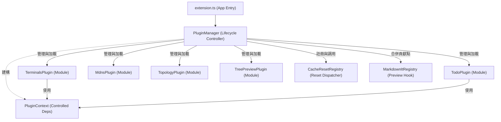

# 架構演進與優化計畫 — pluginization (Architecture Evolution & Optimization Plan)

## 1. 現有架構診斷與技術債 (Architecture Diagnosis & Technical Debt)

本專案 `superset` 是一個包含多項子功能的 `VSCode` 擴充功能 (VSCode Extension)。經過分析與診斷，發現以下在整體生命週期治理與擴充性方面的架構痛點與技術債 (Technical Debt)：

- `強耦合的組合根 (Coupled Composition Root)`：
  - `src/extension.ts` ([extension.ts](file:///Users/shuk/projects/tmp/superset/src/extension.ts)) 直接導入並呼叫了 `registerTerminals`、`registerMdns`、`registerTopology` 與 `registerTodo`。這種強編碼的依賴關係導致每次新增或移除功能模組時，都必須直接修改組合根，違反了開放封閉原則 (Open-Closed Principle)。
  - `treePreview` 模組的生命週期與其他模組不同，其 `createTreePreviewExtension()` 返回值被硬編碼在 `activate()` 的結尾返回，這導致主入口函數的返回型別受限於該特定模組，降低了多模組協同的彈性。

- `零散的生命週期與狀態管理 (Scattered Lifecycle & State Management)`：
  - 快取重置機制 (`resetHandlers`) 以簡單的閉包陣列 `(() => void | Promise<void>)[]` 儲存，且直接寫在 `extension.ts` 中。這導致快取重置的錯誤處理、同步與時序管理缺乏統一控制，若單一 `handler` 拋出異常，可能會影響其他模組的重置程序。
  - 生命週期的清理 (Disposal) 僅依賴 `subscriptions` 陣列。各功能模組在註冊時需手動將 `disposable` 推進傳入的 `subscriptions`，無法對各模組進行精細的停用 (Deactivation)、重新啟用 (Re-activation) 或單獨的效能監控。

- `缺乏錯誤隔離與容錯機制 (Lack of Error Isolation & Fault Tolerance)`：
  - 由於模組是同步且順序載入的，如果其中一個模組（例如 `mdns` 或 `topology` 在初始化時因為系統環境問題）拋出未捕獲的錯誤，將會直接導致整個擴充功能啟動失敗 (Activation Failure)，使無關的模組（如 `terminals` 和 `todo`）也無法使用。

## 2. 複雜度量測 (Complexity Metrics)

針對現有的專案結構與模組關係，客觀的複雜度與依賴性量測數據如下：

- `模組規模與分佈 (Module Sizes & Distribution)`：
  - 全專案 `TypeScript` 總程式碼行數為 `5566` 行。
  - 功能模組包含五個子系統，各佔程式碼比例為：
    - `terminals`：`1850` 行 (33.2%)
    - `todo`：`1660` 行 (29.8%)
    - `mdns`：`992` 行 (17.8%)
    - `topology`：`566` 行 (10.2%)
    - `treePreview`：`100` 行 (1.8%)
    - `extension/shared/reset`：`398` 行 (7.2%)

- `耦合度量測 (Coupling Metrics)`：
  - 扇入 (Fan-in)：`src/extension.ts` 被擴充功能框架直接調用，無內部扇入。
  - 扇出 (Fan-out)：`src/extension.ts` 直接依賴 `5` 個核心模組入口，且直接相依於 `vscode` 命名空間中的 `OutputChannel`、`StatusBarItem`、`ExtensionContext` 等多個類別。
  - 依賴路徑長度：組合根直接控制了所有特性的組裝，初始化控制鏈長度為 `1`，缺乏緩衝與生命週期狀態機。

- `改動頻繁度 (Changelog Frequency)`：
  - `src/extension.ts` 累計修改次數為 `16` 次，是整個程式庫中改動次數最多的檔案，每次功能的增刪、快取的清理調整，皆會造成此檔案的變更衝突。

## 3. 架構簡化與解耦設計 (Simplification & Decoupling Design)

為了解耦組合根並提供更安全的擴充功能治理，我們設計了統一的插件式模組載入架構：

- `ExtensionPlugin (統一插件介面)`：
  - 定義每個模組的註冊契約。插件必須宣告其 `id`、`name`、初始化方法 `activate(ctx)` 以及銷毀方法 `deactivate()`。
  - 支援可選的擴充點機制，例如 `markdownItPlugins` 貢獻點，使 `treePreview` 能以宣告式貢獻其渲染器。

- `PluginManager (插件管理器)`：
  - 負責統一調度所有插件的載入、卸載與快取重置。
  - 實現錯誤邊界 (Error Boundary)，當個別插件在 `activate` 階段失敗時，捕獲異常、記錄日誌並標記該插件為失效狀態，但不中斷其他插件的初始化。

- `PluginContext (插件上下文)`：
  - 提供插件運行所需的受控資源，包括 `workspaceFolder`、日誌記錄器、受控的 `StatusBar` 介面，並限制插件直接存取全域 `subscriptions`，改由 `PluginManager` 統一託管生命週期。

以下為解耦後的插件治理架構圖：



## 4. 目錄與模組重整方案 (Reorganization Map)

重整後的架構設計將調整 `src/` 的核心層級結構，引進插件管理器與模組宣告檔：

```tree
src/
├── extension.ts          # 擴充功能物理入口 (VSCode Main Entry)
├── shared.ts             # 基礎共用定義 (Shared Core Types)
├── plugin/
│   ├── index.ts          # 插件治理模組入口 (Plugin System Entry)
│   ├── manager.ts        # 插件管理器 (PluginManager)
│   ├── context.ts        # 插件上下文封裝 (PluginContext)
│   └── types.ts          # 插件生命週期介面定義 (Plugin Types)
├── terminals/            # 終端機模組 (Terminals Feature)
│   └── plugin.ts         # 終端機插件實作 (Terminals Plugin Adapter)
├── todo/                 # 待辦事項模組 (Todo Feature)
│   └── plugin.ts         # 待辦事項插件實作 (Todo Plugin Adapter)
├── mdns/                 # mDNS 模組 (mDNS Feature)
│   └── plugin.ts         # mDNS 插件實作 (mDNS Plugin Adapter)
├── topology/             # 拓撲掃描模組 (Topology Feature)
│   └── plugin.ts         # 拓撲插件實作 (Topology Plugin Adapter)
└── treePreview/          # 預覽模組 (Tree Preview Feature)
    └── plugin.ts         # 預覽插件實作 (Tree Preview Plugin Adapter)
```

### 舊至新元件映射表 (Migration Map)

| 原始檔案與區塊 | 目標檔案 (Target File) | 職責與調整說明 |
| --- | --- | --- |
| `src/extension.ts` L50-56 (同步調用 register) | `src/plugin/manager.ts` | 改為透過 `PluginManager` 以異步與帶有錯誤防護的方式遍歷載入插件。 |
| `src/extension.ts` L60-78 (快取重置) | `src/plugin/manager.ts` | 快取重置改由 `PluginManager.resetAll()` 統一調度與記錄，移除 `resetHandlers` 暴露。 |
| `src/extension.ts` L122-125 (MarkdownIt返回) | `src/plugin/manager.ts` | 透過 `PluginManager.getMarkdownPlugins()` 收集各插件的貢獻，合併後統一傳回給 `VSCode`。 |
| `src/shared.ts` | `src/plugin/types.ts` | 廢棄 `FeatureContext`，改用符合單一依賴原則的 `PluginContext` 與 `ExtensionPlugin` 介面。 |
| 各模組的 `register(ctx)` 入口 | 各模組 the `plugin.ts` | 封裝成繼承 `ExtensionPlugin` 的子類別，將 `disposable` 納入生命週期規範。 |

## 5. 插件化與可擴充性機制 (Plugin & Extensibility Mechanism)

- `可擴充性介面設計 (Extensibility Interface)`：
  定義核心生命週期介面，位於 `src/plugin/types.ts`：
  ```typescript
  export interface PluginContext {
      readonly workspaceFolder: string;
      readonly extensionUri: vscode.Uri;
      readonly globalState: vscode.Memento;
      readonly workspaceState: vscode.Memento;
      log(message: string): void;
      showStatus(text: string, tooltip?: string): void;
      registerDisposable(disposable: vscode.Disposable): void;
      registerResetHandler(handler: () => void | Promise<void>): void;
  }

  export interface ExtensionPlugin {
      readonly id: string;
      readonly name: string;
      activate(ctx: PluginContext): void | Promise<void>;
      deactivate?(): void | Promise<void>;
      contributeMarkdownIt?(md: any): any;
  }
  ```

- `錯誤邊界載入演算法 (Error-Bounded Activation Algorithm)`：
  在 `PluginManager` 內部，以隔離方式初始化各個插件：
  ```typescript
  export class PluginManager {
      private activePlugins = new Map<string, ExtensionPlugin>();
      private contexts = new Map<string, PluginContext>();

      async activateAll(plugins: ExtensionPlugin[], baseCtx: vscode.ExtensionContext): Promise<void> {
          for (const plugin of plugins) {
              try {
                  const pCtx = this.createContext(plugin.id, baseCtx);
                  await plugin.activate(pCtx);
                  this.activePlugins.set(plugin.id, plugin);
                  this.contexts.set(plugin.id, pCtx);
              } catch (err) {
                  // 錯誤邊界：單一插件失敗，不影響其餘插件載入
                  baseCtx.workspaceState.update(`plugin.failed.${plugin.id}`, true);
                  console.error(`[PluginManager] Failed to activate plugin ${plugin.id}:`, err);
              }
          }
      }
  }
  ```

## 6. 漸進式重構路徑與驗證 (Refactoring Roadmap & Verification)

重構將拆分為小步驟進行，確保現有單元測試與功能不中斷。

### 第一階段：基礎介面與插件上下文實作
- `任務`：建立 `src/plugin/types.ts`、`src/plugin/context.ts` 與 `src/plugin/manager.ts`。
- `驗證方式`：
  - 針對 `PluginManager` 的載入與錯誤處理撰寫單元測試。
  - 驗證當單一模擬插件拋出異常時，其餘插件能被正確初始化且無漏損。

### 第二階段：移轉 treePreview 至新架構
- `任務`：將最簡單且無狀態的 `treePreview` 封裝為 `TreePreviewPlugin`，並透過 `PluginManager` 的 `contributeMarkdownIt` 接口載入。
- `驗證方式`：
  - 執行 `npm run build` 確認編譯通過。
  - 測試 Markdown 預覽，驗證 `tree` 區塊的渲染依然正常運作。

### 第三階段：模組化遷移 (Todo & Mdns)
- `任務`：為 `todo` 與 `mdns` 模組建立 `plugin.ts` 適配器，移轉其 `register` 邏輯。
- `驗證方式`：
  - 移除原 `index.ts` 中的 `register` 並替換為插件導入。
  - 執行 `npm test` 確保現有 `195` 個測試案例全數通過，無功能退化。

### 第四階段：模組化遷移 (Terminals & Topology)
- `任務`：為 `terminals` 與 `topology` 模組建立插件適配器，完成全模組的插件化改造。
- `驗證方式`：
  - 移去 `src/extension.ts` 對各功能元件的直接依賴，使其僅載入 `PluginManager`。
  - 運行擴充功能測試環境，手動點擊各面板以驗證命令切換、UI 狀態整合正常。

## 7. 風險與回滾策略 (Risks & Rollback)

- `風險一：模組銷毀不乾淨導致記憶體洩漏 (Memory Leak)`：
  - `原因`：插件在 `deactivate` 時若未將訂閱的事件監聽器（如 `FileSystemWatcher`、`mDNS` 連線）正確銷毀，會殘留在 VSCode 程序中。
  - `防範策略`：`PluginContext` 內部使用受控的 `subscriptions` 數組。當插件被停用時，`PluginManager` 強制釋放該插件註冊的所有 `disposable` 物件，不依賴插件自行手動清理。

- `風險二：異步初始化競爭條件 (Race Condition)`：
  - `原因`：若模組之間存在隱式依賴關係（例如某個命令需要另一個模組先註冊完畢），異步載入可能導致呼叫時命令未找到。
  - `防範策略`：模組載入應保持嚴格的拓撲順序（例如底層狀態模組優先於 UI 模組載入）。在 `PluginManager` 中維護靜態的載入優先級，並在所有插件 `activate` 完畢後，再對外宣告擴充功能準備就緒。

- `回滾機制 (Rollback Strategy)`：
  - 每完成一個特性的插件化遷移，均提交一個獨立的 Git commit。
  - 一旦在 Extension Host 測試中發現異常，立即執行 `git reset --hard HEAD` 回滾到前一個已驗證的提交。
