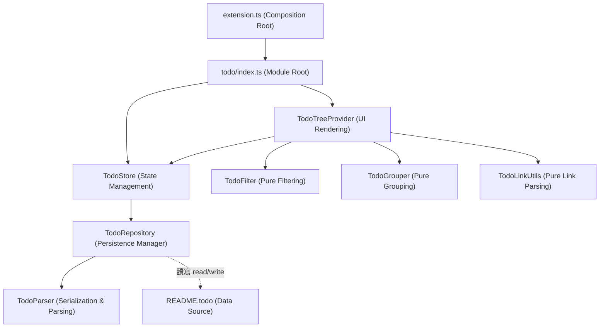

# 架構演進與優化計畫 — superset (Architecture Evolution & Optimization Plan)

## 1. 現有架構診斷與技術債 (Architecture Diagnosis & Technical Debt)

本專案是一個 `VSCode` 擴充功能 (VSCode Extension)，用以提供終端機面板管理、mDNS 服務發現、網路拓撲掃描以及 `README.todo` 待辦清單管理。經過對現有程式碼的分析，診斷出以下主要技術債 (Technical Debt)：

- `單一職責原則違背 (Single Responsibility Principle Violation)`：
  - `TodoStore` ([todoStore.ts](file:///Users/shuk/projects/tmp/superset/src/todo/todoStore.ts)) 承載了過多職責。它同時處理了檔案讀寫 (`fs/promises`)、基於正規表示式 (Regular Expression) 的 Markdown 語法解析、記憶體中的狀態管理 (In-Memory State Management) 以及針對 Markdown 檔案的行數拼接修改 (Line-by-line Splicing and Rewriting)。這導致任何 Markdown 格式的調整或功能擴充都需要修改此檔案，且難以進行獨立單元測試 (Unit Testing)。
  - `TodoTreeProvider` ([todoTreeProvider.ts](file:///Users/shuk/projects/tmp/superset/src/todo/todoTreeProvider.ts)) 同時處理了 `VSCode` `TreeView` 的節點轉譯、依據優先級 (Priority) 與完成狀態的過濾邏輯 (Filtering Logic)，以及超連結 (Hyperlink) 的提取與解析工具函式。
  - `MdnsRegistry` ([mdnsRegistry.ts](file:///Users/shuk/projects/tmp/superset/src/mdns/mdnsRegistry.ts)) 同時處理了網路封包解析 (DNS Packet Parsing)、逾期快取清除 (Cache Expiration) 與重複服務合併 (Service Coalescing) 的邏輯。

- `高耦合度的組合根 (High Coupling in Composition Root)`：
  - `extension.ts` ([extension.ts](file:///Users/shuk/projects/tmp/superset/src/extension.ts)) 直接導入了所有功能模組 (`terminals`, `mdns`, `topology`, `todo`, `treePreview`) 並執行手動註冊。這阻礙了未來新增新模組或對既有模組進行開關/外掛化 (Pluggability) 的便利性。

- `硬編碼的持久化邏輯 (Hardcoded Persistence)`：
  - 待辦事項模組強依賴於單一的 `README.todo` 檔案路徑。檔案的操作直接嵌在業務狀態管理中，無法輕易替換成其他儲存媒介或支援多工作區設定。

- `脆弱的檔案修改模式 (Fragile File IO Pattern)`：
  - `TodoStore` 中有大量的 `lines.splice()` 操作（例如 `todoStore.ts` 中的 `toggle`、`updatePriority`、`moveTodo` 等方法），這些方法仰賴在載入時計算出的 `line` 索引。若檔案在外部被編輯，或者記憶體狀態未即時同步，這種基於行數的就地修改極易發生資料錯位或覆蓋毀損 (Data Corruption) 的風險。

## 2. 複雜度量測 (Complexity Metrics)

以下為針對現有程式碼庫 (Codebase) 進行的量測與客觀訊號數據：

- `程式碼規模 (Lines of Code)`：
  - 本專案 `TypeScript` 程式碼總計 `5566` 行。
  - 前五大巨型檔案與長度：
    1. `src/todo/todoStore.ts`：`661` 行。
    2. `src/todo/todoTreeProvider.ts`：`521` 行。
    3. `src/mdns/mdnsRegistry.ts`：`487` 行。
    4. `src/todo/index.ts`：`430` 行。
    5. `src/terminals/index.ts`：`260` 行。
  - `src/todo/` 目錄下程式碼總數約占整體功能的 `30%`。

- `改動熱點 (Changelog Hotspots)`：
  - 根據 `Git` 提交紀錄分析，`src/extension.ts` (16次)、`src/types.ts` (13次，已拆分)、`src/todoTreeProvider.ts` (5次) 以及 `src/todoStore.ts` (4次) 為最頻繁修改的檔案，顯示其核心邏輯與 `UI` 邏輯緊密交織。

## 3. 架構簡化與解耦設計 (Simplification & Decoupling Design)

為了解決 `todo` 模組的技術債，我們設計了以下分層解耦方案，將複雜的單一類別拆解為高內聚、低耦合的元件：

- `TodoParser (解析層)`：純函式類別，僅負責將 Markdown 字串解析成 `TodoItem` 抽象語法樹 (Abstract Syntax Tree, AST)，以及將 `TodoItem` 陣列重新序列化為 Markdown 文字。不包含任何檔案 `I/O` 或狀態，提升可測試性。
- `TodoRepository (持久化層)`：負責讀取與寫入 `README.todo` 檔案。呼叫 `TodoParser` 做序列化，並監聽檔案變更。
- `TodoStore (狀態層)`：維護記憶體中的 `TodoItem` 狀態，向外提供訂閱介面 (Observer Pattern)，接收 `UI` 層的操作請求並將其派發給 `TodoRepository`。
- `TodoFilter & TodoGrouper (業務過濾與分群邏輯)`：抽離 `TodoTreeProvider` 內部的過濾與分組邏輯，實作為純函式，以便對其撰寫詳盡的單元測試。

以下為優化後的模組關聯圖 (Dependency Diagram)：



## 4. 目錄與模組重整方案 (Reorganization Map)

重整後的 `src/todo/` 目錄樹將具備更單一的職責劃分：

```tree
src/todo/
├── index.ts          # 模組入口與 VSCode 命令註冊 (Module Entry)
├── types.ts          # 資料模型模型定義 (Domain Models)
├── todoStore.ts      # 記憶體狀態管理 (State Store)
├── repository.ts     # 檔案存取與監聽 (File Persistence)
├── parser.ts         # Markdown 語法解析器 (Markdown Parser)
├── treeProvider.ts   # VSCode TreeView 轉譯 (UI Data Provider)
├── filter.ts         # 過濾與分組邏輯 (Filtering & Grouping)
├── linkUtils.ts      # 超連結處理工具 (Link Utilities)
└── badge.ts          # 狀態列徽章計算 (Badge Helper)
```

### 舊至新元件映射表 (Migration Map)

| 原始檔案與區塊 | 目標檔案 (Target File) | 職責與調整說明 |
| --- | --- | --- |
| `todoStore.ts` L51-156 (`load`) | `parser.ts` (`TodoParser.parse`) | 將 Markdown 文字解析為結構化 `TodoItem[]` 的純演算法，無檔案 `I/O`。 |
| `todoStore.ts` L158-648 (編輯/寫入邏輯) | `parser.ts` (`TodoParser.serialize`) | 重構行數修改邏輯，改為「修改 AST 後整體序列化輸出」以防行數錯位。 |
| `todoStore.ts` L40-50, L158-182 (檔案讀寫) | `repository.ts` (`TodoRepository`) | 負責 `readFile` 與 `writeFile` 的調度，以及 `FileSystemWatcher` 的整合。 |
| `todoStore.ts` L11-39, L650-662 (狀態與訂閱) | `todoStore.ts` (`TodoStore`) | 保留 `listeners` 訂閱機制，純化為記憶體狀態庫。 |
| `todoTreeProvider.ts` L393-464 (Filter) | `filter.ts` (`applyPriorityFilter`, `filterCompleted`) | 提取為純過濾函式，消除對 `VSCode` `API` 的直接依賴。 |
| `todoTreeProvider.ts` L239-344 (Grouping) | `filter.ts` (`buildPriorityGroups`, `buildFileGroups`) | 提取為純分組函式。 |
| `todoTreeProvider.ts` L466-520 (Link) | `linkUtils.ts` (`extractLink`, `cleanLabelText`, `resolveTodoLink`) | 提取為獨立超連結工具包。 |
| `todoTreeProvider.ts` 剩餘部分 (TreeView) | `treeProvider.ts` (`TodoTreeProvider`) | 僅負責與 `VSCode` `TreeItem` `API` 做視覺對接（圖示、狀態、上下文選單）。 |

## 5. 插件化與可擴充性機制 (Plugin & Extensibility Mechanism)

- `插件化必要性評估`：
  - 由於 `superset` 目前功能模組數量僅 `5` 個，且皆由同一個專案本體所管理，目前並無支援第三方外部載入或動態載入的業務需求。因此，設計一個動態的插件載入器屬於過度設計 (Over-engineering)。
  - 然而，為了簡化組合根 `extension.ts` 並防止各功能模組與主入口強耦合，有必要引進靜態生命週期介面，來達成模組化 (Modularization) 治理。

- `簡化機制設計`：
  - 為所有功能模組定義統一的生命週期介面：
    ```typescript
    // src/shared.ts
    export interface FeatureModule {
        register(ctx: FeatureContext): FeatureHandle;
    }

    export interface FeatureHandle {
        dispose(): void;
    }
    ```
  - 這可以讓 `extension.ts` 簡化為以下靜態清單遍歷，使未來新增模組時不需修改 `extension.ts` 的核心組裝逻辑，僅需在清單中註冊即可：
    ```typescript
    const modules: FeatureModule[] = [
        terminalsModule,
        mdnsModule,
        topologyModule,
        todoModule,
    ];

    for (const m of modules) {
        subscriptions.push(m.register(ctx));
    }
    ```

## 6. 漸進式重構路徑與驗證 (Refactoring Roadmap & Verification)

本重構遵循「小步前進、持續驗證」原則，確保每一步都具有完整的測試安全網。

### 第一階段：補充特徵測試 (Characterization Tests) — 安全網建置
- `任務`：在重構前，針對既有的 `TodoStore` 和 `TodoTreeProvider` 邏輯確認有充足的黑箱單元測試。
- `驗證方式`：
  - 確保當前測試 `npm test` 全數通過（目前為 `266` 個 `cases` 綠燈）。
  - 特別確認對層級 `checkbox`、`bare list`、外部連結等各種邊界情況已在 `test/todoStore.test.ts` 中進行覆蓋。

### 第二階段：分離純函式工具包
- `任務`：將超連結解析工具與過濾/分組邏輯移至 `linkUtils.ts` 和 `filter.ts`。
- `驗證方式`：
  - 移動後，更新 `TodoTreeProvider` 的引用。
  - 為 `filter.ts` 與 `linkUtils.ts` 內的純函式補充直接的單元測試，執行 `npm run build` 確認型別正確。

### 第三階段：Markdown 解析器抽離
- `任務`：從 `TodoStore` 中提取 `TodoParser`。
- `驗證方式`：
  - 針對 `TodoParser.parse` 與 `TodoParser.serialize` 撰寫測試，驗證「Markdown 字串 <-> 結構化樹」轉換的前後一致性 (Roundtrip Consistency)。

### 第四階段：持久化層與狀態層拆分
- `任務`：建立 `TodoRepository`，將 `I/O` 操作與 `TodoStore` 剝離。
- `驗證方式`：
  - 使用 Mock 檔案系統驗證 `TodoRepository` 讀寫的正確性。
  - 驗證 `TodoStore` 接收 repository 事件並正確廣播給聽眾。

### 第五階段：VSCode 端集成與最終測試
- `任務`：重新於 `src/todo/index.ts` 裝配所有組件。
- `驗證方式`：
  - 跑完專案的所有單元測試，確保完全相容。
  - 在 `VSCode` 測試環境中手動點擊待辦項目、更改優先級、拖曳區段，驗證實際檔案編輯行為正常。

## 7. 風險與回滾策略 (Risks & Rollback)

- `風險一：Markdown 寫回時破壞使用者原有排版或註解`：
  - `原因`：新的解析與序列化器若僅讀取 `AST` 再寫回，可能會遺漏非標準 Markdown 內容（如 HTML 註解、多餘的空行）。
  - `防範策略`：在 `TodoParser` 測試中，必須包含包含自訂文字段落、代碼塊的 `README.todo` 實例，驗證寫回後除了被修改的 todo item 行，其餘非 todo 行內容必須 100% 保持原樣 (Preservation of Non-Todo Lines)。

- `風險二：檔案監聽引發無窮迴圈 (Infinite Loop)`：
  - `原因`：`TodoRepository` 寫入檔案後，`FileSystemWatcher` 會偵測到變更並再次觸發 `load()`，容易引發狀態無限更新循環。
  - `防範策略`：在持久化寫入檔案前暫時忽略 Watcher 事件，或者在 `load()` 時對檔案內容進行雜湊值 (Hash/MD5) 對比，若內容無實質改變則不觸發後續的 `emit`。

- `回滾機制 (Rollback Strategy)`：
  - 每次重構步驟的 `Git` 提交 (Commit) 粒度控制在單一任務之內。
  - 若在任何驗證階段發現異常，立即執行 `git reset --hard HEAD` 回滾到前一個綠燈提交點。
