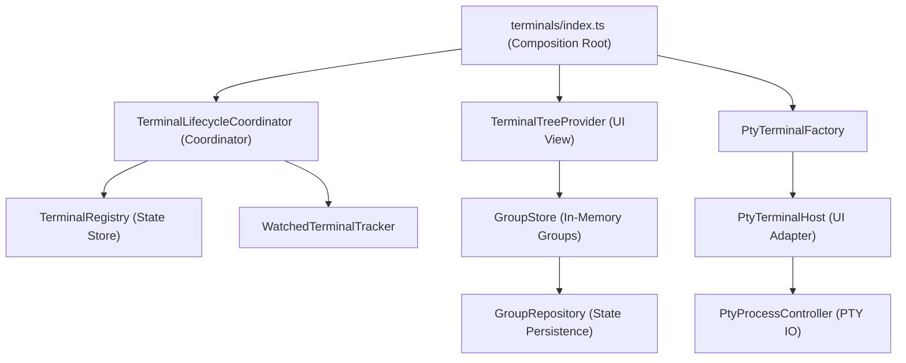

# 架構演進與優化計畫 — terminals (Architecture Evolution & Optimization Plan)

## 1. 現有架構診斷與技術債 (Architecture Diagnosis & Technical Debt)

本專案是一個 `VSCode` 擴充功能 (VSCode Extension)，其中 `terminals` 模組負責終端機面板管理、群組管理、`PTY-backed` 虛擬終端機代理以及未讀輸出高亮提示。經過對現有程式碼的分析，診斷出以下主要技術債 (Technical Debt)：

- `生命週期事件與組合根高度耦合 (High Coupling of Lifecycle Events and Composition Root)`：
  - `src/terminals/index.ts` ([index.ts](file:///Users/shuk/projects/tmp/superset/src/terminals/index.ts)) 不僅作為組合根 (Composition Root) 進行各元件的宣告與裝配，還直接承載了眾多 `VSCode` 事件監聽邏輯（例如 `window.onDidOpenTerminal` 的自動替換判斷、`window.onDidCloseTerminal` 的清理邏輯、`window.onDidChangeActiveTerminal` 與 `window.onDidChangeActiveTextEditor` 的追蹤控制）。這使得該入口檔案包含了大量的程序性控制流與時序邏輯，極難進行獨立的單元測試 (Unit Testing)。

- `虛擬終端機適配器與底層進程控制耦合 (Coupling of Pseudoterminal Adapter and PTY Process)`：
  - `PtyTerminalHost` ([ptyTerminalHost.ts](file:///Users/shuk/projects/tmp/superset/src/terminals/ptyTerminalHost.ts)) 實作了 `VSCode` 的 `vscode.Pseudoterminal` 介面，但同時直接負責了 `@homebridge/node-pty-prebuilt-multiarch` 行程 (Process) 的管理、寫入/讀取/調整視窗大小 (Resize) 以及監聽 output 資料。這將 `UI` 抽象層的 `Pseudoterminal` 適配與作業系統底層的進程生命週期完全綁死，難以替換進程的驅動核心或單度測試進程管理行為。

- `記憶體狀態與 VSCode 持久化機制耦合 (Coupling of In-Memory State and VSCode Persistence)`：
  - `GroupStore` ([groupStore.ts](file:///Users/shuk/projects/tmp/superset/src/terminals/groupStore.ts)) 負責終端機群組 (Terminal Group) 的狀態維護（包含群組排序、新增刪除與成員分配）。然而，它也直接通過傳入的 `workspaceState` 進行群組中繼資料 (Metadata) 的序列化與持久化讀寫。這導致狀態管理與 `VSCode` 擴充環境產生強依賴，無法在純 `Node.js` 環境中進行無 `mock` 測試。

- `UI 樹狀檢視與未讀狀態處理混雜 (Mixing of UI View and State Aggregation)`：
  - `TerminalTreeProvider` ([treeProvider.ts](file:///Users/shuk/projects/tmp/superset/src/terminals/treeProvider.ts)) 作為 `VSCode` `TreeView` 的資料提供者，除了處理節點的轉譯，還在內部直接維護了未讀終端機集合 `unseen`、訂閱 `TerminalRegistry` 進行集合變更，並管理了一個 3 秒一次的定時器 `refreshTimer` 以修正終端機重新命名時的畫面刷新問題。

## 2. 複雜度量測 (Complexity Metrics)

針對現有的 `terminals` 模組，以下為客觀的程式碼規模與訊號數據：

- `程式碼規模 (Lines of Code)`：
  - `src/terminals/` 目錄總行數為 `1850` 行，佔整個專案 TypeScript 程式碼的 `33%`。
  - 主要檔案行數：
    1. `src/terminals/index.ts`：`260` 行。
    2. `src/terminals/ptyTerminalHost.ts`：`215` 行。
    3. `src/terminals/groupStore.ts`：`214` 行。
    4. `src/terminals/treeProvider.ts`：`195` 行.
    5. `src/terminals/commands.ts`：`162` 行。
    6. `src/terminals/highlightPresenter.ts`：`113` 行。
    7. `src/terminals/terminalRegistry.ts`：`109` 行。
    8. `src/terminals/ptyTerminalFactory.ts`：`103` 行。

- `改動熱點 (Changelog Hotspots)`：
  - 在歷次的終端機名稱高亮降級機制、未讀狀態更新與 `Antigravity` 背景代理排除等變更中，`src/terminals/index.ts` 與 `src/terminals/highlightPresenter.ts` 為頻繁修改的檔案，累積了多種生命週期邊界處理邏輯。

## 3. 架構簡化與解耦設計 (Simplification & Decoupling Design)

為了解決 `terminals` 模組的技術債，我們設計了以下分層解耦方案，將複雜的單一類別與程序性代碼拆解為高內聚、低耦合的元件：

- `TerminalLifecycleCoordinator (生命週期協調層)`：從 `index.ts` 中分離出事件監聽與協調邏輯。它訂閱 `VSCode` 的終端機生命週期事件，調用 `PtyTerminalFactory` 與 `TerminalRegistry`，管理延時銷毀 (`setTimeout`)，並配合 `WatchedTerminalTracker` 追蹤聚焦狀態。
- `PtyProcessController (PTY 行程控制層)`：包裝底層 `node-pty` 行程，專注於進程的 `spawn`、輸入/輸出資料流讀寫以及視窗 `resize`，完全不依賴 `vscode` 模組。
- `PtyTerminalHost (UI 適配層)`：僅作為 `vscode.Pseudoterminal` 介面的實現。它做為中介者 (Mediator)，將 `VSCode` 的輸入與 `resize` 事件轉發給 `PtyProcessController`，並將進程的輸出寫回 `VSCode` 的 `Pseudoterminal.onDidWrite`。
- `GroupRepository (持久化層)`：定義群組持久化儲存介面 (`GroupStorage`)，負責對 `workspaceState` 的讀寫，使 `GroupStore` 純化為記憶體狀態庫，消除了對 `VSCode` 的直接相依性。
- `TerminalTreeProvider (UI 渲染層)`：只負責視覺節點的轉譯（`buildGroupTreeItem`、`buildTerminalTreeItem`），不再內部維護 `unseen` 狀態，改由外部直接注入或調用。

以下為優化後的模組關聯圖 (Dependency Diagram)：



## 4. 目錄與模組重整方案 (Reorganization Map)

重整後的 `src/terminals/` 目錄樹將具備更單一的職責劃分：

```tree
src/terminals/
├── index.ts          # 模組入口與宣告式組裝 (Composition Root)
├── types.ts          # 資料模型與介面定義 (Domain Models & Interfaces)
├── coordinator.ts    # 生命週期與事件協調器 (TerminalLifecycleCoordinator)
├── terminalRegistry.ts # 終端機狀態庫 (Terminal Registry)
├── watchedTerminalTracker.ts # 聚焦終端機追蹤器 (Watched Terminal Tracker)
├── groupStore.ts     # 群組記憶體狀態庫 (Group In-Memory Store)
├── groupRepository.ts # 群組持久化層 (Group Persistence Repository)
├── ptyTerminalFactory.ts # 虛擬終端機工廠 (PTY Terminal Factory)
├── ptyTerminalHost.ts # Pseudoterminal 介面適配器 (Pseudoterminal Host)
├── ptyProcessController.ts # node-pty 進程控制器 (PTY Process Controller)
├── outputWatcher.ts  # 一般終端機輸出監聽器 (Output Watcher)
├── highlightPresenter.ts # 高亮狀態呈現器 (Highlight Presenter)
├── dragAndDrop.ts    # 拖曳控制器 (Drag and Drop Controller)
├── commands.ts       # VSCode 命令註冊 (VSCode Commands)
├── jumpToTerminal.ts # 模糊搜尋切換器 (Fuzzy Switcher)
├── treeProvider.ts   # VSCode TreeView 轉譯 (UI Data Provider)
├── treeSpec.ts       # 樹狀節點渲染規格 (Tree View Spec)
└── treeFilter.ts     # 樹狀結構過濾器 (Tree Filter)
```

### 舊至新元件映射表 (Migration Map)

| 原始檔案與區塊 | 目標檔案 (Target File) | 職責與調整說明 |
| --- | --- | --- |
| `index.ts` L115-219 (事件訂閱與處理) | `coordinator.ts` (`TerminalLifecycleCoordinator`) | 封裝所有終端機與編輯器生命週期事件處理，簡化 `index.ts` 為純粹的裝配入口。 |
| `ptyTerminalHost.ts` L65-175 (進程操作與資料流) | `ptyProcessController.ts` (`PtyProcessController`) | 將 `node-pty` 的 `spawn`、讀寫 stream、`resize` 與 `kill` 抽出，與 `vscode` 模組解耦。 |
| `ptyTerminalHost.ts` 剩餘部分 (Pseudoterminal) | `ptyTerminalHost.ts` (`PtyTerminalHost`) | 僅負責調度 `PtyProcessController` 並對接 `vscode.Pseudoterminal` 的介面事件。 |
| `groupStore.ts` L33-51, L74-82 (Persistence) | `groupRepository.ts` (`GroupRepository`) | 將群組設定讀寫 `workspaceState` 的邏輯抽出，使 `GroupStore` 可以完全在測試中被隔離。 |
| `treeProvider.ts` L29-89, L183-187 (Unseen維護) | `treeProvider.ts` (`TerminalTreeProvider`) | 移出未讀狀態的管理邏輯，將其改為唯讀屬性或從協調器傳遞，專注於渲染。 |

## 5. 插件化與可擴充性機制 (Plugin & Extensibility Mechanism)

- `插件化必要性評估`：
  - 目前 `terminals` 為系統的核心子模組，不涉及外部動態載入的場景，因此設計動態插件機制為過度設計 (Over-engineering)。
  
- `可擴充性介面設計`：
  - 由於 PTY 的底層進程可能在不同環境下有不同的需求（例如：本機進程、遠端 `SSH` 進程、甚至是 `WSL` 容器行程），我們可以將進程控制器的建立抽象為介面：
    ```typescript
    export interface ProcessController {
        write(data: string): void;
        resize(cols: number, rows: number): void;
        onData(cb: (data: string) => void): void;
        onExit(cb: (exitCode: number) => void): void;
        kill(): void;
    }
    ```
  - 這可以讓 `PtyTerminalHost` 僅依賴 `ProcessController` 介面，當未來需要支援遠端終端機時，只需新增實現該介面的 `RemoteProcessController` 即可直接替換，而不需要修改視覺與適配器邏輯。

## 6. 漸進式重構路徑與驗證 (Refactoring Roadmap & Verification)

本重構遵循「小步前進、持續驗證」原則，確保每一步都具有完整的測試安全網。

### 第一階段：補充特徵測試 (Characterization Tests) — 安全網建置
- `任務`：在重構前，針對既有的 `ptyTerminalHost.ts` 與 `groupStore.ts` 編寫更為詳盡的黑箱測試，確保當前行為被完整記錄。
- `驗證方式`：
  - 確保當前測試 `npm test` 綠燈（目前為 `195` 個 `cases` 綠燈）。

### 第二階段：解耦 GroupStore 與持久化層
- `任務`：建立 `src/terminals/groupRepository.ts`，將 `workspaceState` 存取抽出。
- `驗證方式`：
  - 修改 `GroupStore` 的單元測試，改為傳入 `Mock` 的 `GroupRepository`。
  - 驗證 `npm test` 中與 `groupStore` 相關的 `25` 個 `cases` 全數通過。

### 第三階段：抽取進程控制器 (PtyProcessController)
- `任務`：建立 `src/terminals/ptyProcessController.ts`，移入 `node-pty` 行程控制，使其成為無 `vscode` 依賴的純 `TypeScript` 模組。
- `驗證方式`：
  - 為 `PtyProcessController` 編寫單元測試，驗證寫入指令後，輸出資料流能正確返回。
  - 修改 `PtyTerminalHost` 引入控制器，執行 `npm run build` 確認型別正確，且 `ptyTerminalHost.test.ts` 的 `15` 個 `cases` 通過。

### 第四階段：建立生命週期協調器 (TerminalLifecycleCoordinator)
- `任務`：建立 `src/terminals/coordinator.ts`，移入 `index.ts` 中的事件訂閱與自動替換時序邏輯。
- `驗證方式`：
  - 為協調器編寫單元測試，模擬終端機的開關與切換，驗證狀態變更事件是否結構化通知 `TerminalRegistry`。
  - 簡化 `index.ts` 並裝配新組件。

### 第五階段：VSCode 端整合與冒煙測試
- `任務`：重構 `TerminalTreeProvider` 移出未讀快取維護，於 `src/terminals/index.ts` 裝配所有組件。
- `驗證方式`：
  - 執行 `npm test` 確保所有測試案例全數回歸通過。
  - 在 VSCode 開發環境下，藉由點擊、重新命名、拖曳群組、開啟 `TUI` 終端機等動作，手動驗證實際互動與視覺高亮表現完全如常。

## 7. 風險與回滾策略 (Risks & Rollback)

- `風險一：自動替換終端機時的時序死鎖 (Deadlock during Auto-replace)`：
  - `原因`：當新終端機開啟時，協調器會銷毀原終端機並建立 PTY 虛擬終端機。如果銷毀和建立的時序未處理妥當，可能會在 `onDidOpenTerminal` 中引發無限迴圈或終端機瞬間閃退。
  - `防範策略`：嚴格保持 `decideAutoReplace` 檢查機制，並在 `PtyTerminalFactory` 中使用 `isPtyBacked` 做前置攔截防禦；對銷毀的 `setTimeout` 做精確控制。

- `風險二：拖曳與重新命名狀態不同步 (State Out of Sync during Rename & DND)`：
  - `原因`：若 TreeView 資料提供者與記憶體群組庫 `GroupStore` 狀態不同步，可能導致面板中項目的樹狀視圖與實際終端機對應關係錯亂。
  - `防範策略`：在 `GroupStore` 測試中特別增加 drag-and-drop 的多場景覆蓋，驗證 `TerminalTreeProvider` 每次重新整理後其內部快取會完全與 Store 對齊。

- `回滾機制 (Rollback Strategy)`：
  - 每次重構步驟的 `Git` 提交粒度控制在單一任務之內。
  - 若在任何驗證階段發現編譯錯誤或測試失敗，立即執行 `git reset --hard HEAD` 回滾到前一個綠燈提交點。
