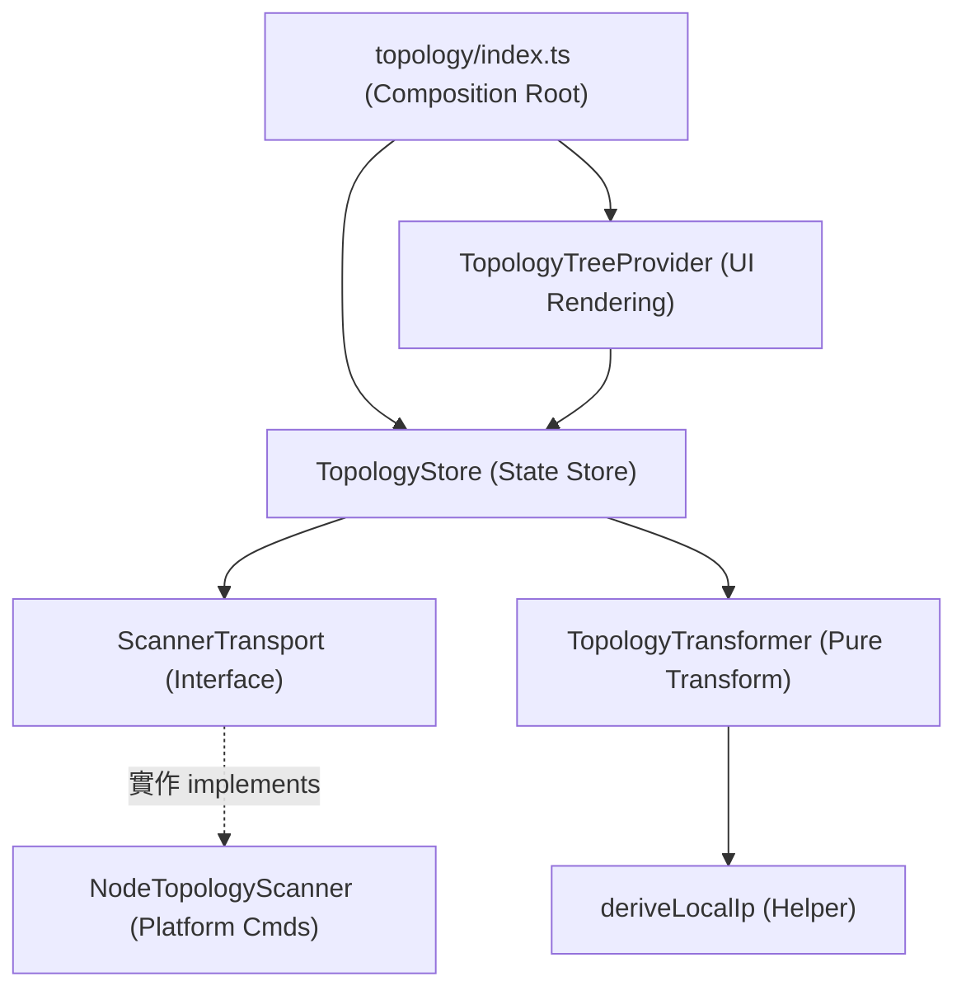

# 架構演進與優化計畫 — topology (Architecture Evolution & Optimization Plan)

## 1. 現有架構診斷與技術債 (Architecture Diagnosis & Technical Debt)

本專案是一個 `VSCode` 擴充功能 (VSCode Extension)，其中 `topology` 模組負責網路拓撲掃描、本機 IP 推導以及網路樹狀圖表呈現。經過對現有程式碼的分析，診斷出以下主要技術債 (Technical Debt)：

- `單一職責原則違背 (Single Responsibility Principle Violation)`：
  - `TopologyStore` ([topologyStore.ts](file:///Users/shuk/projects/tmp/superset/src/topology/topologyStore.ts)) 承載了過多職責。它同時處理了網路掃描各階段資料的協調調度、原始掃描結果至 `TopologyNode` 樹狀物件的資料格式轉換（例如本機網卡與預設閘道之字串串接），以及基於 `/24` 子網路 (Subnet) 之 trace 路由路徑拓撲的重構演算法（`insertInto` 等遞迴插入邏輯）。這導致資料格式化或拓撲重構邏輯的變更皆須修改狀態層的 `TopologyStore`，也使得拓撲路徑演算法難以脫離整個 Store 進行獨立單元測試 (Unit Testing)。
  - `NodeTopologyScanner` ([topologyScanner.ts](file:///Users/shuk/projects/tmp/superset/src/topology/topologyScanner.ts)) 同時處理了多個作業系統平台的網路指令執行與命令列輸出 (stdout) 的正規表示式 (Regular Expression) 解析。

- `UI 展示模型與領域模型耦合 (Coupling of UI Models and Domain Models)`：
  - 狀態庫 `TopologyStore` 直接維護並回傳 `TopologyNode` 陣列。然而，`TopologyNode` 的結構（`label`, `description`, `children`）實際上是為了適配 `VSCode` `TreeItem` 的展示需求而設計的。狀態庫直接向外暴露帶有 UI 展示傾向的樹狀結構，限制了該狀態在庫內部的重用性（如將來若要導出為 JSON 格式或在 Webview 繪製 SVG 拓撲圖時將難以使用）。

- `脆弱的異步掃描控制與異常處理 (Fragile Async Scan Control)`：
  - `TopologyStore.scan()` 通過本地屬性 `this.activeScanPromise` 進行單一執行實例的防鎖，但其未實施超時機制 (Timeout Mechanism)。若底層系統指令如 `traceroute` 於特定網路環境下掛起 (Hang)，將導致狀態被永久鎖定在 `scanning = true`，使使用者無法再次執行掃描。

## 2. 複雜度量測 (Complexity Metrics)

針對現有的 `topology` 模組，以下為客觀的程式碼規模與訊號數據：

- `程式碼規模 (Lines of Code)`：
  - `src/topology/` 目錄總行數為 `566` 行，佔整個專案 TypeScript 程式碼的約 `10%`。
  - 主要檔案行數：
    1. `src/topology/topologyStore.ts`：`229` 行。
    2. `src/topology/topologyScanner.ts`：`164` 行。
    3. `src/topology/topologyTreeProvider.ts`：`60` 行。
    4. `src/topology/localIp.ts`：`50` 行。
    5. `src/topology/index.ts`：`49` 行。
    6. `src/topology/topologyTreeSpec.ts`：`24` 行。
    7. `src/topology/types.ts`：`10` 行。

- `函數複雜度 (Function Complexity)`：
  - `TopologyStore.scan()` 函式（L45-216）長度高達 `171` 行，佔該檔案長度的 `74.6%`。這段程式包含了本機網卡、預設閘道、Trace 跳步解析、子網路分組、DNS、ARP 表的解析和樹狀組裝，圈複雜度較高，極易隱藏邊界錯誤 (Edge Cases)。

## 3. 架構簡化與解耦設計 (Simplification & Decoupling Design)

為了解決 `topology` 模組的技術債，我們設計了以下分層解耦方案，將複雜的單一類別與程序性代碼拆解為高內聚、低耦合的元件：

- `TopologyTransformer (轉換解析層)`：純函式類別，僅負責將 Raw Scan Data 轉換成 UI 的 `TopologyNode` 樹結構，並封裝 `/24` 子網路的路由插入與分組演算法。不包含任何檔案 I/O、系統調用或狀態。
- `ScannerTransport (介面層)`：定義統一的網路拓撲掃描介面，確保其完全不依賴特定執行平台。
- `NodeTopologyScanner (平台適配層)`：實作 `ScannerTransport` 介面，封裝 `child_process` 呼叫與 stdout 解析邏輯。
- `TopologyStore (狀態層)`：僅負責維護當前的狀態（是否掃描中、當前的掃描結果），提供觀察者訂閱機制，不承載任何解析與轉換邏輯。

以下為優化後的模組關聯圖 (Dependency Diagram)：



## 4. 目錄與模組重整方案 (Reorganization Map)

重整後的 `src/topology/` 目錄樹將具備更單一的職責劃分：

```tree
src/topology/
├── index.ts          # 模組入口與 VSCode 命令註冊 (Module Entry)
├── types.ts          # 資料模型定義 (Domain Models)
├── topologyStore.ts  # 網路拓撲狀態管理 (Topology Store)
├── topologyScanner.ts # 系統命令掃描器 (Platform Scanner)
├── transformer.ts    # 樹狀結構轉換器 (Topology Transformer)
├── treeProvider.ts   # VSCode TreeView 轉譯 (UI Data Provider)
├── treeSpec.ts       # 節點展示規格 (Tree Item Spec)
└── localIp.ts        # 本機 IP 推導 (Local IP Heuristics)
```

### 舊至新元件映射表 (Migration Map)

| 原始檔案與區塊 | 目標檔案 (Target File) | 職責與調整說明 |
| --- | --- | --- |
| `topologyStore.ts` L64-206 (樹狀節點轉換) | `transformer.ts` (`TopologyTransformer`) | 抽取成純函式或獨立類別，將網拓領域資料轉換為 `TopologyNode[]`，包含子網路分群遞迴。 |
| `topologyStore.ts` 剩餘部分 (狀態控制) | `topologyStore.ts` (`TopologyStore`) | 保留訂閱、狀態及對 Scanner/Transformer 的協調。 |
| `topologyTreeProvider.ts` | `treeProvider.ts` | 重新命名為 `treeProvider.ts`，與 `todo/` 和 `terminals/` 命名風格保持一致。 |
| `topologyTreeSpec.ts` | `treeSpec.ts` | 重新命名為 `treeSpec.ts`，與其他模組命名風格保持一致。 |

## 5. 插件化與可擴充性機制 (Plugin & Extensibility Mechanism)

- `插件化必要性評估`：
  - 目前 `topology` 為內部輔助工具，不涉及外部動態載入的場景，因此設計動態插件機制為過度設計 (Over-engineering)。

- `可擴充性介面設計`：
  - 由於 PTY 的底層系統掃描可能在不同環境下有不同的權限限制（例如在沙盒環境中可能無法執行 `traceroute`），我們可以強化 `ScannerTransport` 介面：
    - 使 `TopologyStore` 僅依賴 `ScannerTransport` 介面，當未來需要支援其他替代方案（例如 K8s API 拓撲發現、Snmp 掃描、或純 API Mock 掃描）時，只需新增實現該介面的適配器，而不需要修改 Store 或 UI 展示邏輯。

## 6. 漸進式重構路徑與驗證 (Refactoring Roadmap & Verification)

本重構遵循「小步前進、持續驗證」原則，確保每一步都具有完整的測試安全網。

### 第一階段：補充特徵測試 (Characterization Tests) — 安全網建置
- `任務`：針對既有的 `TopologyStore.scan()` 進行詳盡單元測試，錄製不同掃描結果（例如有多個網卡、無閘道、部分 trace 節點 unreachable 等），驗證生成的 `TopologyNode` 結構符合預期。
- `驗證方式`：
  - 確保 `npm test` 中與 `topology` 相關的 `4` 個 `cases` 全數通過。

### 第二階段：提取轉換層 (TopologyTransformer)
- `任務`：建立 `src/topology/transformer.ts`，移入樹狀生成邏輯與 `insertInto` 演算法，將其重構為純資料轉換函數。
- `驗證方式`：
  - 為 `TopologyTransformer` 編寫單元測試，輸入 mock 的掃描原始資料，驗證輸出結構正確。
  - 修改 `TopologyStore` 引入該轉換器，執行 `npm run build` 確認型別正確。

### 第三階段：優化狀態與超時控制
- `任務`：在 `TopologyStore` 中引進超時控制（如 10 秒自動熔斷），並清理狀態暴露方式。
- `驗證方式`：
  - 為 Store 寫入超時 Mock 測試，驗證當 Scanner 掛起時，超時能正確拋出並重設 `scanning` 標記。

### 第四階段：重新命名與目錄對齊
- `任務`：重新命名 `topologyTreeProvider.ts` -> `treeProvider.ts` 以及 `topologyTreeSpec.ts` -> `treeSpec.ts`。
- `驗證方式`：
  - 跑完專案的所有單元測試，確保完全相容。
  - 在 VSCode 開發環境下執行 `superset.topologyScan` 命令，手動驗證實際互動與視覺高亮表現完全如常。

## 7. 風險與回滾策略 (Risks & Rollback)

- `風險一：不同平台的 Trace 輸出解析失敗 (Trace Parsers Mismatch)`：
  - `原因`：Windows 和 Mac/Linux 的 `tracert` / `traceroute` 回傳格式存在差異，在重構解析器時容易發生 Regex 比對失敗，導致掃描結果丟失。
  - `防範策略`：在單元測試中保留兩平台的典型 stdout mock，確保解析器在重構前後對各種 stdout 的解析行為完全一致。

- `風險二：檔案重新命名導致的語意引入錯誤 (Compilation Errors on Rename)`：
  - `原因`：`TreeProvider` 與 `TreeSpec` 改名可能漏掉 `package.json` 中的註冊引用或其他導入路徑。
  - `防範策略`：嚴格在 `index.ts` 與 `package.json` 中進行全面 grep，重改名後進行 `tsc --noEmit`。

- `回滾機制 (Rollback Strategy)`：
  - 每次重構步驟的 `Git` 提交粒度控制在單一任務之內。
  - 若在任何驗證階段發現異常，立即執行 `git reset --hard HEAD` 回滾到前一個綠燈提交點。
