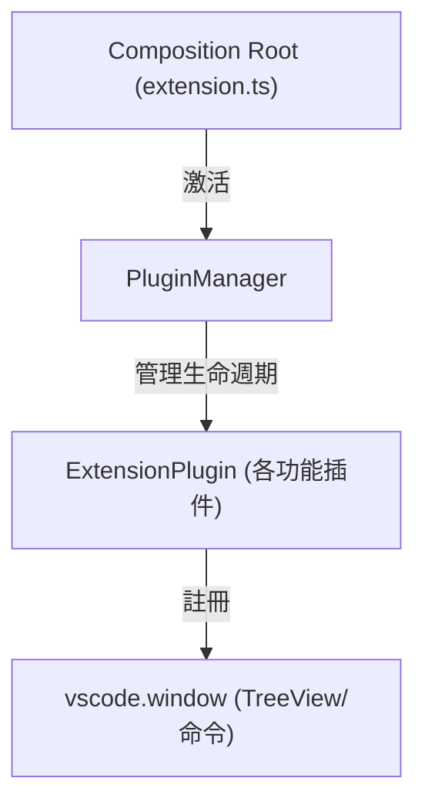
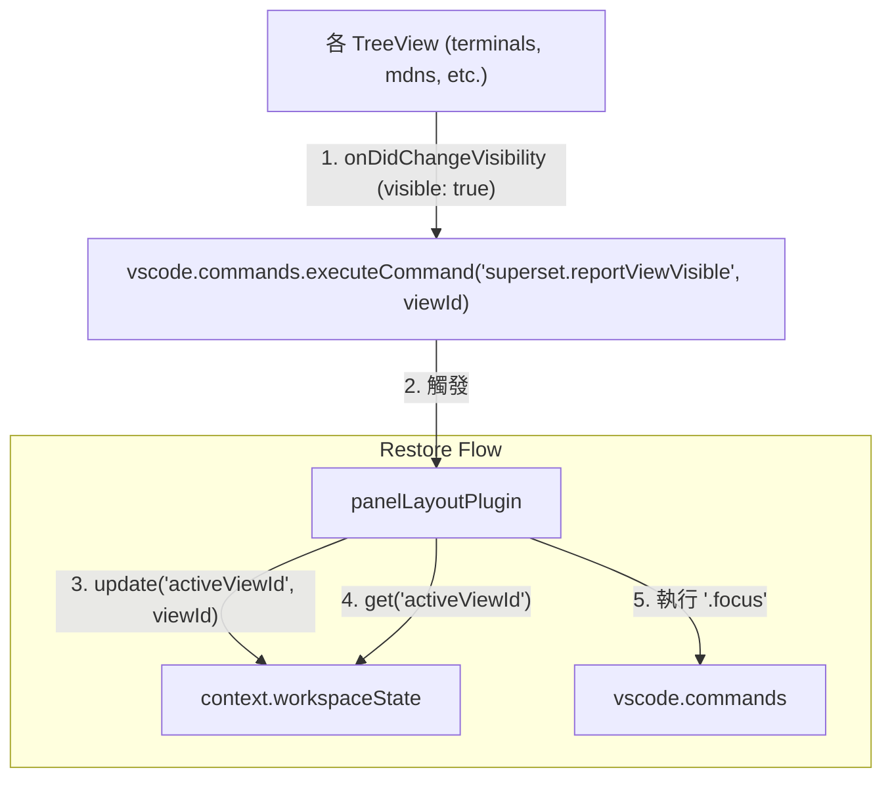

# 架構計畫 — panel-layout-persistence (Architecture Plan)

## 1. 目標與範圍 (Goal & Scope)

設計一個 `面板佈局持久化 (Panel Layout Persistence)` 功能，記住 `superset` viewContainer 內最後一次 active 的子 view，並在下次啟動 VS Code 時自動恢復該焦點。

以下項目為 `非本階段目標 (out of scope)`：
- 支援恢復側邊欄整體的展開或折疊狀態，也不恢復側邊欄在 VS Code 視窗中的左/右位置（此為 VS Code 核心功能管理）。
- 支援恢復各子面板內部的具體捲動位置或選取項目。
- 支援跨工作區的狀態共享，狀態儲存僅限於單一工作區的 `context.workspaceState` 中。

## 2. 現況架構 (Current Architecture)

目前 Superset 採用插件底座 `PluginManager` 管理多個 `ExtensionPlugin` 的生命週期。現有的模組（如 `terminals`、`mdns`、`topology` 與 `todo`）皆封裝為插件並在 `extension.ts` 中被註冊。

當前架構中，各子面板建立 `TreeView` 時各自獨立運作，沒有統一回報焦點狀態的機制，且啟動時 VS Code 預設僅開啟第一個 visible 的面板（通常是 Terminals）。

現況架構如下：

相關模組清單：
- [extension.ts](file:///Users/shuk/projects/tmp/superset/src/extension.ts)：擴充功能進入點與組裝層。
- [plugin/types.ts](file:///Users/shuk/projects/tmp/superset/src/plugin/types.ts)：定義插件與插件上下文合約。
- [terminals/index.ts](file:///Users/shuk/projects/tmp/superset/src/terminals/index.ts)：Terminals 視圖進入點。
- [mdns/index.ts](file:///Users/shuk/projects/tmp/superset/src/mdns/index.ts)：mDNS 視圖進入點.
- [topology/index.ts](file:///Users/shuk/projects/tmp/superset/src/topology/index.ts)：Topology 視圖進入點。
- [todo/index.ts](file:///Users/shuk/projects/tmp/superset/src/todo/index.ts)：TODO 視圖進入點。

## 3. 架構位置與邊界 (Placement & Boundaries)

- 位置說明：
  - 我們將在 `src/panelLayout/` 底下新增 `plugin.ts`。
  - 新增之 `panelLayoutPlugin` 將實作 `ExtensionPlugin` 介面，並由 `PluginManager` 統一載入。
  - 此插件在 `activate` 時，會註冊一個專屬的內部命令 `superset.reportViewVisible`，當此命令被呼叫時，會將 `viewId` 寫入 `workspaceState` 中的 `activeViewId` 鍵中。
  - 此插件在啟動時，亦會讀取該 `activeViewId` 鍵，若有值，則透過 `vscode.commands.executeCommand` 來恢復焦點。
- 依賴方向：
  - 依賴方向僅由外層指向內層。`panelLayoutPlugin` 依賴 `PluginContext` 與 `vscode` API。
  - 其他功能模組（`terminals`, `mdns`, `topology`, `todo`）不反向依賴 `panelLayoutPlugin`，僅在建立樹狀視圖時，監聽 `onDidChangeVisibility` 事件並透過 `vscode.commands.executeCommand("superset.reportViewVisible", "viewId")` 發送通知。
- 邊界定義：
  - `panelLayoutPlugin` 擁有：佈局狀態的寫入與讀取、視圖焦點恢復邏輯。
  - `panelLayoutPlugin` 不碰觸：各子視圖內部的資料更新、渲染邏輯與生命週期。

## 4. 介面與資料流 (Interfaces & Data Flow)

### 介面設計 (Interface Design)

| 介面/方法名稱 (Interface/Method) | 呼叫端 (Caller) | 被呼叫端 (Callee) | 輸入 (Inputs) | 輸出 (Outputs) | 錯誤情況 (Error Cases) |
| :--- | :--- | :--- | :--- | :--- | :--- |
| `superset.reportViewVisible` (Command) | 各 TreeView 之 `onDidChangeVisibility` | `panelLayoutPlugin` | `viewId: string` | `void` | 當傳入無效或未註冊之 `viewId` 時，記錄錯誤日誌並不予儲存。 |
| `restoreActiveView()` | `panelLayoutPlugin` | `vscode.commands` | `void` | `Promise<void>` | 當所記錄之視圖未註冊或無法焦點時，記錄警告日誌並退回預設視圖。 |

### 資料流圖 (Data Flow Diagram)

## 5. 清晰與可擴充性檢查 (Clarity & Scalability Check)

1. 單一職責：新模組只有一個變更理由？
   - `是`。`panelLayoutPlugin` 唯一的職責就是管理並持久化子面板的佈局狀態，僅在狀態儲存機制或 VS Code 視圖導航方式改變時需要修改。
2. 依賴方向：沒有內層指向外層？沒有循環相依？
   - `是`。本模組僅單向依賴 `PluginContext` 與 `vscode` API，其他功能模組完全不依賴本模組（僅透過鬆耦合的 `executeCommand` 進行通訊）。
3. 可替換：外部依賴（DB、第三方服務）都隔在介面後？
   - `是`。狀態儲存庫的依賴均透過 VS Code 提供的 `workspaceState` 抽象介面進行。
4. 水平擴充：無狀態、可多實例部署？
   - `是`。佈局狀態恢復是基於單一工作區實例，並依賴 VS Code 本身的命令系統。
5. 擴充點：下一個同類 feature 可以不改核心就加入？
   - `是`。未來若新增其他側邊欄子面板（如 `superset.settings`），新面板只需在建立時發送 `superset.reportViewVisible` 即可，完全不需要修改 `panelLayoutPlugin` 的核心邏輯。

## 6. 漸進落地步驟 (Incremental Steps)

| 步驟 (Step) | 做什麼 (What) | 驗證 (Verify) | 回滾 (Rollback) |
| :--- | :--- | :--- | :--- |
| `1. 宣告與實作佈局插件` | 建立 `src/panelLayout/plugin.ts`，實作 `panelLayoutPlugin: ExtensionPlugin`，並註冊 `superset.reportViewVisible` 指令。 | 執行 `npm run build` 確認編譯通過。 | 刪除 `src/panelLayout` 目錄。 |
| `2. 整合至組成根` | 在 `src/extension.ts` 的 `plugins` 清單末端引入並註冊 `panelLayoutPlugin`。 | 啟用擴充功能，確認沒有任何錯誤日誌。 | 在 `src/extension.ts` 中移除對 `panelLayoutPlugin` 的載入。 |
| `3. 連接各 TreeView 狀態變更` | 修改 `terminals`、`mdns`、`topology` 與 `todo` 的 `index.ts`，在其樹狀視圖的 `onDidChangeVisibility` 事件中觸發 `superset.reportViewVisible`。 | 執行單元與整合測試，確認既有測試皆不受影響。 | 還原各子模組的 `index.ts` 變更。 |
| `4. 實作與驗證恢復邏輯` | 在 `panelLayoutPlugin` 的 `activate` 中讀取 `activeViewId` 並執行 focus 命令。 | 在開發環境中切換至 mDNS 面板，重啟擴充視窗，確認會自動切換至 mDNS 面板。 | 還原 `panelLayoutPlugin` 的 `activate` 邏輯。 |

## 7. 風險與假設 (Risks & Assumptions)

- 假設：VS Code 載入各插件的順序可能影響視圖焦點恢復的執行時機。如果 `panelLayoutPlugin` 執行 focus 時，目標 `TreeView` 尚未註冊完成，可能導致 focus 指令失效。為此，我們在 `extension.ts` 中將 `panelLayoutPlugin` 放置在所有視圖插件之後，確保所有 TreeView 皆已註冊完畢；必要時可在執行 focus 時加上 `setTimeout` 以延遲一個 event loop tick 執行。
- 假設：使用者可能手動關閉或隱藏了某個視圖。如果被儲存的 `activeViewId` 指向一個被使用者隱藏的視圖，呼叫 focus 可能無效或造成異常。對此，我們在 focus 邏輯中加入 `try-catch` 區塊，若發生錯誤則安全降級為 default 視圖，防止擴充套件崩潰。
