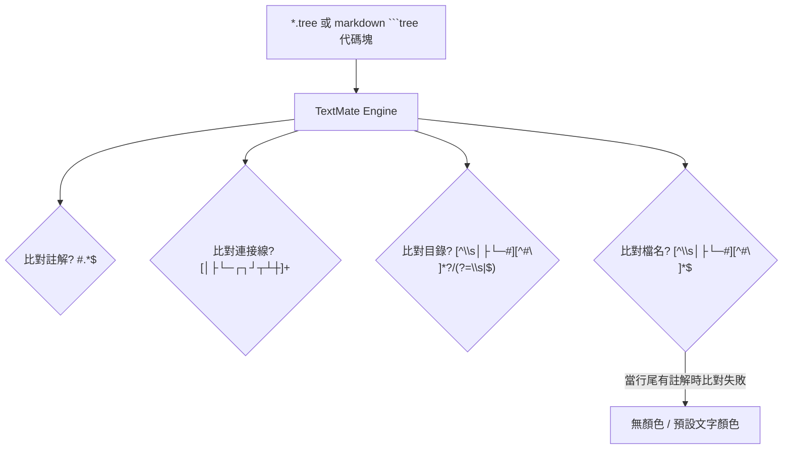
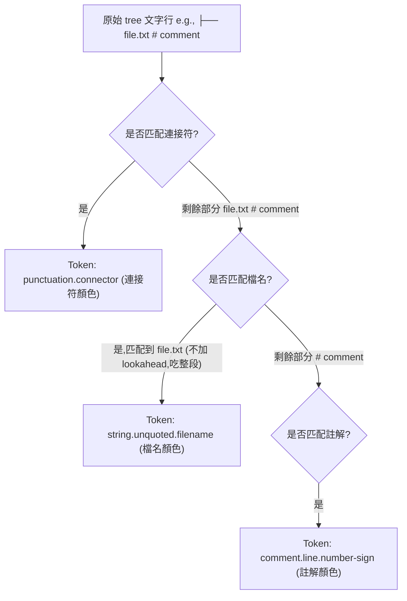
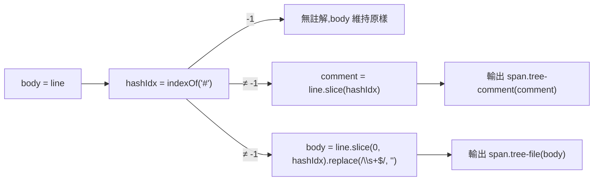

# 規格 (Spec) — tree-comment-highlight

> 對應計劃: [`plans/architecture-tree-comment-highlight.md`](../plans/architecture-tree-comment-highlight.md)
> 實作 commit: `7963b59 fix: improve trailing comment parsing and syntax highlighting to support hashtags without leading spaces`
> 實作日期: 2026-07-05

## 1. 目標與範圍 (Goal & Scope)

設計一個 `終端機/Markdown Tree 語法高亮註解區分 (Tree Syntax Comment Highlight Distinction)` 功能,解決在 `tree` 語法區塊或 `.tree` 檔案中,行尾帶有 `#` 的註解與檔名/目錄顏色無法正確區分的問題。

- 一句話目標:`使用者 (VS Code 使用者)` 用它 `在 markdown tree 代碼塊或獨立的 .tree 檔案中,看見帶有 # 的行尾註解呈現為正確的註解顏色,而不會因為尾隨註解導致前面的檔名或目錄高亮失效`。
- 不做什麼 (Out of Scope):
    1. 不支援除 `#` 以外的其他註解符號(如 `//` 或 `/* */`)。
    2. 預覽層 (`renderLine.ts`) 維持支援 `<span class="tree-comment">`,`tree.css` 已為其上色 — 此點**已超出原 plan 範圍**做小幅擴張(見 §3 異動)。
    3. 不支援在檔名中間或 connector 中間進行註解解析(註解必須在檔名/目錄之後,或獨立成行)。

## 2. 現況架構 (Current Architecture)

目前專案透過 `TextMate Grammar` 來提供 VS Code 編輯器內的語法高亮。設定檔包括 `syntaxes/tree.tmLanguage.json` 以及用於注入 Markdown 檔案的 `syntaxes/tree-markdown-injection.tmLanguage.json`。

現況語意比對流程如下:



## 3. 架構位置與邊界 (Placement & Boundaries)

為維持高內聚低耦合,新變更僅限於 `syntaxes` 語法設定與 `renderLine.ts` 註解切分邏輯,不修改任何其他 TypeScript 邏輯:

1. `語法高亮層 (Syntax Highlighting Layer)`:更新 `syntaxes/tree.tmLanguage.json` 中對於檔名與目錄的比對規則,使其能在遇到註解前行前截止,不再強行要求比對至行尾 `$`。
2. `預覽渲染層 (Preview Rendering Layer)`:**輕幅調整** `src/treePreview/renderLine.ts` 的註解切分邏輯,把 `indexOf(" #")` 改為 `indexOf("#")`,並對切下的 body 做 `replace(/\s+$/, "")` 去掉尾部多餘空白 — 此為**超出原 plan 範圍的擴張**,把「無前置空格的井號標籤」(如 `package.json#manifest`)也納入支援。
3. `邊界定義 (Boundary Definition)`:本變更僅限於靜態配置檔與單一純函式邏輯,不涉及任何狀態 management 或生命週期 (Lifecycle) 邏輯。

## 4. 介面與資料流 (Interfaces & Data Flow)

### 介面設計 (Interface Design)

| Scope 名稱 (Scope Name) | 比對規則 (Match Regex Pattern) | 語意 Token (Token Scope) | 說明 (Description) |
| :--- | :--- | :--- | :--- |
| `comment.line.number-sign.tree` | `#.*$` | `comment.line.number-sign.tree` | 行尾的井號註解內容 |
| `punctuation.definition.tree.connector` | `[│├└─┌┐┘┬┴┼]+` | `punctuation.definition.tree.connector` | 樹狀連接線符號 |
| `entity.name.directory.tree` | `[^\\s│├└─#][^#\\n]*?/(?=\\s\|#\|$)` | `entity.name.directory.tree` | 目錄名稱(以斜線結尾,可後接空格加註解、`#` 加註解或行尾) |
| `string.unquoted.filename.tree` | `[^\\s│├└─#][^#\\n]*` | `string.unquoted.filename.tree` | 檔案名稱(不含註解;不加 lookahead,交由後續 rule 切) |

`renderLine.ts` 註解切分介面:

| 輸入 (Input) | 變數 (Variable) | 處理 (Processing) |
| :--- | :--- | :--- |
| 原始行 | `line: string` | 經 connector prefix 切分後的 body |
| `hashIdx = line.indexOf("#")` | 第一個 `#` 的位置(允許零前置空白) |
| `body` | 檔名部分 | `line.slice(0, hashIdx).replace(/\s+$/, "")` — 去掉尾部空白 |
| `comment` | 註解部分 | `line.slice(hashIdx)` — 從 `#` 開始,後續 CSS 還原為 ` #` 視覺前綴 |

### 資料流圖 (Data Flow Diagram)



`renderLine.ts` 流程(補充):



## 5. 清晰與可擴充性檢查 (Clarity & Scalability Check)

1. 單一職責:新模組只有一個變更理由?
    - `是`。此處僅變更 TextMate 語法規則與對應的純函式切分邏輯,變更理由僅限於「區分 tree 行尾註解」。
2. 依賴方向:沒有內層指向外層?沒有循環相依?
    - `是`。靜態配置檔 + 純函式,無任何 runtime 相依。
3. 可替換:外部依賴(DB、第三方服務)都隔在介面後?
    - `不適用`。此為編輯器高亮配置,不相依任何外部服務。
4. 水平擴充:無狀態、可多實例部署?
    - `是`。TextMate Tokenizer 運作於 VS Code 編輯器執行緒中,無狀態且可被多個編輯器窗格並行使用。
5. 擴充點:下一個同類 feature 可以不改核心就加入?
    - `是`。未來若需加入其他語義節點(例如檔案大小、修改日期高亮),可直接在 `patterns` 清單中以 regex 擴充,不影響既有比對結構。

## 6. 漸進落地步驟 (Incremental Steps)

| 步驟 (Step) | 做什麼 (What) | 驗證 (Verify) | 回滾 (Rollback) |
| :--- | :--- | :--- | :--- |
| `1. 備份與更新語法檔` | 更新 `syntaxes/tree.tmLanguage.json`,將檔名與目錄的 regex 匹配尾端更新為 `(?=\\s\|#\|$)` 與無 lookahead(交由 comment rule 切) | 使用 `git diff` 驗證 Regex 格式正確無誤 | 使用 `git checkout` 還原 `syntaxes/tree.tmLanguage.json` 的變更 |
| `2. 擴張 renderLine 註解切分` | 改用 `indexOf("#")` 取代 `indexOf(" #")`,body 尾端空白 `replace(/\\s+$/, "")` 去掉 | `npm test` 既有 7 個 `treePreview.test.ts` case + 新增 1 個無空格 case 通過 | `git checkout src/treePreview/renderLine.ts test/treePreview.test.ts` |
| `3. 編輯器 Token 驗證` | 在工作區建立一個測試用的 `.tree` 檔案,填入包含行尾註解的範例,如 `├── file.txt # comment` 與 `├── package.json#manifest` | 使用 VSCode 指令 `Developer: Inspect Editor Tokens and Scopes`,確認 `file.txt` 被識別為 `string.unquoted.filename.tree`,`# comment` 為 `comment.line.number-sign.tree` | 刪除測試用的 `.tree` 檔案 |
| `4. Markdown 預覽一致性驗證` | 在 markdown 檔案中建立 ```` ```tree ```` 代碼塊,寫入相同範例,並開啟 Markdown 預覽 | 確認預覽中產生的 HTML 與樣式渲染結果,註解顯示為綠色斜體,檔名與連接線顯示正確 | 無須特別回滾,因為未修改任何代碼 |

## 7. 風險與假設 (Risks & Assumptions)

- `風險一:Regex 比對優先順序問題 (Regex match order)`:
    - `原因`:若 `comment` 規則的比對優先級低於 `filename`,可能導致 `filename` 把井號後的註解也一併吞入。
    - `對策`:確保 `comment.line.number-sign.tree` 的規則在 `syntaxes/tree.tmLanguage.json` 中置於最前方。實作上 `filename` 規則拿掉 lookahead 改用非錨定 `[^#\\n]*`,但因 comment rule 排在前面,TextMate 引擎會先把 `file.txt` 之前的 `#xxx` 切走 — 實際觀察需要驗證(§6 步驟 3)。若發現被吞,需恢復 lookahead `(?=\\s+#|$)` 形式。
- `風險二:空格字元判定 (Whitespace handling)`:
    - `原因`:部分使用者撰寫註解時可能在井號前有多個空格,或完全沒有空格(如 `file.txt#comment`)。
    - `對策`:TextMate 端用 `(?=\\s\|#\|$)` 容忍;`renderLine.ts` 端改用 `indexOf("#")` + `replace(/\\s+$/, "")` 容忍,並保留 CSS 端的「視覺前綴 ` #`」(即最後輸出 `<span class="tree-comment">#manifest</span>` 顯示為「 #manifest」)。
- `風險三:renderLine 改動的測試覆蓋`:
    - `原因`:放寬 `indexOf` 條件可能誤切到合法檔名內的 `#`(理論上檔名內 `#` 罕見但合法)。
    - `對策`:`npm test` 既有 7 個 case 全部通過即視為安全網;若日後發現誤切,再加 negative case。

## 8. 異動記錄 (Changelog)

| 日期 | Commit | 異動 |
| :--- | :--- | :--- |
| 2026-07-05 | `7963b59` | 初版實作 — 更新 `tree.tmLanguage.json` 兩條 regex + 放寬 `renderLine.ts` 註解切分 + 新增 1 個測試 case |
