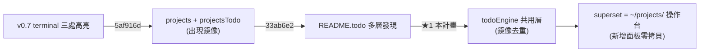

# 業務範圍評估與高價值方向 (Business Scope Evaluation & High-Value Directions)

> 產生日期 (created): 2026-07-08
> 對應 todo: README.todo `## Architecture`

## 1. 評估動機 (Why Evaluate Now)

`superset` 從最初「terminal 三處高亮」單一功能 (v0.1),已長成 8 個 feature module、~9k LOC src / ~7.2k LOC test、44 個 test file、~412 case 的多面板擴充 (v0.8.0)。最近的兩次 commit (`5af916d` projects / projectsTodo plugin、`33ab6e2` README.todo discovery) 把範圍從「單一工作區的終端機面板」推進到「跨 `~/projects/` 全工作區的專案發現 + 專案層級 TODO 管理」。這是一個範圍躍遷 (scope transition),適合回頭盤點:哪些能力是真正高價值的骨幹,哪些是邊際收益遞減的擴充。

> 註:本評估與同日 [`2026-07-08-chore-consistency-redundancy-scalability.md`](2026-07-08-chore-consistency-redundancy-scalability.md) 互補而非重疊 — 那份處理「結構健康度」(todo×projectsTodo 鏡像去重、檔案命名、`.vscodeignore`),本評估處理「業務範圍與高價值方向」(todo 引擎統一為主軸,見 §3 與 §4)。兩者範圍不交集:本評估的 ★1 (todo 引擎統一) 概念上呼應那份的 Stage 5 — 後續應合併成單一實作 plan,避免雙軌提案。

## 2. 業務範圍現況 (Current Scope Map)

以「資料來源 → 面板」對映,目前 8 個 module 分三類價值層:

```tree
superset v0.8.0
├── 核心骨幹 (Core Backbone) — 拿掉這些就不是 superset
│   ├── terminals/     1983 LOC  終端機清單 + 三處高亮 + PTY TUI 偵測 (方案 5)
│   ├── todo/          2457 LOC   單一工作區 README.todo 面板 (parser/repository/store)
│   └── projectsTodo/  1035 LOC   跨 ~/projects/ 多檔 README.todo 彙整面板 (新增)
├── 觀測副面板 (Observation Subpanels) — 與 terminal 共用 tree 框架,獨立資料源
│   ├── mdns/          1438 LOC   mDNS 服務發現 (去重 + TTL 過期)
│   └── topology/       757 LOC   網路拓撲掃描 (interfaces/routing/DNS/ARP + 熔斷)
├── 專案導航 (Project Navigation) — 新增高價值軸
│   └── projects/       372 LOC   ~/projects/ 四層分組掃描 (匯集/應用/框架/工具/暫存)
└── Markdown 貢獻 (Markdown Contributions) — 零 VSCode TreeView,純預覽增強
    ├── treePreview/    190 LOC   `tree` 區塊高亮 + 預覽 (md-tree-highlight 併入)
    └── todoPreview/    186 LOC   README.todo CSS 摺疊預覽
```

### 與根 CLAUDE.md 統一介面的對齊度

根 `~/CLAUDE.md` 定義「每個 repo 須具備 `README.md` / `CLAUDE.md` / `AGENTS.md` / `plans/` / `docs/backlog/` / `docs/specs/` / `README.todo`」與「`.project_index/`(`projects.json` + `INDEX.md`)為全工作區機器可讀註冊表,依 README/CLAUDE.md 自動探索」。`superset` 作為「框架層框架 (framework-layer host)」,其 `projects/` 與 `projectsTodo/` 模組正是對這套統一介面的消費端:

| 統一介面元素                | superset 現況                                                                                              | 對齊? |
| --------------------------- | ---------------------------------------------------------------------------------------------------------- | ----- |
| 各 repo `README.todo`       | `todo/` 讀單一工作區、`projectsTodo/` 彙整多專案 — 已消費                                                   | ✅    |
| `~/projects/` 四層分層      | `projects/projectStore.ts` 用 `FRAMEWORK/TOOL/AGGREGATION_PROJECTS` 三個**硬編碼 Set** 分類                 | ⚠️    |
| `.project_index/` 註冊表     | `src/` 內**零** `project_index` / `projects.json` / `INDEX.md` 引用 — 完全未消費,分類靠 hardcode           | ❌    |
| README/CLAUDE.md 自動探索   | 未實作 — 專案分類與命名皆 hardcode,新增 repo 不會自動收錄                                                 | ❌    |

> 這是本次評估發現的最大落差:`projects/` 模組在 `getRoots()` 用三個 `new Set([...])` 寫死分層,根 CLAUDE.md 明說「新增 repo 只要符合統一介面即自動被收錄」,但目前新增一個 framework repo 必須**改 superset 原始碼**加進 `FRAMEWORK_PROJECTS`。這違反了根規範的演化 (Evolution) 與慣例 (Convention) 原則。

## 3. 高價值面向盤點 (High-Value Axes)

依「對核心使用情境的槓桿 × 實作風險」排序:

| 順位 | 面向                                          | 槓桿 (Leverage)                                                                                                  | 風險 | 說明                                                                                                                                                  |
| ---- | --------------------------------------------- | ---------------------------------------------------------------------------------------------------------------- | ---- | ----------------------------------------------------------------------------------------------------------------------------------------------------- |
| ★1   | todo 引擎統一 (todo ↔ projectsTodo 共用引擎) | 高 — 兩模組合計 19 個獨立 command × ~5 處 menu 註冊點 = ~95 條 entry,絕大多數完全鏡像重複;抽 `todoEngine/` 後可降至 ~30 LOC 差異 | 中  | `projectsTodo` 已 import `../todo/parser`(共用 AST),但 command/menu/icon/filter 全複製一份;factory 化後兩面板只差「資料來源」一維                |
| ★2   | 終端機活動摘要 (Terminal Activity Summary)    | 中高 — 核心情境是「背景 terminal 有動靜」,但目前只給布林高亮,沒有「上次輸出摘要 / 命令歷史」可看回                 | 中  | 與已 archived 的 `terminal-lifecycle-audit-log`、`terminal-fuzzy-search` 互補;WebView 呈現 per-terminal 的最近命令 + tail                            |
| ★3   | 跨面板 reveal-in-tree 共用機制                | 中 — 已有 plan (`2026-07-05-architecture-reveal-in-tree.md`,已 archived 但未實作),terminals/mdns/todo 都能用                 | 低  | 純增量,`vscode.commands.executeCommand("treeView.reveal")` 已穩定;解除 archived 狀態即可排程                                                           |
| ★4   | mDNS one-click connect                        | 中 — 偵測到服務後「一鍵連」是自然延伸 (SSH/Browser/AirPlay)                                                       | 低  | 已有 plan (`2026-06-23-feature-mdns-one-click-connect.md`),依 service type 派發對應 opener                                                             |
| ☆5   | Open Settings / Show Diagnostics WebView      | 低中 — 兩個 archived plan,屬「方便但非核心」,可等設定項變多再收斂                                                  | 低  | 目前 `superset.*` 設定項少,webview 投入產出比偏低                                                                                                     |

### 3.1 已撤回:`.project_index` 註冊表消費

原列為 ★1,實地盤點 `~/projects/.project_index/projects.json` 後發現關鍵落差:

- 該檔案是 **object keyed by project name**(非 array),且**完全沒有 `subgroup` 欄位**
- 真實 schema:`{ generated_at, stale_after_days, projects_root, projects: { <name>: { path, purpose, tags, stack, subprojects, has_readme, has_claude } } }`
- 19 個 entries 全部需要外部對應才能得到 subgroup;若 superset 想直接消費,需先在 `.project_index` 端擴充 schema(跨 repo,需與 indexer 維護者協調)

**撤回原因**:實作前置成本(跨 repo schema 變更)超過本 plan 可承擔的 scope,且收益(消 hardcode)未能在無 schema 擴充前提下達成。`.project_index` 消費改列入 §5 deferred,待跨 repo 協調完成後另開獨立 plan。

### 3.2 為何 ★1 (todo 引擎統一) 是最高槓桿

`superset` 的核心價值主張正從「終端機儀表板」演化為「`~/projects/` 工作區的統一觀測 + 操作台」,這條軸線上 **`todo` 與 `projectsTodo` 是第一個出現鏡像重複的 feature pair**:



不處理這個鏡像,後續每加一個「跨多檔 × 單檔」的 feature pair(mdns × projectsMdns? topology × projectsTopology?)都會複製一次;先建立共用層,後續新 pair 只需寫 store + treeProvider 兩份,command/menu 全繼承。這是**結構性槓桿**,而非一次性省碼。

## 4. 推薦計畫 (Recommended Plan):todo 引擎統一

### 4.1 目標 (Goal)

把 `src/todo/`(單一工作區)與 `src/projectsTodo/`(跨多檔彙整)鏡像重複的 **command / menu / filter / icon** 抽出到 `src/todoEngine/`,兩個面板只剩**資料來源**與 **TreeView 渲染**兩處差異。介面語意 100% 保留,既有 19 個獨立 command × 5 處 menu 註冊點(共 ~95 條 entry)的鏡像副本砍成一份工廠輸出。

### 4.2 設計決策 (Design Decisions)

| 議題                              | 決策                                                                                                                                                | 理由                                                                                                                                                  |
| --------------------------------- | --------------------------------------------------------------------------------------------------------------------------------------------------- | ----------------------------------------------------------------------------------------------------------------------------------------------------- |
| 共用層位置                        | 新建 `src/todoEngine/`(對齊 `todo/`、`mdns/`、`topology/` 的命名風格)                                                                            | 不污染 `todo/`(它是面板本體,非共用基礎);`todoEngine` 名字直白                                                                       |
| 共用範圍                          | command factory、menu/rule factory、filter 邏輯(priority/hideCompleted)、icon 對應、viewType 切換                                              | 這些是純函式 + 資料驅動,易抽                                                                                                                        |
| **不**共用範圍                    | Store 介面(單檔 vs 多檔聚合)、TreeView 渲染(兩面板結構不同:`todo` 是 sections/items,`projectsTodo` 是 projects/(sections/items))                  | 強抽會把 store 與 treeProvider 耦合在一起,違反兩模組既有 SRP                                                                       |
| Command factory 簽名              | `createTodoCommands(deps: TodoEngineDeps): CommandDef[]`,`deps` 注入 `store`、`treeProvider`、`commandPrefix`(e.g. `todo` vs `projectsTodo`)         | 純函式 + DI,可單測;`commandPrefix` 區隔兩個 namespace                                                                              |
| Menu factory                      | `createTodoMenus(deps, config)` 動態產出 `view/title` + `view/item/context` 條目,綁定 `viewItem` 與 `viewId`                                      | 與 command 同源,避免「command 改了 menu 沒跟」                                                                                                       |
| `package.json` 處理               | `contributes.commands` 與 `menus.view/title`、`menus.view/item/context` 改由 build script 動態生成(對齊同日 `consistency-redundancy-scalability` Stage 5 的 `gen-package-commands.mjs`) | 手寫 95 條 entry 易漏;script 化是 single source of truth                                                                            |
| 介面契約保留                      | 使用者看到的 command ID 名稱(`superset.todo*` / `superset.projectsTodo*`)、keybinding、`when` clause **完全不變**                                  | 既有使用者設定 (keybindings.json / settings) 不破                                                                                                    |
| 風險隔離                          | 抽工廠為獨立 commit,既有 `src/todo/`、`src/projectsTodo/` 在同一 commit 內 refactor;既有 todo + projectsTodo 共 57 個 test case 必須 0 修改通過                      | 把「對鏡像去重」與「行為變更」解耦                                                                                                                   |
| 與同日 plan 邊界                  | 本 plan 為**評估與決策**;`plans/2026-07-08-chore-consistency-redundancy-scalability.md` Stage 5 為**實作規格** — 兩者應於後續合併成單一實作 plan     | 避免雙軌提案入口造成版本衝突                                                                                                                        |

### 4.3 修改檔案 (Files to Change)

```tree
src/todoEngine/                    # 新建 module
├── commandFactory.ts              # createTodoCommands(deps) → CommandDef[]
├── menuFactory.ts                 # createTodoMenus(deps) → view/title + view/item/context entries
├── filterFactory.ts               # createTodoFilters(deps) → priority filter 邏輯
├── iconMap.ts                     # viewType / priority → icon resource 路徑對應
├── types.ts                       # TodoEngineDeps / CommandDef / MenuEntry
└── index.ts                       # barrel

src/todo/
├── plugin.ts                      # 改用 todoEngine factory 取代 inline command/menu 註冊
└── index.ts                       # 既有 FeatureContext register 入口;行為不變

src/projectsTodo/
├── plugin.ts                      # 同上,改用 todoEngine factory(commandPrefix="projectsTodo")
└── index.ts                       # 既有 FeatureContext register 入口;行為不變

package.json                       # contributes.commands + menus.view/* 改由 build script 生成
scripts/
└── gen-package-commands.mjs       # 新建:讀 src/todoEngine/factory 輸出,產出 package.json 片段
```

**`todoEngine/commandFactory.ts` 範例形狀**(純函式,無 `vscode` import,可單測):

```ts
// 給定 deps,產出所有 todoEngine 衍生的 command definitions
// deps.commandPrefix = "todo" | "projectsTodo" 決定 command ID prefix
export function createTodoCommands(deps: TodoEngineDeps): CommandDef[] {
    return [
        { id: `${deps.commandPrefix}.toggle`, handler: () => deps.store.toggle(deps.activeItem) },
        { id: `${deps.commandPrefix}.archive`, handler: () => deps.store.archive(deps.activeItem) },
        // ... 共 19 個獨立 command × 兩 prefix = 38 個 def,但原始碼只有 19 份
    ];
}
```

**`todo/plugin.ts` 改動後**(示意):

```ts
export const todoPlugin: ExtensionPlugin = {
    id: "todo",
    activate(pCtx) {
        const deps: TodoEngineDeps = {
            commandPrefix: "todo",
            store: registry,          // 既有 TodoStore
            treeProvider,             // 既有 TodoTreeProvider
            viewId: "superset.todo"
        };
        const cmds = createTodoCommands(deps);
        const menus = createTodoMenus(deps);
        registerFromFactory(pCtx, cmds, menus);  // 既有 register 邏輯,只是吃 factory 產物
        return;  // 沒 markdown 貢獻
    }
};
```

### 4.4 測試 (Testing)

新增(對齊既有 `todoParser.test.ts` / `mdnsParser.test.ts` 純函式模式):

| 測試檔                              | 對象                                                                              | 案例數級距 |
| ----------------------------------- | --------------------------------------------------------------------------------- | ---------- |
| `todoEngine/commandFactory.test.ts` | 19 個 command 對兩 prefix 的 ID 拼裝 + handler 綁定                                | ~38        |
| `todoEngine/menuFactory.test.ts`    | `view/title` × `view/item/context` × `viewItem` 條件對齊                          | ~20        |
| `todoEngine/filterFactory.test.ts`  | priority × hideCompleted 組合 + commandPrefix 對 view 狀態的查詢                  | ~8         |

既有測試不動:
- `todoStore.test.ts`(6)+ `todoTreeProvider.test.ts`(17)+ `todoParser.test.ts`(8)+ `todoPlugin.test.ts`(3)
- `projectsTodoStore.test.ts`(8)+ `projectsTodoTreeProvider.test.ts`(12)+ `projectsTodoPlugin.test.ts`(3)

驗收條件:**既有 todo 系列 + projectsTodo 系列合計 57 個 test case 全部 0 修改通過**,只新增 todoEngine 系列。

### 4.5 不修改 (Out of Scope)

- Store 介面(`TodoStore` 與 `ProjectsTodoStore` 簽章不變)
- TreeView 渲染邏輯(`todoTreeProvider` 與 `projectsTodoTreeProvider` 渲染路徑不變)
- README.todo 檔案格式(沒有變更 AST)
- 同日 `consistency-redundancy-scalability` 的 Stage 0–4(命名、結構、`.vscodeignore`)— 那些是 Stage 5 的前置,本 plan 不重複
- `.project_index` 消費(已撤回,見 §3.1)

### 4.6 版本 (Version)

依 `package.json` 規則 `<major,minor,patch>`:

- 介面語意 100% 保留 → **不需 major bump**
- 內部結構大改 + 新增 `todoEngine` module + 新增 build script → **minor bump** 合理
- `0.8.1` → `0.9.0`

> 衝突預警:同日 `consistency-redundancy-scalability` Stage 0 寫「base 到 0.8.2」。本 plan 若同期 merge,版本需協調 — 建議本 plan 與該 plan Stage 5 **合併實作**,一次 bump 至 `0.9.0`(涵蓋兩邊的範圍)。

### 4.7 驗證 (Verification)

1. `npm test` — 既有 todo + projectsTodo 共 57 case 全綠;新增 todoEngine ~66 case 全綠。
2. `npm run build` — `tsc` + `vsce package` 無 type error;`gen-package-commands.mjs` 生成的 `package.json` 與手寫版本逐項 diff 無差異(雙軌期間 safety net)。
3. 手動:兩個面板的右鍵選單、view/title 按鈕、filter toggle、viewType 切換、keybinding (F2 / Ctrl+Shift+`) 行為完全一致。
4. 邊界:`package.json` 內 command 順序若被腳本重排,需 `npm run build` 後 `git diff package.json` 確認無未預期變動。

## 5. 後續方向 (Follow-ups, 不在本計畫範圍)

### 5.1 Deferred:`.project_index` 註冊表消費 (原 ★1)

撤回原因見 §3.1。後續重啟條件:

- 與 `.project_index` indexer 維護者協調,在 `router.py` 加入 `subgroup` 推導邏輯(seed 來源可用 superset 既有 hardcode Set)
- `projects.json` schema 擴充後(加入 `subgroup` 為 optional 欄位),`ProjectStore` 才能真正去 hardcode
- 屆時另開 `plans/YYYY-MM-DD-feature-project-index-consume.md`,本 plan §4.2–§4.7 的 schema/fallback/版本號論述可整段搬過去

### 5.2 Stage 1.5:`.project_index` 的 `purpose` / `tags` / `stack` 消費

`projects.json` 19 個 entries 帶有高價值 metadata(`purpose` 一句話用途、`tags` 8–15 個標籤、`stack` 技術棧、`subprojects` 子專案)。`ProjectStore` 目前只消費檔名 → 顯示在面板毫無資訊密度。**這是比 `.project_index` subgroup 消費更容易做、收益更直接的延伸**:

- 在 `ProjectItemNode` 加 `description?: string`(`purpose` 第一行)
- 在面板顯示 `name + description` 兩行
- 後續可加 `tagFilter`(面板頂部多一個 tag quick-pick)

零跨 repo 依賴(`projects.json` 已有這些欄位),純 superset 內消費,建議★1 (todo 引擎統一) 完成後接力做。

### 5.3 其他評估面向(本評估標為 ★2–☆5)

- **終端機活動摘要 WebView**:per-terminal 的最近命令 + tail 摘要,補目前「只有布林高亮」的盲區。
- **reveal-in-tree**:解除 `2026-07-05-architecture-reveal-in-tree.md` 的 archived 狀態並實作。
- **mDNS one-click connect**:已有 plan (`2026-06-23-feature-mdns-one-click-connect.md`),依 service type 派發對應 opener。
- **Open Settings / Show Diagnostics WebView**:可等 `superset.*` 設定項累積後再收斂,移入 `docs/backlog/`。

### 5.4 Plan 生命週期 (Lifecycle Convention)

依 `~/CLAUDE.md`「plans/ 進行中、docs/specs/ 已實作後的歷史規格」:

- 本 plan 完成時(★1 todo 引擎統一 push 進 git history 後)整份移到 `docs/specs/YYYY-MM-DD-business-scope-evaluation.md`
- `plans/` 內不保留 archive 區(對齊根 CLAUDE.md 規範)
- 移動前請先確認 §3 評估面向與現況仍一致 — 若已有顯著變動,應新開 plan 重新評估,而不是更新本份
- 對應的 todo 條目(見文頭)由 `## Architecture` 段移除或歸檔
