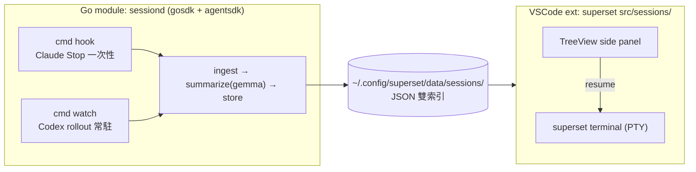

# Multi-Agent Session Summary Hooks (跨 agent session 摘要面板)

> 進行中設計。目標:把 AI coding session 逐 turn 摘要,attach 到 session 與 workspace,
> 在 VSCode side panel 呈現,使用者可瀏覽 turn 摘要後決定是否 resume。
>
> `本次範圍`(2026-07-20 收斂):先落地 `Claude Code`(原生 hook)+ `Codex`(檔案 watch)。
> `Grok` / `Antigravity` 延後(§10 保留調查結果)。
> ingest + summary 抽成`獨立 Go module`,用 `github.com/bizshuk/gosdk` + `github.com/bizshuk/agentsdk`,
> 摘要模型暫定 `gemma`(走 agentSDK `provider/google`)。VSCode 端只當 consumer。

---

## 1. 結論 (Decision)

拆成`兩個部署單位`,以一份 JSON store 為唯一契約(seam):



分工理由:

- 摘要要呼叫 LLM(gemma)+ 解析大 JSONL + 常駐 watch,這些在 Go(gosdk/agentSDK)遠比在 VSCode extension 內做乾淨,也符合 workspace 分層(framework 層被 app 層 import)。
- VSCode extension 保持薄:只讀 store、畫 tree、按 resume 開 terminal(複用既有能力),不碰 LLM、不 parse 原始 agent 格式。
- store 是`唯一耦合點`:先凍結它,兩邊即可獨立開發。

---

## 2. 地基:四家實測格式 (2026-07-20 本機盤點)

| Agent | session 位置 | 格式 | workspace 來源 | turn 單位 | 觸發 | 本次範圍 |
| --- | --- | --- | --- | --- | --- | --- |
| `Claude Code` | `~/.claude/projects/<enc-cwd>/<sid>.jsonl` | JSONL,`type:user/assistant` + `uuid`/`parentUuid` 鏈 | hook payload `cwd` / 目錄名反解 | 真實 user prompt → 下一個之間 | `原生 hook` `Stop`(stdin 帶 `session_id`/`transcript_path`/`cwd`) | ✅ 落地 |
| `Codex` | `~/.codex/sessions/YYYY/MM/DD/rollout-<ts>-<id>.jsonl` | JSONL,`payload.type:message` `role:user/assistant` | `session_meta.payload.cwd` | `response_item` role 切換 | 無 hook → `fsnotify` tail | ✅ 落地 |
| `Grok` | `~/.grok/sessions/<url-enc-cwd>/<sid>/{summary.json,updates.jsonl}` | JSON + JSONL | 路徑內 url-enc cwd + `git_root_dir` | `updates.jsonl` 事件 | tail + 直接讀 `summary.json` | ⏸ 延後 |
| `Antigravity` | `~/.gemini/antigravity/conversations/<uuid>.db` | SQLite `steps(blob)` + `.pb` | `trajectory_meta` | `steps` row | SQLite `mtime` 輪詢 | ⏸ 延後 |

本次只需 Claude + Codex,兩家都是 append-only JSONL,可用同一套 offset-cursor 讀取(只解析新增行,避免整檔重讀)。

---

## 3. 共享契約:store JSON schema (先凍結)

路徑用 gosdk `config.GetAppDataDir()`(appName = `superset`)→ `~/.config/superset/data/sessions/`。
Go 端`只寫`,VSCode 端`只讀` + `fs.watch` 觸發 refresh。

```tree
~/.config/superset/data/sessions/
├── index.json                 # workspace → ["claude:<sid>", "codex:<sid>"] 反向索引
├── claude-<sid>.json          # 單一 AgentSession
└── codex-<sid>.json
```

`AgentSession`(`model/session.go`,同時是 TS 端 `types.ts` 的鏡像):

```jsonc
{
  "agent": "claude",                 // claude | codex | grok | antigravity
  "sessionId": "70471642-...",
  "workspacePath": "/Users/shuk/projects/tmp/superset",
  "title": "探查四個 agent session 格式",
  "startedAt": "2026-07-20T10:31:59Z",
  "lastActiveAt": "2026-07-20T12:40:00Z",
  "turnCount": 10,
  "resume": { "kind": "terminal", "command": "claude --resume 70471642-...", "cwd": "/Users/.../superset" },
  "turns": [
    { "index": 1, "userText": "讀 CLAUDE.md 與結構", "summary": "讀專案說明並盤點結構", "at": "...", "source": "llm" }
  ],
  "schemaVersion": 1
}
```

`source` ∈ `native | heuristic | llm`。`schemaVersion` 讓兩邊各自演進不會默默錯位。

---

## 4. Go module 架構 (`sessiond`)

獨立 module(app/tool 層),自帶 `go.mod`,import framework 層。SRP 分層,純函式優先可測。

```tree
session-summary/                 # module github.com/bizshuk/session-summary
├── go.mod
├── main.go                      # cobra root + config.Default(WithAppName("superset"))
├── cmd/
│   ├── hook.go                  # `sessiond hook`     一次性,Claude Stop hook 呼叫
│   ├── watch.go                 # `sessiond watch`    常駐,fsnotify tail Codex rollout
│   └── backfill.go              # `sessiond backfill` 一次性,補摘要既有 session
├── ingest/
│   ├── claude.go                # parseClaudeTurns(transcriptPath, sinceUUID) → []Turn, cwd
│   ├── codex.go                 # parseCodexTurns(rolloutPath, sinceOffset) → []Turn, cwd
│   └── ingest_test.go           # 純函式,吃 fixture jsonl,無 I/O
├── summarize/
│   ├── summarizer.go            # interface Summarizer
│   ├── gemini.go                # agentsdk provider/google → gemma
│   ├── heuristic.go             # fallback:user prompt 首行截斷(零成本)
│   └── prompt.go                # zh-Hant SYSTEM_PROMPT 常數
├── store/
│   ├── store.go                 # JSON 雙索引 + atomic write(temp+rename)+ mtime 快取
│   └── store_test.go
├── model/session.go             # AgentSession / TurnSummary(共享契約)
└── ecosystem.config.js          # pm2: sessiond watch(namespace Superset, autorestart)
```

核心介面(讓摘要後端可換 = agentSDK provider registry):

```go
// summarize/summarizer.go
type Summarizer interface {
    Turn(ctx context.Context, in TurnInput) (string, error) // 回一行摘要
}
type TurnInput struct{ Agent, UserText, AssistantGist string }
```

gemma 後端(agentSDK):

```go
// summarize/gemini.go
func NewGemini(ctx context.Context, model string) (Summarizer, error) {
    p, err := google.New(ctx, google.WithModel(model)) // GOOGLE_API_KEY 走 env
    if err != nil { return nil, fmt.Errorf("google provider: %w", err) }
    return &gemini{p: p}, nil
}
func (g *gemini) Turn(ctx context.Context, in TurnInput) (string, error) {
    res, err := g.p.Generate(ctx, core.ModelRequest{
        Messages:  []core.Message{sysMsg(SYSTEM_PROMPT), userMsg(render(in))},
        MaxTokens: 64, // 一行摘要,壓成本
    })
    if err != nil { return "", fmt.Errorf("gemma summarize: %w", err) }
    return strings.TrimSpace(res.Text), nil
}
```

`★ 設計 ─────────────────────────────────────`
- `heuristic` 是`預設可用`路徑:turn 摘要 = 清理後 user prompt 首行(截 ~40 字)。整條 pipeline 不接 LLM 就能端到端跑;`gemma` 是後插的品質升級,靠 config 開關,失敗自動降級到 heuristic(不讓摘要失敗擋住 ingest)。
- 摘要後端由 `config` 選:`summarizer.provider` = `google`(gemma,預設)/ `ollama`(本地無 API key)/ `anthropic`。全部走 agentSDK 同一個 `Generate`,換 provider 不改 pipeline。
- gemma 走 Google Generative Language API,需 `GOOGLE_API_KEY`;若要`完全本地零成本`,改 `provider/ollama` 拉本地 gemma。
`─────────────────────────────────────────────`

---

## 5. 兩條 ingest 路徑

Claude(push,一次性):

```tree
Claude Stop hook  →  `sessiond hook`  (stdin JSON: session_id / transcript_path / cwd)
  ├─ store.LastUUID(session_id)                       # 上次處理到哪
  ├─ ingest.parseClaudeTurns(transcript_path, sinceUUID)
  │     濾掉 sidechain / command-caveat / 純 tool_result user 行
  ├─ summarize.Turn(...) 每個新 turn
  └─ store.Upsert(session)                            # atomic
```

`<git-root>/.claude/settings.json`（選裝，需使用者同意）：

```json
{ "hooks": { "Stop": [ { "hooks": [ { "type": "command", "command": "sessiond hook" } ] } ] } }
```

Codex(pull,常駐):

```tree
`sessiond watch`  (pm2 常駐)
  ├─ fsnotify 監看 ~/.codex/sessions  (rollout-*.jsonl 的 create/write)
  ├─ 每檔 offset cursor;parseCodexTurns(path, sinceOffset) → turns + session_meta.cwd
  ├─ summarize + store.Upsert
  └─ 啟動時先 backfill 一輪(近期檔)
```

`★ 設計 ─────────────────────────────────────`
Claude 用 hook 而非 watch,是因為它`唯一`提供原生 turn 邊界事件(Stop),延遲最低且不用輪詢整個 `~/.claude/projects`。Codex 無 hook,只能 watch。兩者最後都匯進同一個 `summarize → store` 管線。就算 Claude hook 沒裝,`sessiond backfill` 一樣能事後補。
`─────────────────────────────────────────────`

---

## 6. 設定 (gosdk viper)

| key / env | 預設 | 用途 |
| --- | --- | --- |
| appName | `superset` | 決定 `~/.config/superset/{data,logs}` |
| `summarizer.provider` | `google` | `google` / `ollama` / `anthropic` |
| `summarizer.model` | `gemma`(暫定,`需 verify` 有效 id) | 傳給 `google.WithModel` |
| `summarizer.enabled` | `true` | false → 只用 heuristic |
| `GOOGLE_API_KEY`(env) | — | google provider 認證 |
| `claude.projectsDir` | `~/.claude/projects` | 覆寫用 |
| `codex.sessionsDir` | `~/.codex/sessions` | 覆寫用 |

`config.Default(config.WithAppName("superset"))` 必須在 cmd 啟動時呼叫,否則 viper 讀到空字串(gosdk 慣例)。

---

## 7. VSCode 端 `src/sessions/`(Phase 5,薄)

feature-as-folder + `ExtensionPlugin` shim,`extension.ts` 的 `activateAll([...])` 加一行。

- `store.ts`:讀 `~/.config/superset/data/sessions/`,`fs.watch` 該目錄 → refresh。`不`再 parse 原始 agent 格式(Go 端已做完)。
- `treeSpec.ts`:純函式 row 渲染(可 vitest)。
- resume:讀 `session.resume.command` + `cwd`,開 superset PTY terminal 跑它。

```tree
Sessions ▸
├─ [claude] 探查四個 agent 格式 · 10 turns · 2h ago   [▶ resume]
│   ├─ 1. 讀 CLAUDE.md 與結構
│   └─ …10
└─ [codex]  surfboard adapter 重構 · 4 turns · yesterday [▶ resume]
```

session row 預設收合(對齊 Projects TODO overview,避免炸行);tooltip 放 workspace + git branch。

### 已落地 (2026-07-20)

面板`兩層`,tree 只有一層,第二層是 editor 文件:

1. `TreeView superset.sessions`(container `superset`,位置在 `topology` 與 `todo` 之間,非獨立 side panel)。
   一列一個 session,dim description = `檔案大小 · turn 數 · 相對時間`;右鍵 `Copy Session ID` / `Delete Session`(inline 垃圾桶,modal 確認)。
2. 點列開 `superset-session:` virtual document(read-only markdown):
   `#` session 標題 / `##` 每個 round / `###` 每次 tool 執行與結果。

| 檔案 | 職責 |
| --- | --- |
| `store.ts` | 定位 / 解析 / watch JSONL,`%2F` workspace 編碼與 Go 端對稱 |
| `markdown.ts` | 純 renderer:record → markdown(heading 契約在此) |
| `treeSpec.ts` | 純 row spec(label / description / tooltip / icon) |
| `sessionsTreeProvider.ts` | vscode-bound provider + 空狀態列 |
| `sampleData.ts` | `sample-*.jsonl` 假資料產生/清除(gemma 摘要未驗證前的可視化路徑) |

`sample 是 fixture matrix 不是 demo`:8 筆各自標註 `covers`,合起來打到每一條 render 分支 —
四家 agent + 未知 agent(icon fallback)、`llm`/`heuristic`/`native` 三種 source、error turn 與 error tool、
無 resume(Antigravity)、0 turn(空狀態)、malformed 尾行(⚠️ banner)、過長標題截斷、多行 prompt quote、
>1200 字 tool 輸出截斷、`m/h/yesterday/d` 四種相對時間。`test/sessionsStore.test.ts` 對這個矩陣逐項斷言,
新增 render 分支但沒有 sample 打到,測試會抓出來。

產生方式有兩條,共用同一份 fixture(`src/sessions/sampleData.ts`),不各自複製:
面板標題列的 $(beaker) `Seed Sample Sessions`,以及 CLI `./scripts/seed-sessions.sh`
(`-w` 指定 workspace、`-d` 指向 scratch store、`-l` 只列出、`-c` 只清除;out/ 不存在會自動 `npx tsc`)。
兩條路徑都只寫/刪 `sample-*.jsonl`,真實 ingest 產生的檔案不受影響(已測)。

`lastActive` 取`最後一個 turn 的 timestamp`,file mtime 只當沒有 timestamp 時的 fallback
(不是 `max(turn, mtime)` — mtime 會因為複製或重新 seed 而跳動,那會讓每一列都顯示 `just now`)。

`已知落差`:
- 一個 session = 一個 `.jsonl` 檔,不是資料夾;「刪除 session」刪的是該檔,大小也是該檔大小。
- `resume` 只渲染在 markdown 尾端的 bash 區塊,`尚未`接 superset PTY terminal(§8 指令仍待實測)。
- `Turn.tools`(H3 來源)是本次新增的 additive 欄位(Go `omitempty`,schemaVersion 維持 1),ingest 端`尚未`填。

### Bug fix (2026-07-20, 落地 1h 後發現)

症狀:點任何 session row 都開到「Session 已不存在」placeholder。

`原因`:`sessionDocUri()` 把 `.jsonl` 路徑塞進 URI 的 path segment;
`vscode.Uri` 在 parse/顯示時會 normalize — `%2F` 解碼回 `/`、leading slash 被折,
回傳的路徑已經不是原本的檔案,`readSession()` 找不到 → placeholder。
workspace 編碼後的 `%2F` 是這個問題的放大器,但同樣的 bug 在任何 `~/.config/...`
絕對路徑下都會發生。

`修正`:`docUri.ts` 新增,把 `.jsonl` 路徑搬到 URI 的 `query`、
path 只放 `/{session_id}.md`。Helper 依賴結構型別 `SessionDocUri`,
`不` import `vscode`,所以 vitest 不需要 host API 就能斷言 round-trip。

---

## 8. Resume 指令 (需實作前逐一 verify)

| Agent | 指令(在 `resume.cwd` 下) | 狀態 |
| --- | --- | --- |
| `Claude Code` | `claude --resume <sid>` | 穩定 |
| `Codex` | `codex resume <sid>` / `codex --continue` | `需 verify`(版本差異) |

延後兩家:`Grok` `grok --resume <sid>`(verify);`Antigravity` 無 CLI resume,只 reveal。

---

## 9. 分階段落地 (build order)

```tree
Phase 0  ✅ 凍結契約:internal/model/session.go(JSONL meta+turn,schemaVersion)
Phase 1  ✅ Go 骨架:main + config.Default("superset") + store(冪等 append 雙索引)+ heuristic
Phase 2  ✅ Claude:ingest/claude.go + `sessiond hook claude`(讀 stdin payload → transcript)
Phase 3  ✅ Codex:ingest/codex.go + `sessiond hook codex`(改用 hook,不需 watch daemon)
	         ✅ install：註冊兩家 project-level hook（dry-run 預設，`--apply` 才寫，含備份）
Phase 4  ✅ gemma:summarize/gemini.go 接 agentsdk provider/google(config 驅動,無 key 自動降級 heuristic;只摘要新增 turn)
Phase 5  🔨 VSCode src/sessions/:讀契約 + TreeView + summary-as-markdown ✅ / resume-in-terminal ⏸
```

`修正`:原 Phase 3 規劃 Codex 走 `fsnotify watch`;實測 Codex 已有 lifecycle hooks(`Stop`/`SubagentStop`),
兩家統一走 `JSON-over-stdin` hook,`不需常駐 watch daemon`,pm2 也省了。

Phase 1–3 已完成:Claude+Codex 的 turn 逐條進 JSONL(heuristic 摘要),`go test ./...` 綠 + 真實 transcript smoke 通過。
Phase 4 換 gemma 升級摘要品質;Phase 5 才畫面(可平行)。

### 實作關鍵發現 (2026-07-20)

- 兩家 hook payload 同構:`session_id` / `transcript_path` / `cwd` / `hook_event_name`(Codex 另有 `turn_id` / `last_assistant_message`)。turn 內容一律`從 transcript 檔重讀`,不信 payload 文字。
- `Claude` event 確認為真:`Stop` / `StopFailure` / `SubagentStop` / `TaskCompleted`;`Codex` lifecycle hooks 含 `Stop` / `SubagentStop`,config 在 `config.toml` 的 `[[hooks.*]]`。
- `Codex` turn 的乾淨來源是 `event_msg` 的 `user_message` / `agent_message`(不是 `response_item` — 後者混入 `<permissions>` / `<recommended_plugins>` / `# AGENTS.md` 等注入,需過濾)。
- hook 必須 `exit 0`(Claude `exit 2` 會 block Stop);Codex 需在 stdout 回 `{"continue": true}`。
- project-level Codex target 固定為 `<git-root>/.codex/config.toml`；trusted project 才啟用，且 hook 支援依 installed Codex version 而異。

---

## 10. 待驗證 / 風險

- `gemma` 有效 model id(Google API)+ `GOOGLE_API_KEY`;`google.Models()` 只列 gemini,需確認 `Generate` 不擋非白名單 id(否則走 `provider/ollama` 本地 gemma)。
- `core.Message` / `core.ModelRequest` / `ModelResult` 實際欄位名(Role 常數、Text vs Content),實作時對 `agentsdk/core` 核對。
- Codex / Grok resume 旗標實測(§8)。
- Claude JSONL 可能數 MB:offset/uuid cursor 只讀新增行。
- 大量 session:discover / backfill lazy 化,避免一次解析數十 workspace。
- Go module 放置:建議`獨立 repo`(app/tool 層,binary 裝 `~/.local/bin` + pm2 常駐);與 superset extension 僅靠 §3 store 契約耦合,不進 superset 的 npm build。

### 延後家(調查已完成,備忘)

- `Grok`:已自帶 `~/.grok/sessions/.../summary.json`(`session_summary` = 首個 prompt)→ 未來 adapter 幾乎零成本,直接 reuse。
- `Antigravity`:`conversations/<uuid>.db` SQLite `steps.step_payload` 是 protobuf blob,無 `.proto` 時只能 heuristic 抽文字或僅「列出 + turn 數」;摘要 best-effort,resume 只能 reveal。
