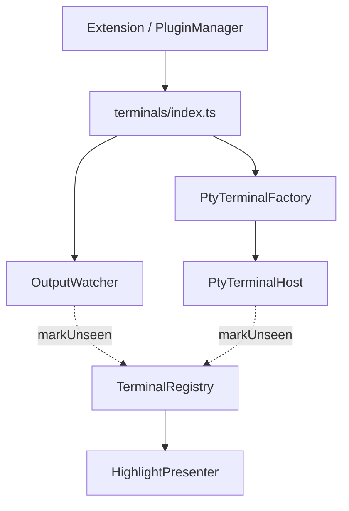
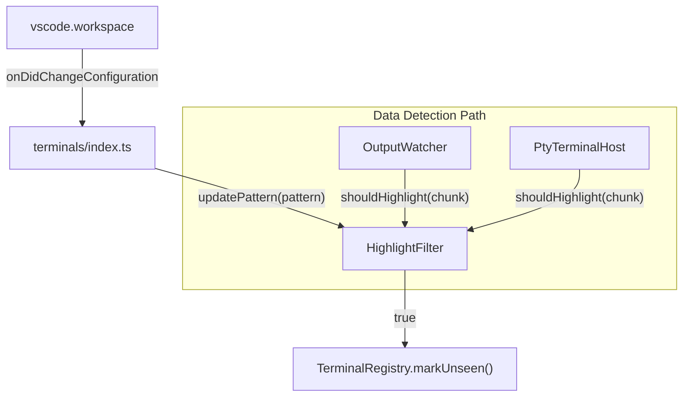

# 架構計畫 — highlight-regex (Architecture Plan)

## 1. 目標與範圍 (Goal & Scope)

VSCode 擴充功能的使用者透過自訂的規則運算式 (regex) 決定哪些背景終端機輸出內容才觸發未讀高亮提示。

以下項目為 `非本階段目標 (out of scope)`：
- 支援對自訂規則運算式做語法驗證的 UI 編輯器，設定僅限於 `settings.json` 的配置或一般的文字輸入框。
- 修改既有的 PTY 資料攔截核心邏輯，如 `ptyTerminalHost`、`outputWatcher` 等元件，僅在其上層擴充判定過濾邏輯。
- 支援針對不同的正規表達式匹配套用不同的高亮顏色，高亮提示仍沿用系統既有的顏色與邏輯。

## 2. 現況架構 (Current Architecture)

目前終端機模組中，`OutputWatcher` 負責監聽 VSCode 內建的 Shell 執行資料（利用 `Shell Integration` 串流），而 `PtyTerminalHost` 負責攔截使用者手動建立之 PTY-backed 終端機的所有輸出。當它們收到資料時，會直接呼叫 `TerminalRegistry.markUnseen` 以觸發高亮提示。

現況架構如下：

相關模組清單：
- [index.ts](file:///Users/shuk/projects/tmp/superset/src/terminals/index.ts)：終端機模組進入點與組裝層。
- [outputWatcher.ts](file:///Users/shuk/projects/tmp/superset/src/terminals/outputWatcher.ts)：內建終端機輸出事件監聽器。
- [ptyTerminalHost.ts](file:///Users/shuk/projects/tmp/superset/src/terminals/ptyTerminalHost.ts)：自訂 PTY 串流宿主。
- [ptyTerminalFactory.ts](file:///Users/shuk/projects/tmp/superset/src/terminals/ptyTerminalFactory.ts)：PTY 宿主工廠。
- [terminalRegistry.ts](file:///Users/shuk/projects/tmp/superset/src/terminals/terminalRegistry.ts)：管理終端機註冊與未讀狀態。

## 3. 架構位置與邊界 (Placement & Boundaries)

- 位置說明：
  - 新設一個純邏輯過濾元件 `HighlightFilter` 於 `src/terminals/highlightFilter.ts`。此元件負責儲存已編譯的 `RegExp` 物件、過濾 ANSI 控制字元（避免控制序列破壞正則匹配），並執行比對。
  - 此元件為純程式碼邏輯，不依賴 `vscode` 命名空間與任何環境 I/O，便於 100% 進行單元測試。
  - 在 `src/terminals/index.ts` 內，我們藉由監聽 `vscode.workspace.onDidChangeConfiguration`，在使用者修改 `superset.highlightRegex` 設定時，即時編譯並更新 `HighlightFilter`。
  - `OutputWatcher` 與 `PtyTerminalHost` 均以依賴注入方式取得 `shouldHighlight` 的回傳函式，於觸發 `markUnseen` 前先行呼叫。

- 邊界清單：
  - `HighlightFilter` 擁有：RegExp 的解析、編譯、快取、ANSI 碼清理、以及字串比對邏輯。
  - `HighlightFilter` 不碰觸：VSCode 設定變更監聽、終端機群組指派、高亮渲染邏輯或終端機生命週期。

## 4. 介面與資料流 (Interfaces & Data Flow)

### 介面設計 (Interface Design)

| 介面/方法名稱 (Interface/Method) | 呼叫端 (Caller) | 被呼叫端 (Callee) | 輸入 (Inputs) | 輸出 (Outputs) | 錯誤情況 (Error Cases) |
| :--- | :--- | :--- | :--- | :--- | :--- |
| `shouldHighlight(data: string)` | `OutputWatcher`, `PtyTerminalHost` | `HighlightFilter` | `data: string` (終端機輸出片段) | `boolean` (是否觸發未讀高亮) | 正則表達式無效或未設定時，預設回傳 `true` 降級為全部高亮。 |
| `updatePattern(pattern?: string)` | `terminals/index.ts` | `HighlightFilter` | `pattern?: string` (自訂 RegExp 字串) | `void` | 傳入無效的正則表達式時，捕捉 `SyntaxError` 並記錄錯誤日誌，內部 regex 設為 `undefined`。 |

### 資料流圖 (Data Flow Diagram)

## 5. 清晰與可擴充性檢查 (Clarity & Scalability Check)

- 單一職責：新模組只有一個變更理由？
  - `是`：`HighlightFilter` 唯一的職責就是依設定的正則表示式來判斷資料內容，僅在過濾邏輯或清理機制改變時需要修改。
- 依賴方向：沒有內層指向外層？沒有循環相依？
  - `是`：`HighlightFilter` 是最底層邏輯，沒有引進外部依賴，也沒有反向依賴任何呼叫端。
- 可替換：外部依賴（DB、第三方服務）都隔在介面後？
  - `是`：此功能並無外部服務或資料庫依賴，與 VSCode Configuration API 的接觸已隔離於 `terminals/index.ts` 中。
- 水平擴充：無狀態、可多實例部署？
  - `是`：`HighlightFilter` 除了編譯快取之外為無狀態元件，可安全並行處理多個終端機的比對。
- 擴充點：下一個同類 feature 可以不改核心就加入？
  - `是`：若未來要增加黑名單/白名單過濾模式，可在不修改 `OutputWatcher` 與 `PtyTerminalHost` 的呼叫介面的前提下，直接擴充 `HighlightFilter`。

## 6. 漸進落地步驟 (Incremental Steps)

| 步驟 (Step) | 做什麼 (What) | 驗證 (Verify) | 回滾 (Rollback) |
| :--- | :--- | :--- | :--- |
| `1. 宣告設定與定義介面` | 在 `package.json` 的 `contributes.configuration` 中新增 `superset.highlightRegex` 設定項，並在 `src/terminals/types.ts` 定義 `shouldHighlight` 的型別。 | 執行 `npm run build` 確認編譯通過，且 VSCode 設定頁面中出現該欄位。 | 還原 `package.json` 與 `src/terminals/types.ts`。 |
| `2. 實作過濾核心元件` | 建立 `src/terminals/highlightFilter.ts` 與其對應單元測試 `test/highlightFilter.test.ts`。實作 ANSI 碼過濾與正則比對邏輯。 | 執行 `npx vitest run test/highlightFilter.test.ts`，確認正則比對成功、異常排除、ANSI 清理以及無效正則降級測試全數通過。 | 刪除 `highlightFilter.ts` 與其測試檔。 |
| `3. 串接過濾邏輯與組裝` | 修改 `outputWatcher.ts`、`ptyTerminalHost.ts` 與 `ptyTerminalFactory.ts` 引入 `shouldHighlight` 依賴。並在 `index.ts` 訂閱設定變更。 | 執行 `npm test` 確認既有測試無受影響。在開發環境中手動輸入一些輸出，驗證符合 regex 時會觸發高亮，不符合時不觸發。 | 還原修改的 4 個 terminals 元件與 `index.ts`。 |
| `4. 新增整合測試` | 在 `test/` 中新增整合測試，模擬設定檔變更對 `OutputWatcher` 與 `PtyTerminalHost` 高亮觸發的影響。 | 執行整個測試套件 `npm test`，確認所有整合測試皆為綠燈。 | 刪除整合測試檔，還原測試異動。 |

## 7. 風險與假設 (Risks & Assumptions)

- 假設：VSCode 的 `execution.read()` 與 `node-pty` 的 `onData` 傳遞的 chunk 長度為不確定，若使用者設定的規則運算式剛好被切在 chunk 邊界上，可能會導致該次比對失敗。本階段假設大部分的觸發關鍵字長度較短，直接進行 chunk-level 的比對已能滿足 95% 以上的需求；若未來有跨 chunk 比對需求，需引入滑動視窗字元緩衝區 (sliding buffer)。
- 假設：使用者可能會設定極為複雜的規則運算式，從而引發 Regular Expression Denial of Service (ReDoS)。由於此設定為使用者自訂，故風險由使用者自行承擔，但我們藉由 `try-catch` 捕捉語法錯誤防範 extension 崩潰。
