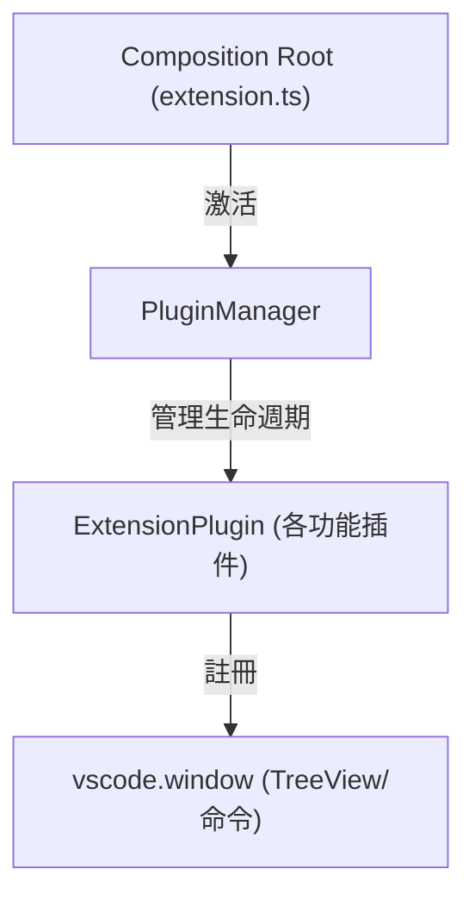
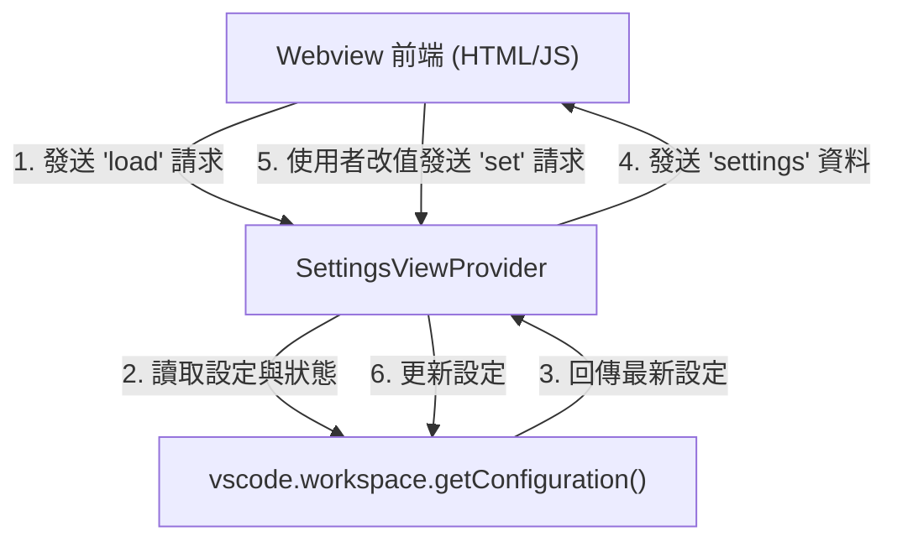

# 架構計畫 — open-settings-webview (Architecture Plan)

## 1. 目標與範圍 (Goal & Scope)

設計一個 `設定網頁視圖 (Settings Webview)` 功能，允許使用者在自訂的 Webview 介面中集中管理所有 Superset 設定，並能即時看見各面板的資料狀態與更新設定。

- 一句話目標：`使用者 (VS Code 使用者)` 用它 `在 Webview 介面中集中管理所有 Superset 設定，並能即時看見各面板的資料狀態標章 (Status Badge) 與更新設定`。
- 不做什麼 (Out of Scope)：
  1. 不提供設定檔的匯出與匯入功能，僅提供重設與編輯。
  2. 不更改 VS Code 原生 `Settings UI` 的佈局與樣式，僅提供獨立的 `webview` 面板。
  3. 不包含設定變更的雲端同步功能，設定仍儲存於本機的 `vscode.workspace.getConfiguration` 中。

## 2. 現況架構 (Current Architecture)

目前 Superset 採用插件底座 `PluginManager` 管理多個 `ExtensionPlugin` 的生命週期。現有的模組（如 `terminals`、`mdns` 等）皆封裝為插件並在 `extension.ts` 中被註冊。目前尚未有集中式的設定管理模組，所有設定均透過 VS Code 預設的設定介面或手動修改 `settings.json` 來進行。

現況架構如下：

相關模組清單：
- [extension.ts](file:///Users/shuk/projects/tmp/superset/src/extension.ts)：擴充功能進入點與組裝層。
- [plugin/types.ts](file:///Users/shuk/projects/tmp/superset/src/plugin/types.ts)：定義插件與插件上下文合約。
- [globalCommandsPlugin.ts](file:///Users/shuk/projects/tmp/superset/src/globalCommandsPlugin.ts)：註冊全域命令（如快取重設）。

## 3. 架構位置與邊界 (Placement & Boundaries)

- 位置說明：
  - 我們將在 `src/settings/` 底下新增 `plugin.ts` 與 `viewProvider.ts`。
  - 新增之 `settingsPlugin` 將實作 `ExtensionPlugin` 介面，並由 `PluginManager` 統一載入。
  - `SettingsViewProvider` 將實作 `vscode.WebviewViewProvider`，負責處理視圖生命週期與訊息傳遞。
- 依賴方向：
  - 依賴方向僅由外層指向內層。`SettingsViewProvider` 依賴 `PluginContext` 與 `vscode` API。
  - 本模組不被其他功能模組（如 `terminals`、`mdns`）反向依賴，避免循環相依。
- 邊界定義：
  - `SettingsViewProvider` 擁有：webview HTML 樣式、與 webview 前端之 IPC 訊息通道管理、以及對 `package.json` 中 `superset` 設定項之檢視與修改邏輯。
  - `SettingsViewProvider` 不碰觸：各功能插件之內部狀態管理或背景掃描之具體實作，僅藉由讀取其公開之狀態計數或狀態標章。

## 4. 介面與資料流 (Interfaces & Data Flow)

### 介面設計 (Interface Design)

| 介面/方法名稱 (Interface/Method) | 呼叫端 (Caller) | 被呼叫端 (Callee) | 輸入 (Inputs) | 輸出 (Outputs) | 錯誤情況 (Error Cases) |
| :--- | :--- | :--- | :--- | :--- | :--- |
| `resolveWebviewView(webviewView)` | `vscode` | `SettingsViewProvider` | `webviewView: vscode.WebviewView` | `void` | webviewView 載入 HTML 失敗時，VS Code 將回報視圖渲染錯誤。 |
| `onDidReceiveMessage(message)` | `Webview 前端` | `SettingsViewProvider` | `message: { type: string, key?: string, value?: any }` | `void` | 訊息格式不符或 key 不在白名單內時，寫入診斷日誌並捨棄該訊息。 |
| `postMessage(message)` | `SettingsViewProvider` | `Webview 前端` | `message: { type: string, payload: any }` | `Thenable<boolean>` | Webview 已被銷毀 (Disposed) 時，發送失敗並回傳 `false`。 |

### 資料流圖 (Data Flow Diagram)

## 5. 清晰與可擴充性檢查 (Clarity & Scalability Check)

1. 單一職責：新模組只有一個變更理由？
   - `是`。`SettingsViewProvider` 僅在設定視圖的 UI 佈局或 IPC 通訊協定改變時需要變更。
2. 依賴方向：沒有內層指向外層？沒有循環相依？
   - `是`。本模組僅單向依賴 `PluginContext` 與 `vscode` API，其他功能模組不依賴本模組.
3. 可替換：外部依賴（DB、第三方服務）都隔在介面後？
   - `是`。本模組與 VS Code 設定儲存庫的依賴均透過 `vscode.workspace.getConfiguration` 介面進行，不直接接觸底層檔案儲存。
4. 水平擴充：無狀態、可多實例部署？
   - `是`。Webview 為無狀態檢視器，其資料完全來自 VS Code 控制器的即時查詢。
   - `注意`：由於 VS Code 視窗限制，設定面板通常為單一實例，但在多視窗環境下可安全獨立運作。
5. 擴充點：下一個同類 feature 可以不改核心就加入？
   - `是`。若未來有新增的 `superset.*` 設定，只需在 `package.json` 與 `viewProvider` 的設定白名單中追加該 key 名稱即可，不影響核心的 IPC 通訊與渲染機制。

## 6. 漸進落地步驟 (Incremental Steps)

| 步驟 (Step) | 做什麼 (What) | 驗證 (Verify) | 回滾 (Rollback) |
| :--- | :--- | :--- | :--- |
| `1. 新增設定配置與 Command 宣告` | 在 `package.json` 中配置 `contributes.configuration` 區塊，定義設定項，並聲明 `superset.openSettings` 指令與 webview 視圖 `superset.settings`。 | 執行 `npm run build` 通過編譯，並在 VS Code 設定中能找到對應的設定項目。 | 撤銷 `package.json` 的修改。 |
| `2. 實作 Webview HTML 與通訊核心` | 於 `src/settings/` 建立 `viewProvider.ts`，實作 `SettingsViewProvider`，載入 `webview/settings.html`，並實作 `onDidReceiveMessage` 的 `load` 與 `set` 處理邏輯（包含 key 的白名單檢查機制）。 | 撰寫 `test/settingsViewProvider.test.ts` 針對設定載入與儲存做單元測試，執行 `npm test` 確認通過。 | 刪除 `src/settings/` 與測試檔案。 |
| `3. 註冊 Settings 插件至 Plugin System` | 實作 `src/settings/plugin.ts`，包裝為 `settingsPlugin: ExtensionPlugin`，並在 `src/extension.ts` 中將其加入 `plugins` 陣列進行載入。 | 執行 VS Code Extension 開發視窗，使用命令 `Superset: Open Settings`，能正常開啟側邊欄的 settings 面板，且顯示設定清單。 | 還原 `src/extension.ts`，移除對 `settingsPlugin` 的引用。 |
| `4. 前端資料雙向綁定與狀態標章實作` | 於 webview 前端實作 UI，建立輸入控制項，並在 extension 端取得各 plugin 的即時狀態計數，動態推送至 webview 渲染為狀態標章。 | 在 webview 介面中修改設定值，確認對應的 `settings.json` 會同步更新。 | 撤銷 `src/settings/viewProvider.ts` 與 `webview/settings.html` 相關的修改。 |

## 7. 風險與假設 (Risks & Assumptions)

- `風險一：設定項定義不一致 (Configuration inconsistency)`：
  - `原因`：若在 `package.json` 中定義的設定項與 `viewProvider.ts` 的 `KNOWN_KEYS` 白名單不同步，可能導致 webview 無法更新該項設定。
  - `對策`：於 `viewProvider.ts` 中明確記錄設定項的白名單，未來若新增設定須同時在此二處進行修改；或在後續規劃中，利用 `fs` 模組動態讀取並解析 `package.json` 的 contributions，以達到單一事實來源。
- `風險二：Webview XSS 安全性問題 (Webview XSS security)`：
  - `原因`：當 webview 接收到設定值（特別是字串型別的 `highlightRegex`）時，若無適當過濾而直接使用 `innerHTML` 渲染，可能遭受 XSS 攻擊。
  - `對策`：在載入 HTML 時使用 `escapeHtml` 處理設定值，且不允許在 HTML 內使用 inline event handlers，嚴格遵守 Content Security Policy 規範。
