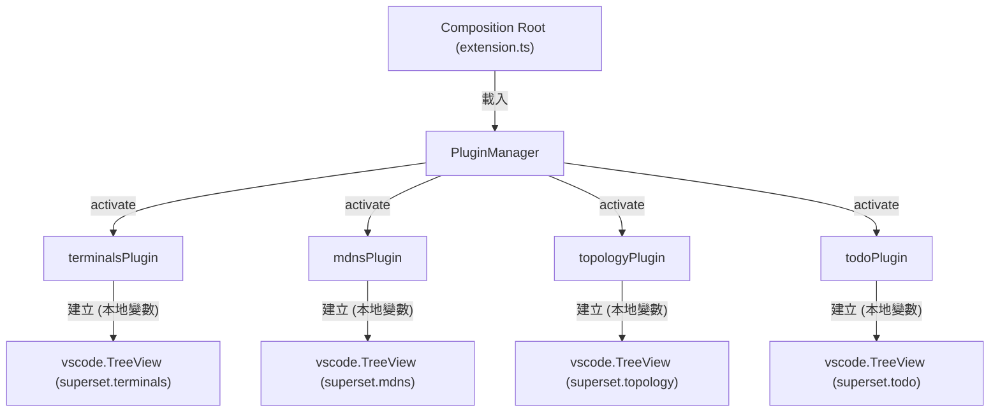
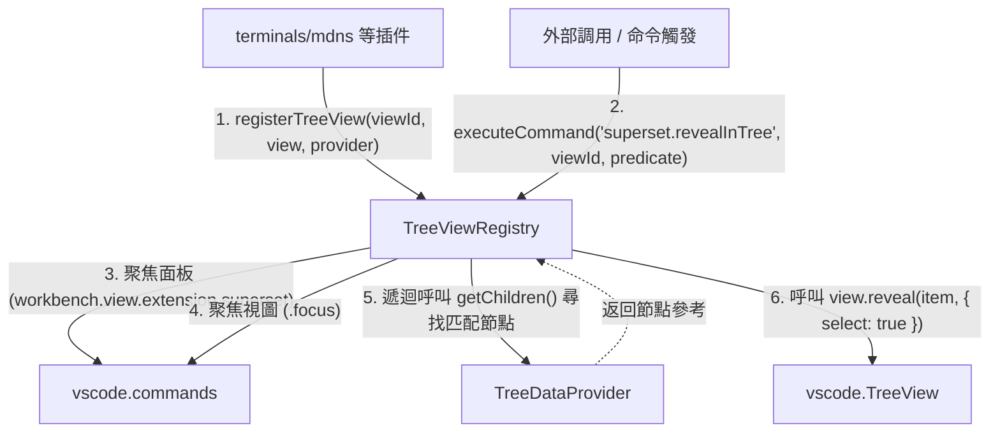

# 架構計畫 — reveal-in-tree (Architecture Plan)

## 1. 目標與範圍 (Goal & Scope)

設計一個 `樹狀視圖定位與聚焦 (Reveal in Tree)` 功能，允許使用者或其他模組透過一個通用的介面與命令，在 Superset 面板 of `TreeView` 中自動展開、定位並選中特定的節點。

- 一句話目標：`使用者/其他模組` 用它 `在 terminals、mdns、topology 與 todo 面板的 TreeView 中自動 focus 並定位特定節點`。
- 不做什麼 (Out of Scope)：
  1. 不支援定位非 Superset 擴充功能持有的 TreeView（如 VS Code 內建的檔案總管或 Git 面板）。
  2. 不涉及 TreeView 底層資料庫、模型或狀態的任何更新。
  3. 不支援在單次定位中同時選取或高亮多個不同節點。

## 2. 現況架構 (Current Architecture)

目前 Superset 在 `src/extension.ts` (Composition Root) 中使用 `PluginManager` 載入多個功能插件（如 `terminalsPlugin`、`mdnsPlugin`、`topologyPlugin`、`todoPlugin`）。各功能插件在其 `register` 入口中，呼叫 `vscode.window.createTreeView` 建立各自的 `TreeView`，並將其放入 disposables 中，並未對外公開其實例。

現況架構如下：

相關模組清單：
- [extension.ts](file:///Users/shuk/projects/tmp/superset/src/extension.ts)：組裝層，宣告載入所有插件。
- [plugin/types.ts](file:///Users/shuk/projects/tmp/superset/src/plugin/types.ts)：定義 `PluginContext` 與 `ExtensionPlugin` 合約。
- [terminals/index.ts](file:///Users/shuk/projects/tmp/superset/src/terminals/index.ts)：建立 `superset.terminals` 的 TreeView。
- [mdns/index.ts](file:///Users/shuk/projects/tmp/superset/src/mdns/index.ts)：建立 `superset.mdns` 的 TreeView。
- [topology/index.ts](file:///Users/shuk/projects/tmp/superset/src/topology/index.ts)：建立 `superset.topology` 的 TreeView。
- [todo/index.ts](file:///Users/shuk/projects/tmp/superset/src/todo/index.ts)：建立 `superset.todo` 的 TreeView。

## 3. 架構位置與邊界 (Placement & Boundaries)

- 位置說明：
  - 我們將新增一個機制來管理 TreeView。在 `src/plugin/` 目錄下建立一個輕量型的 `treeViewRegistry.ts`。
  - 在 `PluginContext` 介面中新增一個擴充方法 `registerTreeView(viewId: string, treeView: vscode.TreeView<any>, treeDataProvider: vscode.TreeDataProvider<any>): vscode.Disposable`。
  - 當各個插件（如 `terminals`）在其 `index.ts` 內建立 TreeView 時，透過 `ctx.registerTreeView` 將 TreeView 與資料提供者註冊到此全域註冊表。
  - 在 `globalCommandsPlugin` 中註冊通用命令 `superset.revealInTree`，透過註冊表執行定位邏輯。
- 依賴方向：
  - 各功能插件僅依賴 `PluginContext` 提供之 `registerTreeView` 介面。
  - `treeViewRegistry` 僅相依於 `vscode.TreeView` 與 `vscode.TreeDataProvider` 之標準 API，不依賴任何插件內部的具體領域模型或私有型別。
- 邊界定義：
  - `treeViewRegistry` 擁有：TreeView 的註冊對照關係、通用尋值定位邏輯 (Walk 演算法)、面板聚焦與定位命令的發送。
  - `treeViewRegistry` 不碰觸：各插件的資料載入與狀態異動、UI 項目的圖示與排版、拖曳放開邏輯。

## 4. 介面與資料流 (Interfaces & Data Flow)

### 介面設計 (Interface Design)

| 介面/方法名稱 (Interface/Method) | 呼叫端 (Caller) | 被呼叫端 (Callee) | 輸入 (Inputs) | 輸出 (Outputs) | 錯誤情況 (Error Cases) |
| :--- | :--- | :--- | :--- | :--- | :--- |
| `registerTreeView()` | 各功能插件的 `index.ts` | `PluginContext` / `TreeViewRegistry` | `viewId: string`, `treeView: vscode.TreeView<T>`, `treeDataProvider: vscode.TreeDataProvider<T>` | `vscode.Disposable` | 若該 `viewId` 已經被註冊，記錄警告日誌並覆蓋舊的註冊項。 |
| `superset.revealInTree` (Command) | 外部組件 (如 status bar, mDNS 連結) | `globalCommandsPlugin` / `TreeViewRegistry` | `viewId: string`, `predicate: (item: any) => boolean` | `Promise<boolean>` | 若指定的 `viewId` 未註冊，或未找到匹配 `predicate` 的節點，則記錄日誌並返回 `false`。 |

### 資料流圖 (Data Flow Diagram)

## 5. 清晰與可擴充性檢查 (Clarity & Scalability Check)

1. 單一職責：新模組只有一個變更理由？
   - `是`。`TreeViewRegistry` 的唯一變更理由是 VS Code 定位、聚焦 API 或樹狀遍歷演算法的修改。
2. 依賴方向：沒有內層指向外層？沒有循環相依？
   - `是`。此註冊表設計為通用的 VS Code API 包裝層，其他插件僅調用 `registerTreeView` 宣告註冊，彼此之間不存在任何直接引用或循環依賴。
3. 可替換：外部依賴（DB、第三方服務）都隔在介面後？
   - `是`。對外僅依賴 VS Code 原生 API。
4. 水平擴充：無狀態、可多實例部署？
   - `是`。它是純粹的執行期介面交互組件，不涉及資料庫或硬碟狀態。
5. 擴充點：下一個同類 feature 可以不改核心就加入？
   - `是`。未來如果加入 `superset.settings` 等新樹狀面板，新面板只需在建立後呼叫 `registerTreeView`，無須修改任何定位核心邏輯。

## 6. 漸進落地步驟 (Incremental Steps)

| 步驟 (Step) | 做什麼 (What) | 驗證 (Verify) | 回滾 (Rollback) |
| :--- | :--- | :--- | :--- |
| `1. 設計與實作 TreeViewRegistry` | 在 `src/plugin/treeViewRegistry.ts` 中實作 `TreeViewRegistry` 類別與遞迴搜尋演算法。 | 撰寫單元測試 `test/treeViewRegistry.test.ts` 驗證 `walk` 遍歷與尋值邏輯，確保 `npm test` 通過。 | 刪除 `src/plugin/treeViewRegistry.ts` 檔案與其測試。 |
| `2. 擴充插件上下文介面` | 在 `src/plugin/types.ts` 與 `src/plugin/context.ts` 中新增 `registerTreeView` 方法，並將其連接至全域的 `TreeViewRegistry` 實例。 | 執行 `npm run build` 確認型別編譯無誤。 | 還原 `src/plugin/types.ts` 與 `src/plugin/context.ts` 中關於此方法之修改。 |
| `3. 註冊定位命令與連接組裝層` | 在 `src/globalCommandsPlugin.ts` 中註冊 `superset.revealInTree` 通用定位命令，並由其調用 `TreeViewRegistry`。 | 確保編譯成功，並可在測試環境呼叫此命令無崩潰。 | 還原 `src/globalCommandsPlugin.ts` 中該命令之註冊。 |
| `4. 連接 terminals 插件` | 修改 `src/terminals/index.ts`，在 `treeView` 建立後呼叫 `ctx.registerTreeView`；同時註冊簡化的快捷命令 `superset.revealTerminal`。 | 撰寫測試或進行手動驗證，確保傳入 `Terminal` 節點後，TreeView 能順利 focus 且 highlight。 | 還原 `src/terminals/index.ts` 之變更。 |
| `5. 連接其他插件與整合測試` | 修改 `mdns`、`topology`、`todo` 等模組的 `index.ts` 將 TreeView 註冊。 | 執行整體測試，確認沒有 regression，所有 TreeView 全綠。 | 還原 `mdns`、`topology`、`todo` 之變更。 |

## 7. 風險與假設 (Risks & Assumptions)

- 假設：VS Code 內建 `treeView.reveal` 尋找物件時，要求傳入之 element 物件在 provider `getChildren` 回傳的陣列中必須具備 `Reference Equality` (即引用一致性)。
  - `風險`：部分 TreeDataProvider 在每次呼叫 `getChildren()` 時都回傳全新的物件實例 (例如每次都呼叫 `new TreeItem(...)`），這會導致 `reveal` 匹配不到節點。
  - `對策`：要求或在設計中加強：各功能插件的 DataProvider 在遍歷時返回的物件需為 Stable 的緩存實例，或提供 Stable ID 給 TreeView 使用。
- 假設：折疊節點的展開可能涉及非同步加載延遲。
  - `風險`：如果節點層級過深且每層都是非同步讀取，定位可能會延遲甚至卡死。
  - `對策`：遍歷過程中設定最大深度（例如最深 5 層）以及定位超時機制 (如 3 秒)，超時後自動中斷並記錄警告。
