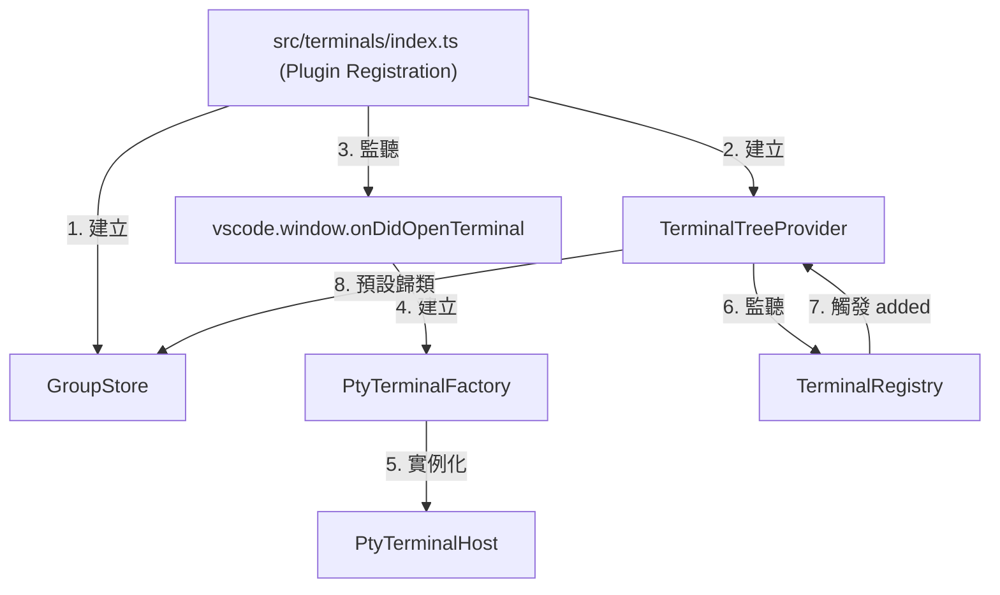
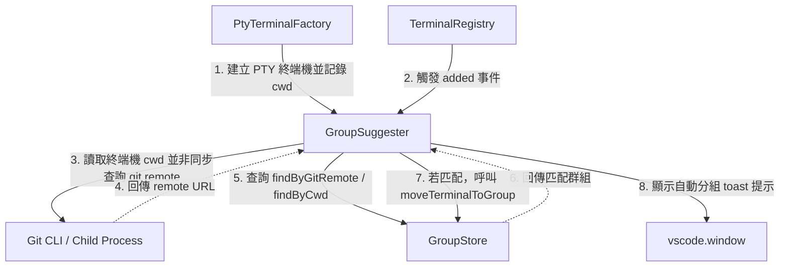

# 架構計畫 — workspace-aware-group-suggestions (Architecture Plan)

## 1. 目標與範圍 (Goal & Scope)

設計一個 `工作區感知群組建議 (Workspace-Aware Group Suggestions)` 機制，當新的 PTY 終端機開啟時，能自動偵測該終端機的 cwd 與 git remote，若匹配既有群組，則自動將其歸類至該群組並以 toast 提示。

- 一句話目標：`使用者` 在開啟新的 `PTY` 終端機時，系統能 `自動偵測該終端機的 cwd 與 git remote，若匹配既有群組的 metadata，則自動將其歸類至該群組並以 toast 提示`。
- 不做什麼 (Out of Scope)：
  1. 不支援非 `PTY-backed` 的原生 VS Code 終端機自動分組（因無法穩定獲取其即時 cwd 且不屬於 PTY 接管範圍）。
  2. 不支援自動創建新群組（只會建議或歸類到已存在的群組）。
  3. 不在此功能中處理群組設定的持久化（交由 `group-metadata-persistence` 處理）。

## 2. 現況架構 (Current Architecture)

目前專案使用 `PluginManager` 載入 `terminalsPlugin` 等功能。在 `terminals` 模組內部，使用 `TerminalRegistry` 記錄終端機，`GroupStore` 記錄群組對照與排序，並在 `TerminalTreeProvider` 監聽 registry 的 `added` 事件以將新終端機分組到 `UNGROUPED`。

現況架構如下：

相關模組清單：
- [index.ts](file:///Users/shuk/projects/tmp/superset/src/terminals/index.ts)：terminals 模組入口，組裝所有終端機相關機制。
- [groupStore.ts](file:///Users/shuk/projects/tmp/superset/src/terminals/groupStore.ts)：純資料層，負責管理群組關係、排序與成員。
- [ptyTerminalFactory.ts](file:///Users/shuk/projects/tmp/superset/src/terminals/ptyTerminalFactory.ts)：負責建立與接管 PTY 終端機。
- [treeProvider.ts](file:///Users/shuk/projects/tmp/superset/src/terminals/treeProvider.ts)：樹狀視圖資料提供者，負責向編輯器回報節點。

## 3. 架構位置與邊界 (Placement & Boundaries)

- 位置說明：
  - 我們將在 `src/terminals/` 下建立一個 `GroupSuggester` 控制器（位於 `groupSuggester.ts`）。
  - 在 `src/terminals/index.ts` 進行初始化時，實例化該控制器並注入 `GroupStore` 與 `TerminalRegistry` 參考。
  - `PtyTerminalFactory` 需要擴充以記錄它建立的各個終端機的 `cwd`，供 `GroupSuggester` 查詢。
- 依賴方向：
  - `GroupSuggester` 僅相依於 `GroupStore`、`TerminalRegistry` 與 `PtyTerminalFactory` 的公開查詢介面。
  - 各個底層資料庫或 PTY 模組不反向相依於 `GroupSuggester`。
- 邊界定義：
  - `GroupSuggester` 擁有：自動歸類判定邏輯、Git 遠端 URL 解析邏輯、非同步排程比對、toast 提示的發送。
  - `GroupSuggester` 不碰：TreeView 節點渲染（由 `TerminalTreeProvider` 負責）、群組狀態變更事件派發（由 `GroupStore` 負責）。

## 4. 介面與資料流 (Interfaces & Data Flow)

### 介面設計 (Interface Design)

| 介面/方法名稱 (Interface/Method) | 呼叫端 (Caller) | 被呼叫端 (Callee) | 輸入 (Inputs) | 輸出 (Outputs) | 錯誤情況 (Error Cases) |
| :--- | :--- | :--- | :--- | :--- | :--- |
| `suggestGroup()` | `TerminalRegistry` 的 `added` 事件監聽器 | `GroupSuggester` | `terminal: TerminalHandle` | `Promise<void>` | 若 git 查詢超時或失敗，將記錄診斷日誌，並維持將其歸入預設群組。 |
| `findByCwd()` | `GroupSuggester` | `GroupStore` | `cwd: string` | `Group | undefined` | 無。 |
| `findByGitRemote()` | `GroupSuggester` | `GroupStore` | `remote: string` | `Group | undefined` | 無。 |
| `getCwdOf()` | `GroupSuggester` | `PtyTerminalFactory` | `terminal: TerminalHandle` | `string | undefined` | 若非 PTY 建立的終端機，回傳 undefined。 |

### 資料流圖 (Data Flow Diagram)

## 5. 清晰與可擴充性檢查 (Clarity & Scalability Check)

1. 單一職責：新模組只有一個變更理由？
   - `是`。`GroupSuggester` 的唯一變更理由是自動歸類與比對策略（如路徑正規化、Git 遠端解析）的調整。
2. 依賴方向：沒有內層指向外層？沒有循環相依？
   - `是`。`GroupSuggester` 依賴於 `GroupStore` 與 `TerminalRegistry`，但它們均不反向依賴 `GroupSuggester`。
3. 可替換：外部依賴（DB、第三方服務）都隔在介面後？
   - `是`。Git 執行程序被封裝在 `GroupSuggester` 的非同步工具方法中，容易進行單元測試與 Mock。
4. 水充擴充：無狀態、可多實例部署？
   - `是`。自動分組判定是基於傳入的終端機實體與 `GroupStore` 現有狀態的純粹邏輯，不保存持久化狀態。
5. 擴充點：下一個同類 feature 可以不改核心就加入？
   - `是`。如果未來需要支援基於環境變數或專案類型（如 Node/Go）的自動分組，只需在 `GroupSuggester` 的比對規則鏈中新增判定邏輯即可。

## 6. 漸進落地步驟 (Incremental Steps)

| 步驟 (Step) | 做什麼 (What) | 驗證 (Verify) | 回滾 (Rollback) |
| :--- | :--- | :--- | :--- |
| `1. 實作 Git 遠端解析與路徑比對工具函式` | 在 `src/terminals/groupSuggest.ts` 中實作 `parseGitRemoteUrl` 與相關工具，包含 `child_process` 封裝。 | 撰寫 `test/groupSuggest.test.ts` 驗證不同格式 Git URL 的解析與 Edge Cases，執行 `npm test` 通過。 | 刪除 `src/terminals/groupSuggest.ts` 與測試檔案。 |
| `2. 擴充 GroupStore 提供查詢與中介資料欄位` | 修改 `src/terminals/groupStore.ts` 增加 `metas` 儲存、`setGroupMeta`、`findByCwd` 與 `findByGitRemote` 方法。 | 撰寫 `test/groupStore.test.ts` 驗證依據 Cwd 與 Remote 正常查詢群組，執行 `npm test` 通過。 | 還原 `src/terminals/groupStore.ts` 的變更。 |
| `3. 在 PtyTerminalFactory 中維護 Cwd 映射` | 修改 `src/terminals/ptyTerminalFactory.ts` 讓 Factory 儲存並曝露所建立終端機的 `cwd` 映射資訊。 | 執行 `npm run build` 確認無型別錯誤，新增測試驗證 map 的 add 與 query。 | 還原 `src/terminals/ptyTerminalFactory.ts` 的變更。 |
| `4. 實作 GroupSuggester 主邏輯與串接事件` | 建立 `src/terminals/groupSuggester.ts` 監聽 `TerminalRegistry` 的 `added` 事件，並進行非同步歸類判定與移動。 | 撰寫整合測試驗證當終端機加入且存在匹配 Group 時，能自動呼叫 `moveTerminalToGroup` 並發送訊息。 | 刪除 `src/terminals/groupSuggester.ts` 並還原 `src/terminals/index.ts` 串接點。 |

## 7. 風險與假設 (Risks & Assumptions)

- 假設：讀取 Git remote URL 可快速返回（使用 local `git config` 讀取而非遠端網路連接）。
  - `風險`：如果磁碟 I/O 慢或進程受阻，可能導致 `execFileSync` 卡死。
  - `對策`：使用非同步 `execFile` 並設置最大超時時間為 1000 毫秒，若超時則取消匹配並回退至預設分組。
- 假設：路徑字串大小寫在不同平台（Mac / Windows）表現一致。
  - `風險`：Cwd 的路徑大小寫差異（如 `/Users/` vs `/users/`）可能導致字串精確比對失敗。
  - `對策`：在比對與儲存前對所有 Cwd 路徑進行正規化（如統一轉為小寫、移除結尾斜線等）。
