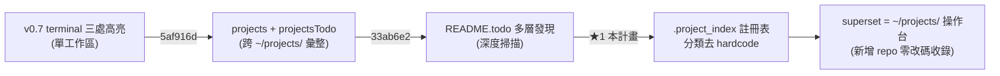

# 業務範圍評估與高價值方向 (Business Scope Evaluation & High-Value Directions)

> 產生日期 (created): 2026-07-08
> 對應 todo: README.todo `## Architecture`

## 1. 評估動機 (Why Evaluate Now)

`superset` 從最初「terminal 三處高亮」單一功能 (v0.1),已長成 8 個 feature module、~9k LOC src / ~7.2k LOC test、44 個 test file、~412 case 的多面板擴充 (v0.8.0)。最近的兩次 commit (`5af916d` projects / projectsTodo plugin、`33ab6e2` README.todo discovery) 把範圍從「單一工作區的終端機面板」推進到「跨 `~/projects/` 全工作區的專案發現 + 專案層級 TODO 管理」。這是一個範圍躍遷 (scope transition),適合回頭盤點:哪些能力是真正高價值的骨幹,哪些是邊際收益遞減的擴充。

> 註:本評估與同日 [`2026-07-08-chore-consistency-redundancy-scalability.md`](2026-07-08-chore-consistency-redundancy-scalability.md) 互補而非重疊 — 那份處理「結構健康度」(todo×projectsTodo 鏡像去重、檔案命名、`.vscodeignore`),本評估處理「業務範圍與高價值方向」(`.project_index` 註冊表消費為主軸)。兩者範圍不交集:本評估的 ★2 (todo 引擎統一) 概念上呼應那份的 Stage 5,但本評估只立項、不實作。

## 2. 業務範圍現況 (Current Scope Map)

以「資料來源 → 面板」對映,目前 8 個 module 分三類價值層:

```tree
superset v0.8.0
├── 核心骨幹 (Core Backbone) — 拿掉這些就不是 superset
│   ├── terminals/     1983 LOC  終端機清單 + 三處高亮 + PTY TUI 偵測 (方案 5)
│   ├── todo/          2457 LOC   單一工作區 README.todo 面板 (parser/repository/store)
│   └── projectsTodo/  1035 LOC   跨 ~/projects/ 多檔 README.todo 彙整面板 (新增)
├── 觀測副面板 (Observation Subpanels) — 與 terminal 共用 tree 框架,獨立資料源
│   ├── mdns/          1438 LOC   mDNS 服務發現 (去重 + TTL 過期)
│   └── topology/       757 LOC   網路拓撲掃描 (interfaces/routing/DNS/ARP + 熔斷)
├── 專案導航 (Project Navigation) — 新增高價值軸
│   └── projects/       372 LOC   ~/projects/ 四層分組掃描 (匯集/應用/框架/工具/暫存)
└── Markdown 貢獻 (Markdown Contributions) — 零 VSCode TreeView,純預覽增強
    ├── treePreview/    190 LOC   `tree` 區塊高亮 + 預覽 (md-tree-highlight 併入)
    └── todoPreview/    186 LOC   README.todo CSS 摺疊預覽
```

### 與根 CLAUDE.md 統一介面的對齊度

根 `~/CLAUDE.md` 定義「每個 repo 須具備 `README.md` / `CLAUDE.md` / `AGENTS.md` / `plans/` / `docs/backlog/` / `docs/specs/` / `README.todo`」與「`.project_index/`(`projects.json` + `INDEX.md`)為全工作區機器可讀註冊表,依 README/CLAUDE.md 自動探索」。`superset` 作為「框架層框架 (framework-layer host)」,其 `projects/` 與 `projectsTodo/` 模組正是對這套統一介面的消費端:

| 統一介面元素                | superset 現況                                                                                              | 對齊? |
| --------------------------- | ---------------------------------------------------------------------------------------------------------- | ----- |
| 各 repo `README.todo`       | `todo/` 讀單一工作區、`projectsTodo/` 彙整多專案 — 已消費                                                   | ✅    |
| `~/projects/` 四層分層      | `projects/projectStore.ts` 用 `FRAMEWORK/TOOL/AGGREGATION_PROJECTS` 三個**硬編碼 Set** 分類                 | ⚠️    |
| `.project_index/` 註冊表     | `src/` 內**零** `project_index` / `projects.json` / `INDEX.md` 引用 — 完全未消費,分類靠 hardcode           | ❌    |
| README/CLAUDE.md 自動探索   | 未實作 — 專案分類與命名皆 hardcode,新增 repo 不會自動收錄                                                 | ❌    |

> 這是本次評估發現的最大落差:`projects/` 模組在 `getRoots()` 用三個 `new Set([...])` 寫死分層,根 CLAUDE.md 明說「新增 repo 只要符合統一介面即自動被收錄」,但目前新增一個 framework repo 必須**改 superset 原始碼**加進 `FRAMEWORK_PROJECTS`。這違反了根規範的演化 (Evolution) 與慣例 (Convention) 原則。

## 3. 高價值面向盤點 (High-Value Axes)

依「對核心使用情境的槓桿 × 實作風險」排序:

| 順位 | 面向                                          | 槓桿 (Leverage)                                                                                       | 風險 | 說明                                                                                                                                                       |
| ---- | --------------------------------------------- | ----------------------------------------------------------------------------------------------------- | ---- | ---------------------------------------------------------------------------------------------------------------------------------------------------------- |
| ★1   | `.project_index` 註冊表消費 + 自動探索        | 高 — 一次消除 `projects/` 的 hardcode 分類,讓「新增 repo 自動收錄」從口號變事實,對齊根 CLAUDE.md     | 低  | `projectStore.ts` 已是 thin 掃描器,改成讀 `.project_index/projects.json`(不存在則 fallback hardcode)即可;`projects/` 已存在的四層結構不變                |
| ★2   | todo 引擎統一 (todo ↔ projectsTodo 去重)     | 高 — `todo` (2457) 與 `projectsTodo` (1035) 共 52 vs 58 個 command、大量 menu/rule 完全對鏡重複        | 中  | 兩者 parser 已共用 (`projectsTodo` import `../todo/parser`),但 command/menu/icon/filter 全複製一份;應抽出共用的 `todoEngine` 讓兩面板只差「資料來源」一維 |
| ★3   | 終端機活動摘要 (Terminal Activity Summary)    | 中高 — 核心情境是「背景 terminal 有動靜」,但目前只給布林高亮,沒有「上次輸出摘要 / 命令歷史」可看回    | 中  | 與已 archived 的 `terminal-lifecycle-audit-log`、`terminal-fuzzy-search` 互補;WebView 呈現 per-terminal 的最近命令 + tail                                 |
| ★4   | 跨面板 reveal-in-tree 共用機制                | 中 — 已有 plan (`architecture-reveal-in-tree.md`,已 archived 但未實作),terminals/mdns/todo 都能用    | 低  | 純增量,`vscode.commands.executeCommand("treeView.reveal")` 已穩定;解除 archived 狀態即可排程                                                              |
| ★5   | mDNS one-click connect                        | 中 — 偵測到服務後「一鍵連」是自然延伸 (SSH/Browser/AirPlay)                                            | 低  | 已有 plan (`2026-06-23-feature-mdns-one-click-connect.md`),依 service type 派發對應 opener                                                                |
| ☆6   | Open Settings / Show Diagnostics WebView      | 低中 — 兩個 archived plan,屬「方便但非核心」,可等設定項變多再收斂                                    | 低  | 目前 `superset.*` 設定項少,webview 投入產出比偏低                                                                                                          |

### 為何 ★1 是最高價值

`superset` 的核心價值主張 (value proposition) 正從「終端機儀表板」演化為「`~/projects/` 工作區的統一觀測 + 操作台 (unified console)」。這個演化由最近三個 commit 標定:



★1 直接服務這條演化主軸:它把「分類」從 superset 內部知識**外移**到 `.project_index/`(全工作區單一真相源),讓 superset 與根 CLAUDE.md 定義的統一介面形成**雙向閉環** — 各 repo 自我宣告分層,superset 消費宣告。這比再長一個獨立面板 (★3) 更能鞏固「superset 是工作區操作台」這個定位,且實作面只動一個檔案。

## 4. 推薦計畫 (Recommended Plan):`.project_index` 註冊表消費

### 4.1 目標 (Goal)

讓 `ProjectStore` 的分層分類**不再靠 hardcode**,改讀 `~/projects/.project_index/projects.json`(機器可讀註冊表);不存在時 fallback 到既有 hardcode Set,保持向後相容。新增 repo 只要符合統一介面(被 `.project_index` 收錄)即自動正確分層,無需改 superset 原始碼。

### 4.2 設計決策 (Design Decisions)

| 議題                            | 決策                                                                                                                                                  | 理由                                                                                                                            |
| ------------------------------- | ----------------------------------------------------------------------------------------------------------------------------------------------------- | ------------------------------------------------------------------------------------------------------------------------------- |
| 註冊表讀取時機                  | `scan()` 開頭 `readProjectIndex()` 一次,失敗/不存在 → fallback hardcode Set                                                                          | 與既有 `scanDirectory` 同生命週期;不另設 watcher(`.project_index` 變動低頻,靠 `Superset: Reset Caches` 重讀即可)                |
| 註冊表格式 (schema 契約)        | `projects.json: { version: 1, projects: [{ name, path, subgroup }] }`,subgroup 為 `aggregation\|application\|framework\|tool\|temporary` 五值之一    | 對齊 `ProjectSubgroupType`;`version` 欄位預留未來 schema 演進                                                                  |
| fallback 策略                   | 註冊表缺某 repo → 用既有 hardcode Set 補;註冊表完全沒有 → 全用 hardcode                                                                               | 不破壞現有行為;過渡期兩套並存                                                                                                  |
| `tmp/` 暫存區                   | 維持掃描 `~/projects/tmp/` 並標 `temporary`,**不**讀註冊表(tmp 是孵化區,未晉升不該進註冊表)                                                          | 根 CLAUDE.md「`tmp/` 只放真正暫存物;成熟 repo 晉升 `~/projects/<name>`」;tmp 與註冊表語意不同                                  |
| 未知 subgroup 值                | 註冊表給了不認得的 subgroup → 視為 `application`(預設),並 log warning                                                                                | 寬容壞資料,不讓單一壞 entry 炸掉整個面板                                                                                        |
| 註冊表路徑                      | `path.join(os.homedir(), "projects", ".project_index", "projects.json")`                                                                              | 對齊根 CLAUDE.md「`.project_index/`(`projects.json` + `INDEX.md`)」                                                              |
| 是否寫回註冊表                  | **不寫** — superset 是消費端,不是註冊表產生端 (那是 `.project_index` 工具的職責)                                                                      | 單向依賴,避免 superset 與註冊表工具互相覆寫;若日後要「掃到新 repo 自動建議加入註冊表」是另一個 feature                        |

### 4.3 修改檔案 (Files to Change)

```tree
src/projects/
├── projectStore.ts        # 主要改動:新增 readProjectIndex() + scan() 整合
├── projectIndex.ts        # 新建:註冊表讀取 + schema 驗證 + fallback 合併 (純函式,可單測)
└── types.ts               # ProjectIndexEntry / ProjectIndexDoc 型別 (如未有)
```

**`projectIndex.ts` 新建**(純函式,無 `vscode` import,可直接單測,模式對齊 `todo/parser.ts` / `mdns/parser.ts`):

```ts
// 讀 ~/projects/.project_index/projects.json,回傳 per-name 的 subgroup 對應表。
// 不存在 / 壞 JSON → 回 undefined,呼叫端 fallback hardcode。
export async function readProjectIndex(
    homeDir: string,
    readFn: (p: string) => Promise<string> = defaultRead
): Promise<Map<string, ProjectSubgroupType> | undefined> { ... }

// 合併註冊表分類與 hardcode fallback:註冊表優先,缺的用 fallback 補。
// 未知 subgroup 值 → application + warn。
export function mergeClassification(
    name: string,
    indexEntry: ProjectSubgroupType | undefined,
    fallback: ProjectSubgroupType
): ProjectSubgroupType { ... }
```

**`projectStore.ts` 改動**:`scan()` 先 `await readProjectIndex(os.homedir())` 取得 `indexMap`,分類階段改呼叫 `mergeClassification(dirName, indexMap?.get(dirName), hardcodeSubgroup(dirName))`。`hardcodeSubgroup()` 封裝既有三個 Set 的 if-else 鏈(保留為 fallback,不刪)。

### 4.4 測試 (Testing)

新增 `test/projectIndex.test.ts`(純函式,模式對齊 `todoParser.test.ts`):

| Case | 描述 |
| --- | --- |
| 1 | 註冊表存在且含某 repo → 回傳正確 subgroup Map |
| 2 | 註冊表檔案不存在 → `readProjectIndex` 回 `undefined`,scan fallback hardcode |
| 3 | 註冊表 JSON 壞掉 → 回 `undefined`,不丟例外 |
| 4 | `mergeClassification`:註冊表有 entry → 用註冊表值 |
| 5 | `mergeClassification`:註冊表無 entry → 用 fallback |
| 6 | `mergeClassification`:註冊表給未知 subgroup → 回 `application`(預設) |
| 7 | 整合:scan() 時註冊表部分覆蓋,未覆蓋 repo 走 fallback,tmp/ 永遠 temporary |

`projectsStore.test.ts` 既有 2 個 case 補一個 mock readFn 注入,確認 fallback 路徑仍綠(對齊 CLAUDE.md 測試段落「注入時鐘/依賴」慣例)。

### 4.5 不修改 (Out of Scope)

- `projectsTodo/` 模組 — 它讀的是各 repo 的 `README.todo`,與分層分類無關,本計畫不碰。
- `.project_index` 的**產生**工具 — 那是獨立的 framework-layer 職責(根 CLAUDE.md 未指定由哪個 repo 產生),superset 只消費。
- `INDEX.md`(人類可讀索引)— 本計畫只消費 `projects.json`,`INDEX.md` 是衍生物,暂不解析。

### 4.6 版本 (Version)

依 `package.json` 規則 `<major,minor,patch>`:新增「讀外部註冊表」是行為增強(向後相容 fallback)→ minor bump。`0.8.0` → `0.9.0`。

### 4.7 驗證 (Verification)

1. `npm test` — 新增 7 case + 既有 `projectsStore.test.ts` 2 case 全綠。
2. `npm run build` — `tsc` + `vsce package` 無 type error。
3. 手動:在 `~/projects/.project_index/projects.json` 放一個測試 entry(例如把 `stock` 標成 `application`),重啟 dev extension,確認「Overall → Projects」面板分層正確;刪掉 `.project_index` 後重啟,確認 fallback 回 hardcode 分類不壞。
4. 邊界:`projects.json` 寫一個不存在的 subgroup 值,確認該 repo 仍顯示(落到 application)+ diagnostic log 有 warning。

## 5. 後續方向 (Follow-ups, 不在本計畫範圍)

- **★2 todo 引擎統一**:抽 `src/todoEngine/` 共用 parser + command/menu factory,`todo` 與 `projectsTodo` 只差「單檔 vs 多檔彙整」資料來源。風險中(動 52+58 個 command 的 menu 註冊),建議★1 完成後獨立開 plan。
- **★3 終端機活動摘要 WebView**:per-terminal 的最近命令 + tail 摘要,補目前「只有布林高亮」的盲區。
- **★4 reveal-in-tree**:解除 `architecture-reveal-in-tree.md` 的 archived 狀態並實作。
- `docs/backlog/` 目前為空 — 本評估的☆6 兩項可移入 backlog 待設定項累積後再排。
