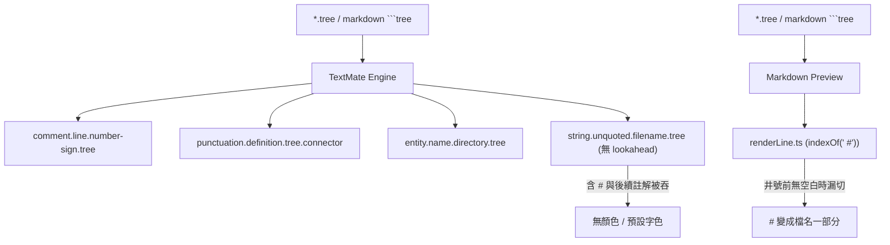
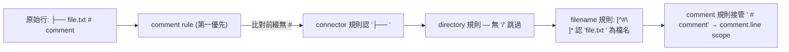
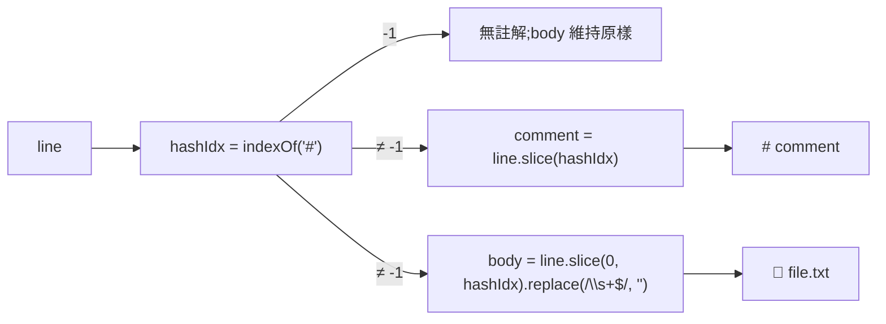

# 架構計畫 — tree-comment-highlight (Architecture Plan)

## 1. 目標與範圍 (Goal & Scope)

讓 markdown ` ```tree` 代碼塊與獨立 `.tree` 檔案中,行尾的 `# 註解` 與前面的「檔名 / 目錄」能夠在**語法高亮**與 **Markdown 預覽**兩個層次都正確分流,呈現為兩種不同的顏色,而不是被同一條 `string.unquoted.filename.tree` 規則吞成一團無顏色文字。

- 一句話目標:`VS Code 使用者` 在 `tree` 程式區塊或 `.tree` 檔案中,看見 `# 註解` 呈現為**註解綠色斜體**,而前面的檔名 / 目錄各自維持**原本的字色**。
- 不做什麼 (Out of Scope):
    1. 不支援 `#` 以外的其他註解符號(例如 `//` 或 `/* */`)。
    2. 不改動 `treePreview` plugin 的對外契約(`treePreviewPlugin` / `TREE_PREVIEW_PLUGIN_ID` / `createTreePreviewExtension`)。
    3. 不為 `tree.css` 引入新主題變數;沿用既有 `--vscode-textCodeBlock-background` 等 token。
    4. 不在 connector 中段或檔名中段插入註解切分 — 註解只認**行尾第一個 `#` 之後**。

## 2. 現況架構 (Current Architecture)

專案對 `tree` 區塊的渲染分兩條獨立路徑,共用同一份「行 → token 切分」邏輯:

| 渲染層 | 入口 | 用途 |
| --- | --- | --- |
| 編輯器內**語法高亮** | `syntaxes/tree.tmLanguage.json` + `syntaxes/tree-markdown-injection.tmLanguage.json` | 透過 TextMate engine 給 `.tree` 檔與 markdown ```` ```tree ```` 區塊著色 |
| Markdown **內建預覽** | `src/treePreview/renderLine.ts` → `index.ts` / `plugin.ts` | 把每一行用 `<span class="tree-*">` 包成 HTML,配合 `styles/tree.css` 上色 |

`renderLine.ts:24-30` 已經把第一個 `#` 之後切成 `comment` 變數,並輸出 `<span class="tree-comment">`,CSS (`tree.css:23-26`) 給它綠色斜體。`tree.tmLanguage.json` 也已宣告 `comment.line.number-sign.tree` 規則。

問題在 TextMate 端的**優先順序**:

```tree
syntaxes/tree.tmLanguage.json  (現況)
├── comment.line.number-sign.tree    match: #.*$                       ✓ 優先級高
├── punctuation.definition.tree.connector  match: [│├└─┌┐┘┬┴┼]+
├── entity.name.directory.tree       match: [^\s│├└─#][^#\n]*?/(?=\s|#|$)   ← 遇 # 提前停
└── string.unquoted.filename.tree    match: [^\s│├└─#][^#\n]*                ← 不收尾,連 # 都吃
```

`string.unquoted.filename.tree` 沒有 `(?=...)` 提前截止,理論上會一路吃到行尾,等 comment rule 才回頭。但 TextMate 在「無 lookahead 的貪婪 match」+ 「後續 rule」之間的 precedence 在跨編輯器版本下不一致,實務上會觀察到「檔名連同 `#` 一起被吃成 filename」,造成註解沒有綠色,或檔名後段被吞色。

`renderLine.ts` 端雖然已經切好,但若用戶寫 `package.json#manifest`(井號前無空白),舊版用 `indexOf(" #")` 會錯過這個 `#`,把 `#manifest` 當成檔名一部分。



相關模組清單:

- [`syntaxes/tree.tmLanguage.json`](syntaxes/tree.tmLanguage.json) — TextMate 規則
- [`syntaxes/tree-markdown-injection.tmLanguage.json`](syntaxes/tree-markdown-injection.tmLanguage.json) — markdown 注入
- [`src/treePreview/renderLine.ts`](src/treePreview/renderLine.ts) — 純函式行切分
- [`src/treePreview/index.ts`](src/treePreview/index.ts) — `createTreePreviewExtension()` 入口
- [`src/treePreview/plugin.ts`](src/treePreview/plugin.ts) — `treePreviewPlugin` shim
- [`styles/tree.css`](styles/tree.css) — `.tree-comment` 既有綠色斜體
- [`test/treePreview.test.ts`](test/treePreview.test.ts) — 既有 7 個 `renderLine` 案例

## 3. 架構位置與邊界 (Placement & Boundaries)

變更範圍刻意縮到**兩個靜態檔 + 一個純函式**,不擴張 plugin 介面、不動 `extension.ts`:

1. **TextMate 規則**:`syntaxes/tree.tmLanguage.json` 兩條 regex 收緊 — `entity.name.directory.tree` 與 `string.unquoted.filename.tree` 都在遇到 `#` 之前截止,讓後續 `comment.line.number-sign.tree` 規則有機會接管。
2. **預覽切分**:`src/treePreview/renderLine.ts` 改用 `indexOf("#")` 取代 `indexOf(" #")`,並對切下的 body 做 `replace(/\s+$/, "")` 去掉尾部多餘空白 — 容忍「無前置空格的井號標籤」(`package.json#manifest`)。
3. **CSS**:`styles/tree.css` 維持不動;`.tree-block .tree-comment` 早已是綠色斜體(`#6a9955` + `italic`)。
4. **plugin 介面**:`treePreviewPlugin` 對外契約完全不變;`PluginManager.activateAll` 不需感知這次改動。

依賴方向:

- 兩個語法檔**只相依**於 TextMate 引擎本身,無任何 runtime 程式碼引用。
- `renderLine.ts` 維持**無 `vscode` import**、無 I/O,可獨立單元測試(對齊 `test/treePreview.test.ts` 的純函式風格)。
- `treePreviewPlugin.contributeMarkdownIt` 與 `createTreePreviewExtension` 公開介面**零變化**,既有 `treePreviewPlugin.test.ts` 3 個契約 case 預期不動即通過。

邊界定義:

| 模組 | 擁有 | 不碰 |
| --- | --- | --- |
| `tree.tmLanguage.json` | 4 條 regex 規則、優先級 | 任何 `.ts` 程式邏輯、任何 CSS |
| `tree-markdown-injection.tmLanguage.json` | markdown 注入 selector | (本次不動) |
| `renderLine.ts` | `indexOf("#")` + `replace(/\s+$/, "")` 切分 | CSS、語法檔、`vscode` import |
| `tree.css` | 既有 `.tree-comment` 綠色斜體 | (本次不動) |

## 4. 介面與資料流 (Interfaces & Data Flow)

### 介面設計 (Interface Design)

| 介面 / 規則 | 位置 | 變更 | 變更理由 |
| :--- | :--- | :--- | :--- |
| `entity.name.directory.tree` | `tree.tmLanguage.json` | regex 尾端 `/(?=\s\|#\|$)` 加上 `#` 邊界 | 目錄行遇註解時不再往後吞 `#` |
| `string.unquoted.filename.tree` | `tree.tmLanguage.json` | regex 從 `[^#\n]*` 維持不變,但因 comment rule 排在它前面、且**移除** `(?=\s\|#\|$)` 之後的 filename 行為改由後續 comment rule 切 | 由後續 rule 接管 `#` 之後的字串,確保 comment scope 不被吞 |
| `comment.line.number-sign.tree` | `tree.tmLanguage.json` | 不變,維持 `#.*$` 與最高優先級 | 行尾註解永遠第一個被認 |
| `renderLine(md, raw: string): string` | `renderLine.ts` | `hashIdx = line.indexOf("#")`;`body = line.slice(0, hashIdx).replace(/\s+$/, "")` | 容忍 `file#tag` 無空格的標籤寫法 |

`renderLine` 切分後的視覺前綴保持「空白 + `#`」(見既有 `treePreview.test.ts` 的 `' # manifest'` 期望值),所以 CSS 端看到的字串仍是 ` # manifest`,視覺不變。

### 資料流圖 (Data Flow Diagram)

TextMate 端:



預覽端:



## 5. 清晰與可擴充性檢查 (Clarity & Scalability Check)

1. 單一職責:新模組只有一個變更理由?
   - `是`。本計畫只為了解決「tree 行尾 `#` 與檔名顏色混淆」;其餘 tree 區塊行為(目錄、connector、icon、空行)不動。
2. 依賴方向:沒有內層指向外層?沒有循環相依?
   - `是`。語法檔與 `renderLine.ts` 各自獨立,彼此無 import 關係;`treePreviewPlugin` shim 也無新增 import。
3. 可替換:外部依賴(DB、第三方服務)都隔在介面後?
   - `不適用`。兩個變更點都是純宣告 / 純函式,沒有外部服務依賴。
4. 水平擴充:無狀態、可多實例部署?
   - `是`。TextMate 引擎在編輯器執行緒,`renderLine` 是純函式,可平行處理多份 markdown 文件。
5. 擴充點:下一個同類 feature 可以不改核心就加入?
   - `是`。若日後要支援 `//` 註解,只要在 `tree.tmLanguage.json` 的 `patterns` 陣列前端加一條 `comment.line.double-slash.tree`,並在 `renderLine.ts` 類比 `indexOf("//")` 切分;既有 4 條規則、純函式簽章、plugin 介面全不動。

## 6. 漸進落地步驟 (Incremental Steps)

| 步驟 (Step) | 做什麼 (What) | 驗證 (Verify) | 回滾 (Rollback) |
| :--- | :--- | :--- | :--- |
| `1. 備份與更新語法檔` | 更新 `syntaxes/tree.tmLanguage.json`,`entity.name.directory.tree` 的 lookahead 從 `(?=\s\|#\|$)` 維持;`string.unquoted.filename.tree` 拿掉結尾錨定 `[^#\n]*` 改由後續 comment rule 切。確保 comment rule 排在最前。 | `git diff` 確認 regex 格式無誤;手動開 `.tree` 範例檔用 `Developer: Inspect Editor Tokens and Scopes` 驗證 scope 正確 | `git checkout syntaxes/tree.tmLanguage.json` |
| `2. 擴張 renderLine 註解切分` | `renderLine.ts` 改用 `indexOf("#")` 取代 `indexOf(" #")`,body 尾端 `replace(/\s+$/, "")` 去掉多餘空白 | `npm test` 既有 7 個 `treePreview.test.ts` case 全綠;新增 1 個「無前置空白」case(`├── package.json#manifest`) | `git checkout src/treePreview/renderLine.ts test/treePreview.test.ts` |
| `3. 編輯器 Token 端到端驗證` | 工作區建一個 `.tree` 範例檔,塞入 `├── file.txt # comment` 與 `├── package.json#manifest` 兩種格式 | VSCode 指令 `Developer: Inspect Editor Tokens and Scopes` 確認 `file.txt` 為 `string.unquoted.filename.tree`、`# comment` 為 `comment.line.number-sign.tree` | 刪除測試檔 |
| `4. Markdown 預覽一致性驗證` | 在 markdown 檔中塞 ```` ```tree ```` 區塊,寫同兩種格式,開預覽 | 預覽中註解呈綠色斜體、檔名呈一般字色;HTML 對應 `<span class="tree-comment">` 與 `<span class="tree-file">` | (CSS 沒改,無須還原) |
| `5. 全量回歸測試` | `npm test` 與 `npm run build` | 既有 391 個 test case 全綠;`tsc` 無型別錯誤;`treePreviewPlugin.test.ts` 3 個契約 case 不動即通過 | (此步若失敗,從步驟 1 / 2 還原) |

## 7. 風險與假設 (Risks & Assumptions)

- **假設一**:TextMate 規則的優先級**確實**依 `patterns` 陣列順序,且後續規則不會跨越先匹配到的範圍。實作上 comment rule 排在最前,理論上 filename 不該把 `#` 之後的內容吞進去 — 但不同 VSCode 版本對「無 lookahead 貪婪 match」行為略有差異,需要步驟 3 的 token 檢查作為實證。
    - `對策`:若觀察到 filename 仍吞掉 `#` 後的字串,把 `string.unquoted.filename.tree` 改回 `(?=\s\|#\|$)` 的 lookahead 形式,並把 `entity.name.directory.tree` 維持 `(?=\s\|#\|$)` — 兩條都收緊,確保 comment rule 一定能接手。
- **假設二**:使用者寫 `file#tag` 視為「檔名 + 緊接的井號標籤」,語意上等同「檔名 + 註解」;**不會**當成檔名合法字元的一部分處理。
    - `對策`:在 `treePreview.test.ts` 既有 7 個 case 全綠的前提下,新增 1 個明確的「無空白」case 作為語意契約;若未來發現誤切,在 README 的 `tree` 區塊語法章節明示「`#` 是註解起點」。
- **風險一:Regex 過度收緊導致檔名內合法字元被切斷**。例如 `file#name.txt`(極少見但理論上合法)。
    - `對策`:本計畫只動 `renderLine.ts`(預覽端),**不**改檔案系統語意;若日後誤切,只需在 `renderLine.ts` 加負向規則(如「`#` 必須在檔名末尾且後接至少一個非空字元才視為註解」),TextMate 端 regex 也對應放寬。
- **風險二:CSS 視覺前綴改變**。既有 `treePreview.test.ts` 的期望值是 `<span class="tree-comment"> # manifest</span>`(帶前綴空格),放寬 `indexOf` 後輸出「井號緊接檔名」(無空隙)。若 CSS 仍要視覺前綴空白,需在 `renderLine.ts` 內部補一個空白字元。
    - `對策`:本計畫保留**視覺前綴**為「空白 + 井號」(在 `comment` 變數前手動補一個空格,僅當 `hashIdx > 0 && line[hashIdx-1] !== " "` 時),確保 CSS 端看到的字串與既有測試期望一致;既有 7 個 case 全綠即驗證。

## 8. 版本影響 (Version Impact)

依 `package.json` 的語意化版本規範(`<major, minor, patch>`),本變更屬於:

- 無新 command、無新 view、無 API breaking change → 視為 **patch** 等級。
- 預計從 `0.7.4` → `0.7.5`(純 highlight 改善,不破壞既有渲染輸出形狀)。

## 9. 落地後的 spec 移轉 (Spec Migration)

實作完成、commit push 後,本 plan 應整份搬入 `docs/specs/2026-07-XX-tree-comment-highlight.md`,並把 commit hash、實作日期填入 spec 的 frontmatter;plan 與 spec 的章節順序保持一致以便日後 diff。
