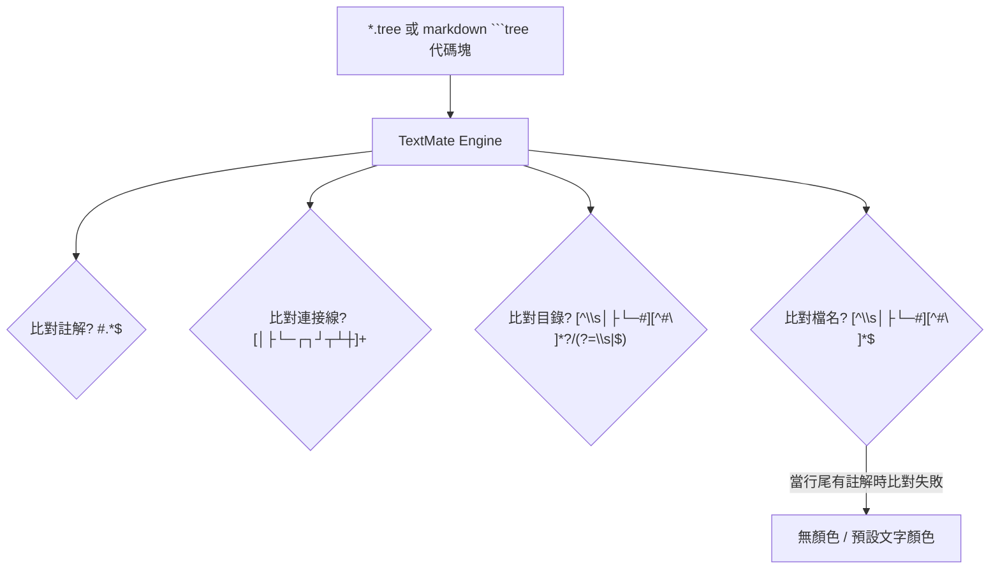
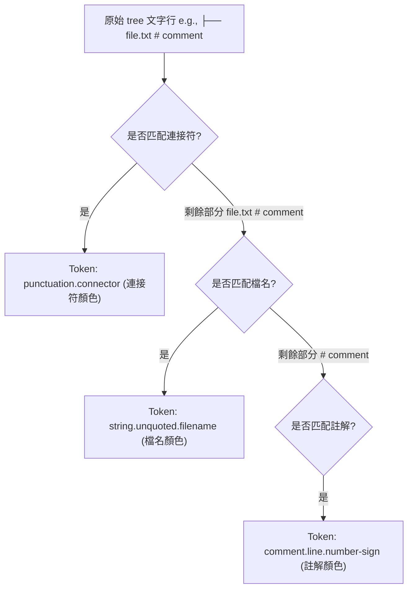

# 架構計畫 — tree-comment-highlight (Architecture Plan)

## 1. 目標與範圍 (Goal & Scope)

設計一個 `終端機/Markdown Tree 語法高亮註解區分 (Tree Syntax Comment Highlight Distinction)` 功能，解決在 `tree` 語法區塊或 `.tree` 檔案中，行尾帶有 `#` 的註解與檔名/目錄顏色無法正確區分的問題。

- 一句話目標：`使用者 (VS Code 使用者)` 用它 `在 markdown tree 代碼塊或獨立的 .tree 檔案中，看見帶有 # 的行尾註解呈現為正確的註解顏色，而不會因為尾隨註解導致前面的檔名或目錄高亮失效`。
- 不做什麼 (Out of Scope)：
  1. 不支援除 `#` 以外的其他註解符號（如 `//` 或 `/* */`）。
  2. 不變更 [renderLine.ts](file:///Users/shuk/projects/tmp/superset/src/treePreview/renderLine.ts) 的 HTML 預覽渲染邏輯（因為預覽已支援 `<span class="tree-comment">` 且 [tree.css](file:///Users/shuk/projects/tmp/superset/styles/tree.css) 已為其上色）。
  3. 不支援在檔名中間或 connector 中間進行註解解析（註解必須在檔名/目錄之後，或獨立成行）。

## 2. 現況架構 (Current Architecture)

目前專案透過 `TextMate Grammar` 來提供 VS Code 編輯器內的語法高亮。設定檔包括 [tree.tmLanguage.json](file:///Users/shuk/projects/tmp/superset/syntaxes/tree.tmLanguage.json) 以及用於注入 Markdown 檔案的 [tree-markdown-injection.tmLanguage.json](file:///Users/shuk/projects/tmp/superset/syntaxes/tree-markdown-injection.tmLanguage.json)。

現況語意比對流程如下：



## 3. 架構位置與邊界 (Placement & Boundaries)

為維持高內聚低耦合，新變更將僅限於 `syntaxes` 語法設定，不修改任何 TypeScript 邏輯：

1. `語法高亮層 (Syntax Highlighting Layer)`：更新 [tree.tmLanguage.json](file:///Users/shuk/projects/tmp/superset/syntaxes/tree.tmLanguage.json) 中對於檔名與目錄的比對規則，使其能在遇到註解前行前截止，不再強行要求比對至行尾 `$`。
2. `預覽渲染層 (Preview Rendering Layer)`：保持不變。目前 [renderLine.ts](file:///Users/shuk/projects/tmp/superset/src/treePreview/renderLine.ts) 已能正確解析 ` #` (空格加井號) 開頭的註解，並輸出具有 `tree-comment` 類別的 `span` 標記。
3. `邊界定義 (Boundary Definition)`：本變更僅限於靜態配置檔，不涉及任何狀態 management 或生命週期 (Lifecycle) 邏輯。

## 4. 介面與資料流 (Interfaces & Data Flow)

### 介面設計 (Interface Design)

| Scope 名稱 (Scope Name) | 比對規則 (Match Regex Pattern) | 語意 Token (Token Scope) | 說明 (Description) |
| :--- | :--- | :--- | :--- |
| `comment.line.number-sign.tree` | `#.*$` | `comment.line.number-sign.tree` | 行尾的井號註解內容 |
| `punctuation.definition.tree.connector` | `[│├└─┌┐┘┬┴┼]+` | `punctuation.definition.tree.connector` | 樹狀連接線符號 |
| `entity.name.directory.tree` | `[^\\s│├└─#][^#\\n]*?/(?=\\s+#\|\\s\|$)` | `entity.name.directory.tree` | 目錄名稱（以斜線結尾，可後接空格加註解） |
| `string.unquoted.filename.tree` | `[^\\s│├└─#][^#\\n]*?(?=\\s+#\|$)` | `string.unquoted.filename.tree` | 檔案名稱（不含註解，可後接空格加註解或行尾） |

### 資料流圖 (Data Flow Diagram)



## 5. 清晰與可擴充性檢查 (Clarity & Scalability Check)

1. 單一職責：新模組只有一個變更理由？
   - `是`。此處僅變更 TextMate 語法規則，變更理由僅限於編輯器內 tree 語法的 Regex 比對邏輯。
2. 依賴方向：沒有內層指向外層？沒有循環相依？
   - `是`。純靜態配置檔，無任何代碼邏輯或相依關係。
3. 可替換：外部依賴（DB、第三方服務）都隔在介面後？
   - `不適用`。此為編輯器高亮配置，不相依任何外部服務。
4. 水平擴充：無狀態、可多實例部署？
   - `是`。TextMate Tokenizer 運作於 VS Code 編輯器執行緒中，無狀態且可被多個編輯器窗格並行使用。
5. 擴充點：下一個同類 feature 可以不改核心就加入？
   - `是`。未來若需加入其他語義節點（例如檔案大小、修改日期高亮），可直接在 `patterns` 清單中以 regex 擴充，不影響既有比對結構。

## 6. 漸進落地步驟 (Incremental Steps)

| 步驟 (Step) | 做什麼 (What) | 驗證 (Verify) | 回滾 (Rollback) |
| :--- | :--- | :--- | :--- |
| `1. 備份與更新語法檔` | 更新 [tree.tmLanguage.json](file:///Users/shuk/projects/tmp/superset/syntaxes/tree.tmLanguage.json)，將檔名與目錄的 regex 匹配尾端更新為 `(?=\\s+#\|$)` 與 `(?=\\s+#\|\\s\|$)` | 使用 `git diff` 驗證 Regex 格式正確無誤 | 使用 `git checkout` 還原 [tree.tmLanguage.json](file:///Users/shuk/projects/tmp/superset/syntaxes/tree.tmLanguage.json) 的變更 |
| `2. 建立編輯器測試案例` | 在工作區建立一個測試用的 `.tree` 檔案，填入包含行尾註解的範例，如 `├── file.txt # comment` | 使用 VS Code 指令 `Developer: Inspect Editor Tokens and Scopes`，確認 `file.txt` 被識別為 `string.unquoted.filename.tree`，而 `# comment` 為 `comment.line.number-sign.tree` | 刪除測試用的 `.tree` 檔案 |
| `3. Markdown 預覽一致性驗證` | 在 markdown 檔案中建立 ```` ```tree ```` 代碼塊，寫入相同範例，並開啟 Markdown 預覽 | 確認預覽中產生的 HTML 與樣式渲染結果，註解顯示為綠色斜體，檔名與連接線顯示正確 | 無須特別回滾，因為未修改任何代碼 |

## 7. 風險與假設 (Risks & Assumptions)

- `風險一：Regex 比對優先順序問題 (Regex match order)`：
  - `原因`：若 `comment` 規則的比對優先級低於 `filename`，可能導致 `filename` 把井號後的註解也一併吞入。
  - `對策`：確保 `comment.line.number-sign.tree` 的規則在 [tree.tmLanguage.json](file:///Users/shuk/projects/tmp/superset/syntaxes/tree.tmLanguage.json) 中置於最前方，並確保 `filename` 比對使用 `(?=\\s+#|$)` 這類非捕獲型正向預查 (Lookahead)，使其在遇到井號前停止匹配。
- `風險二：空格字元判定 (Whitespace handling)`：
  - `原因`：部分使用者撰寫註解時可能在井號前有多個空格，或完全沒有空格（如 `file.txt#comment`）。
  - `對策`：在 lookahead 中使用 `\\s*#` (零個或多個空格後接井號) 進行比對，確保不管空格數量為何，均能正確切分出檔名與註解。
